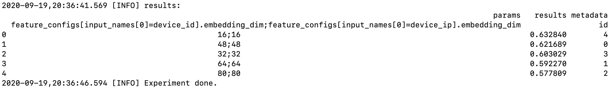
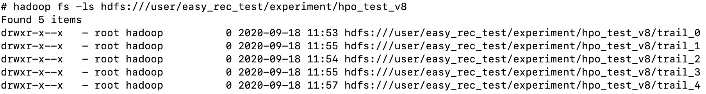
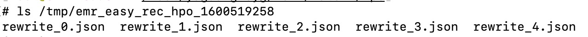
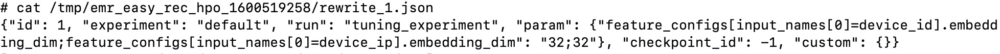

# EMR-HPO

### GetStarted

- 下载安装automl包

```bash
wget http://easyrec.oss-cn-beijing.aliyuncs.com/releases/pai_automl-0.0.1rc1-py3-none-any.whl
pip install pai_automl-0.0.1rc1-py3-none-any.whl
```

启动调优

```bash
python -m easy_rec.python.hpo.emr_hpo --hyperparams hyperparams.json  --config_path ./dwd_avazu_ctr_deepmodel.config --exp_dir hdfs:///user/easy_rec_test/experiment/hpo_test
```

### 参数说明

- --config_path  easyrec训练配置文件
- --exp_dir  调优实验目录
- --debug  保留本地临时目录
- --metric_name  调优的指标，默认是auc，其它可选指标\[参考../eval.md)
- --max_parallel   同一时刻可以并行跑的实验数目，默认4
- --total_trial_num  总共跑多少组实验，默认6
- --el_submit_params  el_submit指定PS/Worker资源的一些参数，包括-t x -m x \[-pn x -pc x -pm x\] -wn x -wc x -wm x -wg x 默认值

```bash
-t standalone -m local -wn 1 -wc 6 -wm 20000 -wg 1
```

- --hyperparams 参数空间配置空间

#### hyperparams设置

```json
[
  {
    "type": "Categorical",
    "name": "feature_configs[input_names[0]=field1].embedding_dim",
    "candidates": ["16", "32", "48", "64", "80"]
  }
]
```

- name:  easy_rec pipeline_config里面的参数名称，注意要用全路径

  feature_configs\[**input_names\[0\]=field_name1**\].embedding_dim

  - 由于feature_configs是一个数组，所以需要用到选择器，根据**属性值**选择部分特征:


```
  - input_names[0]=field_name1是选择器
  - 也支持数字作为选择器, 如: feature_configs[**0**], feature_configs[**1**]
  - 支持使用:选择所有的特征，如:
     - feature_configs[:]选择全部特征
     - feature_configs[5:]选择index从5开始的特征
     - feature_configs[:13]选择index从0到12的特征
     - feature_configs[3:12]选择index从3到11的特征
  - 支持使用>=, <=, >, <选择特征，如:
     - feature_configs[inputs_names[0]>=click_]选择名称排在"click_"后面的特征
  - 注意: 属性值里面不能有="'等操作符.
```

- 关联参数设置

有些参数的值是关联的，比如对于deepfm算法，所有的embedding_dim必须是一样的

- name里面可以指定多个要调整的参数名称，用";"分割feature_configs\[input_names\[0\]=field1\].embedding_dim;feature_configs\[input_names\[0\]=field20\].embedding_dim
- 如果name里面包含了多个参数名称，那么candidates也需要有多个参数值，用";"分割如"32;32"
- candidates: 候选值
- type: 候选值类型, 支持Categorical, Integer, Real
  - Integer类型

```json
{
  "type": "Integer",
  "name": "weeks",
  "min_value": 0,
  "max_value": 5
}
```

- Real类型

```json
{
  "type": "Real",
  "name": "epsilon",
  "min_value": 0.0001,
  "max_value": 0.1
 }
```

### 调优结果

- LOG信息


一共做了5组实验，可以看到embedding_dim越小越好。

- 实验目录信息(exp_dir):  hdfs:///user/easy_rec_test/experiment/hpo_test_v8



- 如果设置了--debug，那么将会保留本地临时目录: /tmp/emr_easy_rec_hpo_1600519258

  rewrite\_\[0-4\].json定义了每组实验的参数
  
  
