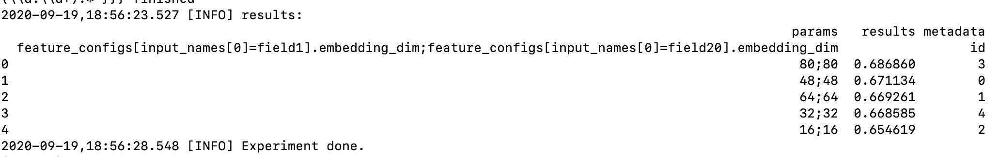

# PAI-HPO

### GetStarted

#### 下载安装automl包

```bash
wget http://easyrec.oss-cn-beijing.aliyuncs.com/releases/pai_automl-0.0.1rc1-py3-none-any.whl
pip install pai_automl-0.0.1rc1-py3-none-any.whl
```

#### 启动调优

```bash
python -m easy_rec.python.hpo.pai_hpo --odps_config ~/.odps_config.ini --oss_config ~/.ossutilconfig --bucket oss://xxx --role_arn acs:ram::xxx:role/xxx --hyperparams samples/hpo/hyperparams.json  --exp_dir easy_rec_test/experiment/model_hpo  --train_tables train_longonehot_4deepfm_20 --eval_tables test_longonehot_4deepfm_20 --config_path oss://xxx/easy_rec_test/dwd_avazu_hpo.config
```

### 参数说明

- --odps_config: odps账号信息文件

```
project_name=easy_rec_test
access_id=xxx
access_key=xxx
end_point=http://service.odps.aliyun.com/api
# MaxCompute 服务的访问链接
tunnel_endpoint=http://dt.odps.aliyun.com
# MaxCompute Tunnel 服务的访问链接
log_view_host=http://logview.odps.aliyun.com
# 当用户执行一个作业后，客户端会返回该作业的 LogView 地址。打开该地址将会看到作业执行的详细信息
https_check=true
#决定是否开启 HTTPS 访问
```

- --oss_config : oss配置文件

```json
[Credentials]
language=ch
endpoint = oss-cn-beijing.aliyuncs.com
accessKeyID = xxx
accessKeySecret= xxx
```

- --bucket   oss_bucket

- --role_arn   acs:ram::xxx:role/xxx

  pai tensorflow 任务访问oss数据的钥匙，[获取方式](https://help.aliyun.com/document_detail/190477.html?spm=h2-url-1)。

- --train_tables 训练表

- --eval_tables 评估表

- --exp_dir 调优目录, oss上的目录

- --config_path  easyrec训练配置文件

- --metric_name  调优的指标，默认是auc，其它可选指标[参考](../eval.md)

- --max_parallel   同一时刻可以并行跑的实验数目

- --total_trial_num  总共跑多少组实验

- --is_outer 内部pai还是外部pai

- --selected_cols 表里面用于训练和评估的列, 有助于提高训练速度

- --cluster 定义PS的数目和worker的数目，有一个worker将被用于评估, 其它的worker用于训练.

```bash
   --cluster='{"ps":{"count":1, "cpu":1000}, "worker" : {"count":3, "cpu":1000, "gpu":100, "memory":40000}}'
```

#### hyperparams设置

- 示例: samples/hpo/hyperparams.json

```json
[
  {
    "type": "Categorical",
    "name": "feature_config.features[input_names[0]=field1].embedding_dim",
    "candidates": ["16", "32", "48", "64", "80"]
  }
]
```

- name:  easy_rec pipeline_config里面的参数名称，注意要用全路径
  ```
      feature_config.features[input_names[0]=field1].embedding_dim
  ```
  - 由于feature_config.features是一个数组，所以需要用到选择器，根据**属性值**选择部分特征:


```
     - input_names[0]=field_name1是选择器
     - 也支持数字作为选择器, 如: feature_config.features[0], feature_config.features[1]
     - 支持使用:选择所有的特征，如:
        - feature_config.features[:]选择全部特征
        - feature_config.features[5:]选择index从5开始的特征
        - feature_config.features[:13]选择index从0到12的特征
        - feature_config.features[3:12]选择index从3到11的特征
     - 支持使用>=, <=, >, <选择特征，如:
        - feature_config.features[inputs_names[0]>=click_]选择名称排在"click_"后面的特征
```

- 关联参数设置

有些参数的值是关联的，比如对于deepfm算法，所有的embedding_dim必须是一样的

- name里面可以指定多个要调整的参数名称，用";"分割
  ```
  feature_config.features[input_names[0]=field1].embedding_dim;
  feature_config.features[input_names[0]=field2].embedding_dim
  ```
- 如果name里面包含了多个参数名称，那么candidates也需要有多个参数值，用";"分割如"32;32"
- candidates: 候选值
- type: 候选值类型, 支持Categorical, Integer, Real
  - Integer类型

```json
{
  "type": "Integer",
  "name": "weeks",
  "min_value": 0,
  "max_value": 5
}
```

- Real类型

```json
{
  "type": "Real",
  "name": "epsilon",
  "min_value": 0.0001,
  "max_value": 0.1
 }
```

#### 调优结果

- LOG信息


一共做了5组实验，可以看出embedding_dim=80的这一组实验效果最好。

- 实验目录信息(exp_dir): oss://xxx/easy_rec/experiment/model_hpo
  - easy_rec_hpo\_\[0-4\]: 每组实验的模型目录
  - \*.json包含了每组实验的参数信息

```json
{"id": 0, "experiment": "default", "run": "tuning_experiment", "param": {"feature_config.features[input_names[0]=field1].embedding_dim;feature_config.features[input_names[0]=field20].embedding_dim": "32;32"}, "checkpoint_id": -1, "custom": {}}
```

- \*.metric包含了每组实验的指标信息

```json
{"loss": 0.6656426191329956, "auc": 0.4911114573478699, "loss/loss/total_loss": 0.6656426191329956, "global_step": 0, "loss/loss/cross_entropy_loss": 0.6656426191329956}
{"loss": 0.16333971917629242, "auc": 0.6694868803024292, "loss/loss/total_loss": 0.16333971917629242, "global_step": 1000, "loss/loss/cross_entropy_loss": 0.16333971917629242}
```
