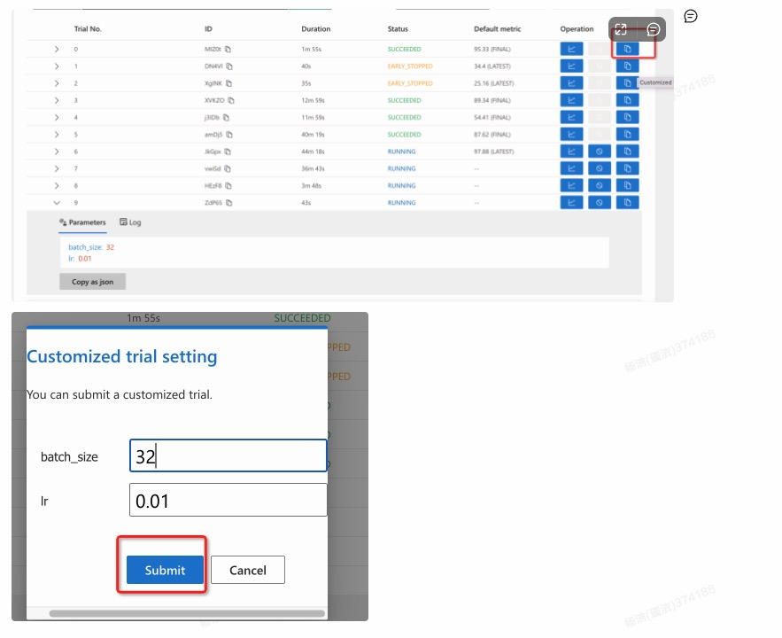
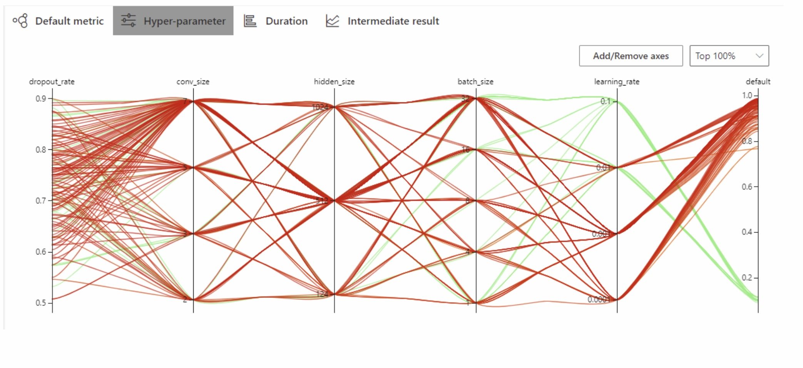
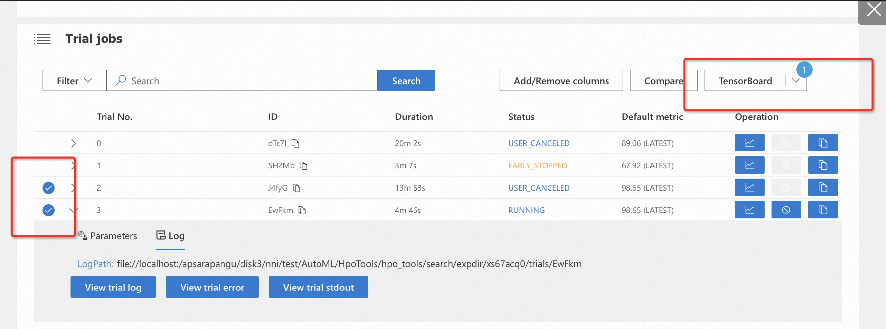

## 调优结果

在运行实验后，可以在命令行界面中找到如下的Web界面地址 ：\[Your IP\]:[Your Port]


### 查看概要页面

点击Overview按钮，在这里可以看到实验相关信息，如配置文件、搜索空间、运行时长、日志路径等。NNI 还支持通过 Experiment summary 按钮下载这些信息和参数。


### 查看Trial详情页面

点击Trials detail按钮，您可以在此页面中看到整个实验过程中，每个trial的结果情况。
其中succeeded代表此次trial成功运行，earlystop表示该组参数运行结果不太好，被提前停止了。停止策略可以查看pai_nni/core/pai_assessor.PaiAssessor，当然也可以根据业务情况去修改。


### 查看作业日志详情

点击每个Trial No，可以看到每个参数Trial的日志、参数详情,报错和输出可以点击以下3个按钮。


### 手动停止某组实验超参

如果某些参数的结果不太好，可以进行手动停止。
例如停止第一组参数。


### 多目标default metric查看

假设用户配置的metric_config为如下，那么UI中Default metric中显示3项；该组trial最终的metric

- default=auc\*0.5+accuracy\*0.5
- auc即为最终的auc值
- accuracy即为最终的accuracy值

```
auc=0.5
accuracy=0.5
```


### 最优模型和参数

可以按照metric排序，获取最优精度的参数，这组实验id kfv91xl5 和trial_id zuKwM,代码中默认设置模型保存路径为以下方式，因此可以在对应的路径下找到该模型
-Dmodel_dir='oss://lcl-bj/eval_dist_test/model\_${exp_id}\_${trial_id}'


### 多组参数比较

点击Trail NO，选中后，点击compare, 就可以查看对应参数的相关信


### 多组实验查看

多组实验可以点击All experiments,然后点击具体的实验ID进入对应的实验详情


### 自定义参数或者失败重试

可以使用自定义参数，也可以使用该功能重启失败的trial。
点击复制这个按钮，然后跳出Customized trial，点击提交/或者修改即可，此处是新增一组参数，应该记得调高MaxTrialNo
注意该功能在2.10目前有问题；需要nni\<=2.9


### 失败续跑

仅实时修改trial.ini，或者初始设置trial.ini 时添加配置resume=1即可将重跑变成断点续跑；
注意续跑时会从上一次该参数失败的cmd开始跑。

```
[platform_config]
name=MaxCompute
resume=1
cmd=PAI -name xxx
```

### 一键重试失败的Trial

当用户确认失败原因为没有资源，或者算法偶现失败等原因时，想采取重试策略，可以使用该API发起多个失败的Trial一起重试。在内部其实是将NNI最大运行次数增大，并发数保持不变；并且是新增了多个Trial，每个Trial的参数和之前失败的Trial保持一致。

注意该功能在2.10目前有问题；需要nni\<=2.9

- experiment_id: 重试的实验ID（必选）

```
python -m hpo_tools.core.utils.retry_multi_failed_trials --experiment_id=o968matg
```

### 一键停止运行的Trial

当用户得到想要的模型和参数时，由于NNI停止实验时，只会停止本地的进程，不会将dlc/trainingservice等平台的任务停止，目前提供了接口，可以将实验正常运行的作业给停止掉，并且将最大实验次数调至1(最小的正数），避免停止的瞬间起新的作业。

- experiment_id: 停止的实验ID（必选）

```
python -m hpo_tools.core.utils.kill_multi_running_trials --experiment_id=o968matg
```

### 停止实验

在停止实验之前，先参考一键停止运行的Trial，再停止实验

```
nnictl stop exp_id
```

### 超参数分析

可以点击超参数Hyper-parameter，选中关注的指标，就可以看出来最好的参数大概是哪些；对参数进行分析


### tensorboard

需要配置output_config,获取相应的summary文件
可以参考：https://nni.readthedocs.io/zh/stable/experiment/web_portal/tensorboard.html

注意目前NNI有个bug，需要先规避一下：

```
nni_tensorboard_filepath=$(python3 -c "import nni;import os;print(os.path.join(os.path.dirname((os.path.dirname(nni.__file__))),'nni_node/extensions/nniTensorboardManager.js'))")
echo "nni_tensorboard_filepath:"$nni_tensorboard_filepath
sed -i -e "s/--bind_all/--host 0.0.0.0/g" $nni_tensorboard_filepath
```

```
[output_config]
summary_path=oss://lcl-bj/eval_dist_test/model_${exp_id}_${trial_id}_${params}
```


