# PAI-NNI-HPO

## GetStarted

注意NNI仅支持python>=3.7,因此请配置python>=3.7的环境

NNI is tested and supported on Ubuntu >= 18.04, Windows 10 >= 21H2, and macOS >= 11.

### 下载安装easyrec

```bash
git clone https://github.com/alibaba/EasyRec.git
cd EasyRec
bash scripts/init.sh
python setup.py install
```

### 下载安装hpo-tools

第一个参数为下载examples的位置，默认下载在输入路径下面的examples下; 如果没写目录，默认生成在根目录下。

```
wget https://automl-nni.oss-cn-beijing.aliyuncs.com/nni/hpo_tools/scripts/install_hpo_tools.sh
bash install_hpo_tools.sh ./
cd ./examples/search/maxcompute_easyrec
```

- 注意如果有旧版本，会先卸载旧版本，升级新版本hpo-tools
- 注意会注册PAIAssessor，用于earlystop和手动停止
- 注意会下载examples，用于开启demo

## 配置

### 配置 config.ini

#### config.ini中参数的自动替换：

程序会将config.ini 中以下这些key默认替换成对应的值。参数默认支持值替换、列表替换、字典替换、json替换、文件替换（params_config)

```
def update_default_params(cmd, tuner_params={}, params_only=False):
    """update params in cmd."""
    trial_id = str(nni.get_trial_id())
    experment_id = str(nni.get_experiment_id())

    tuner_params_list = ''
    tuner_params_dict = ''
    for p, v in tuner_params.items():
        cmd = cmd.replace(p, str(v))
        tuner_params_list += p + ' ' + str(v) + ' '
        tuner_params_dict += p + '=' + str(v) + ' '

    # params_only used in replace ak,sk in test at the begining
    if not params_only:
        # lower for k8s meta.name
        cmd = cmd.replace('${exp_id}', experment_id.lower())
        cmd = cmd.replace('${trial_id}', trial_id.lower())
        cmd = cmd.replace('${NNI_OUTPUT_DIR}',
                          os.environ.get('NNI_OUTPUT_DIR', './tmp'))
        cmd = cmd.replace('${tuner_params_list}', tuner_params_list)
        cmd = cmd.replace('${tuner_params_dict}', tuner_params_dict)
        cmd = cmd.replace('${tuner_params_json}', json.dumps(tuner_params))

    return cmd
```

#### params_config(可选）

如果用户的参数是保存在文件中，则需要配置params_config, 用于标记需要修改参数的源文件路径和目标路径
可以为多个params_src_dst_filepathxx=src_path,dst_path,注意以，分割；支持OSS/HDFS/NAS/LOCAL

#### platform_config(必选）

用于标记任务执行的平台以及对应的执行命令

```
name=DLC/MaxCompute/DataScience/LOCAL/PAI
cmdxx=xx （执行的命令行）
```

#### metric_config（必选）

用于标记任务metric的获取来源、metric类型、最终metric的方式、metric的key以及对应权重、
其中

- metric_type=summary/table/api(必选）
- metric_source=xxx（必选，可以为多个以metric_source开头的，具体可以看finetune案例）
  - metric_source=oss://lcl-bj/eval_dist_test/model\_${exp_id}\_${trial_id}/eval_val/ 为easyrec model_dir/eval_val/下
- final_mode=final/best/avg（可选，默认值为best，可选值为final/best/avg）
- optimize_mode=maximize/minimize （可选，默认值为maximize, 可选值为maximize/minimize)
- source_list_final_mode=final/best/avg（可选，默认值为final_mode，可选值为final/best/avg,用于有多个metric_source时最终metric如何计算，具体可以看maxcompute_crossvalidation案例）
- metric_key示例：对应查询的key以及对应的权重
  - 多目标示例：metric=val(’auc_is_valid_play’)\*0.5+val(’auc_is_like’)\*0.25+val(’auc_is_comment’)\*0.25
    ```
    auc_is_valid_play=0.5
    auc_is_like=0.25
    auc_is_comment=0.25
    ```
  - 多目标示例：metric=val(’auc_is_valid_play’)\*0.5+val(’auc_is_like’)\*0.25+val(’auc_is_comment’)\*0.25-val(’loss_play_time’)\*0.25
    注意：如果config.yml中nni tuner、assessor的配置方式是按metric最大化方式去选择参数的，对于loss这种越小越好的metric，需要定义权重为负值。
    ```
    auc_is_valid_play=0.5
    auc_is_like=0.25
    auc_is_comment=0.25
    loss_play_time=-0.25
    ```
  - 单目标示例：metric=val(’auc_is_valid_play’)\*1
    ```
    auc_is_valid_play=1
    ```

#### oss_config （可选）

如果任务需要使用OSS存储，则需要配置OSS config，修改对应的oss_config的值

#### odps_config （可选）

如果任务需要使用maxcompute平台执行任务，则需要配置odps config,修改对应的odps_config的值

```
[oss_config]
endpoint=http://oss-cn-beijing.aliyuncs.com
accessKeyID=${AK}
accessKeySecret=${SK}

[odps_config]
access_id=${AK}
access_key=${SK}
project_name=pai_rec_dev
end_point=http://service.odps.aliyun.com/api

[params_config]
# easy_rec config replace KEY->search params value
params_src_dst_filepath=/root/test_nni/AutoML/HpoTools/hpo_tools/search/maxcompute_easyrec/samples/pipeline_params.config,oss://lcl-bj/eval_test/config/easyrec_model_${exp_id}_${trial_id}.config

[platform_config]
name=MaxCompute
cmd1="PAI -name=easy_rec_ext
            -project=algo_public
            -Dversion="0.4.2"
            -Dconfig='oss://lcl-bj/eval_test/config/easyrec_model_${exp_id}_${trial_id}.config'
            -Dcmd='train'
            -Dtrain_tables='odps://pai_rec_dev/tables/dwd_avazu_ctr_deepmodel_train_10000'
            -Deval_tables='odps://pai_rec_dev/tables/dwd_avazu_ctr_deepmodel_test_1000'
            -Dcluster='{"ps":{"count":1,"cpu":1000 },"worker":{"count":3,"cpu":1000,"memory":40000}}'
            -Darn='xxx'
            -Dbuckets='oss://lcl-bj/'
            -Dmodel_dir='oss://lcl-bj/eval_dist_test/model_${exp_id}_${trial_id}'
            -DossHost='oss-cn-beijing-internal.aliyuncs.com'
            -Deval_method='separate' "


[metric_config]
# metric type is summary/table
metric_type=summary
metric_source=oss://lcl-bj/eval_dist_test/model_${exp_id}_${trial_id}/eval_val/
# best/final/avg,default=best
final_mode=final
auc=1

```

##### easyrec命令配置

相关参数说明参考[MaxCompute Tutorial](../quick_start/mc_tutorial.md)：

注意pai命令中的value需要用引号，例如DossHost='oss-cn-beijing-internal.aliyuncs.com'

### 配置超参搜索空间search_space.json

- key是Dconfig中的参数名称，相关配置参考[EasyRecConfig参考手册](../reference.md)
- type是nni中定义的搜索类型，相关配置参考[NNI searchSpace参考手册](https://nni.readthedocs.io/en/v2.2/Tutorial/SearchSpaceSpec.html)
- value是根据业务、经验设置相关搜索值

```json
{
    "${initial_learning_rate}":{"_type":"choice","_value":[1e-6,1e-7]}
}
```

常见搜索空间可以参考：samples/hpo/search_space.json

##### key配置注意项

${initial_learning_rate} 为search_space.json中的key，需要在easyrec pipeline config中提前进行替换，原理是采用变量替换的方式去引入新的超参

```
train_config {
  log_step_count_steps: 200
  # fine_tune_checkpoint: ""
  optimizer_config: {
    adam_optimizer: {
      learning_rate: {
        exponential_decay_learning_rate {
          initial_learning_rate: ${initial_learning_rate}
          decay_steps: 10000
          decay_factor: 0.5
          min_learning_rate: 0.0000001
        }
      }
    }
    use_moving_average: false
  }
```

##### type配置注意事项

[NNI searchSpace参考手册](https://nni.readthedocs.io/en/v2.2/Tutorial/SearchSpaceSpec.html)

- {"\_type": "choice", "\_value": options}：从options中选取一个。
- {"\_type": "randint", "\_value": \[lower, upper\]}：\[low,upper)之间选择一个随机整数。
- {"\_type": "uniform", "\_value": \[low, high\]}：\[low,upper\]之间随机采样。

## 启动调优

### 启动命令

```bash
nnictl create --config config.yml --port=8780
```

其中port可以是机器上任意未使用的端口号。需要注意的是，NNI实验不会自动退出，如果需要关闭实验请运行nnictl stop主动关闭。
您也可以参考[NNI参考手册](https://nni.readthedocs.io/en/v2.1/Tutorial/QuickStart.html)
查看nnictl的更多用法。

启动成功界面：
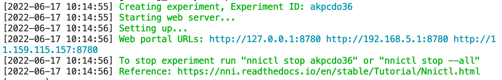

### config.yml 参数说明

config.yml是作为NNI的配置文件，将代码和搜索空间进行结合，并使用指定的环境来运行您的训练代码，具体参考此config.yml文件。在这里，您还可以还提供其他信息，例如并发度、调优算法、最大Trial数量和最大持续时间等参数。

[NNI参考手册config.yml](https://nni.readthedocs.io/zh/stable/reference/experiment_config.html#experimentconfig)

```
experimentWorkingDirectory: ../expdir
searchSpaceFile: search_space.json
trialCommand: python3 -m hpo_tools.core.utils.run --config=./config.ini
trialConcurrency: 1
maxTrialNumber: 1
tuner:
  name: TPE
  classArgs:
    optimize_mode: maximize
debug: true
logLevel: debug
trainingService:
  platform: local
assessor:
  name: PAIAssessor
  classArgs:
    platform: MAXCOMPUTE
    optimize_mode: maximize
    start_step: 1
```

### 并发度和最大Trial数量、最大运行时间可以实时调整：

建议：刚开始设置为1，调测代码成功后，可以先调大最大运行次数Max trial No.，再调大并发度Concurrency。
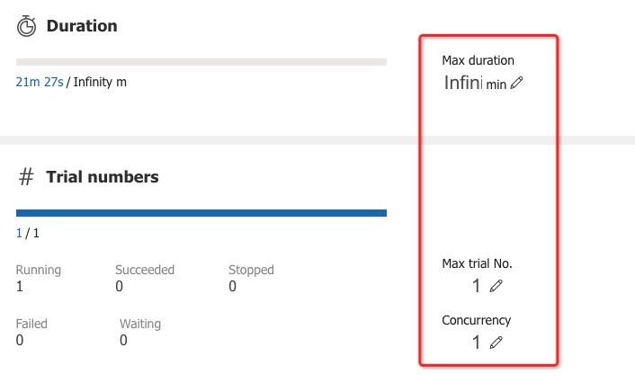

## 调优结果

在运行实验后，可以在命令行界面中找到如下的Web界面地址 ：\[Your IP\]:\[Your Port\]


### 查看概要页面

点击Overview按钮，在这里可以看到实验相关信息，如配置文件、搜索空间、运行时长、日志路径等。NNI 还支持通过 Experiment summary 按钮下载这些信息和参数。
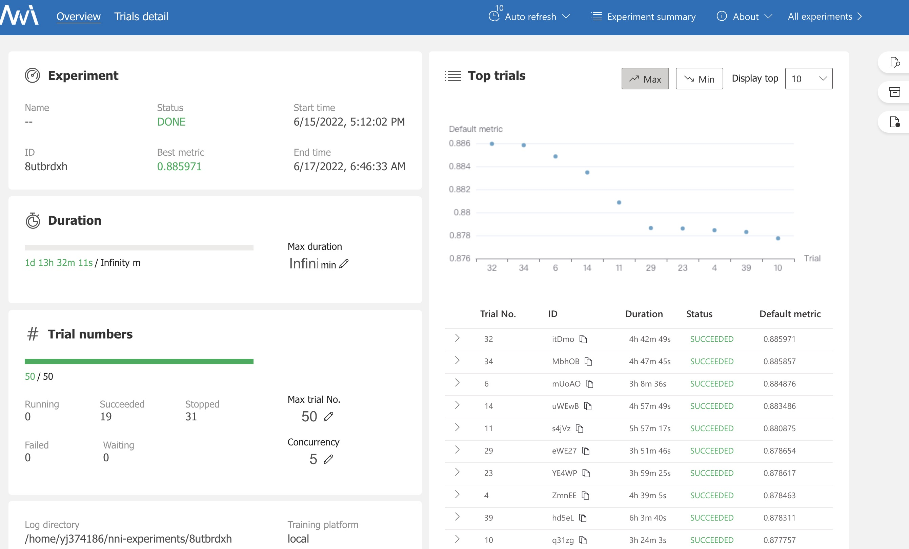

### 查看Trial详情页面

点击Trials detail按钮，您可以在此页面中看到整个实验过程中，每个trial的结果情况。
其中succeeded代表此次trial成功运行，earlystop表示该组参数运行结果不太好，被提前停止了。停止策略可以查看pai_nni/core/pai_assessor.PaiAssessor，当然也可以根据业务情况去修改。
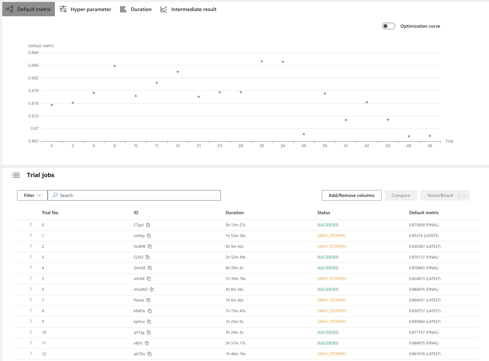

### 查看作业日志详情

点击每个Trial No，可以看到每个参数Trial的日志、参数详情,报错和输出可以点击以下3个按钮。
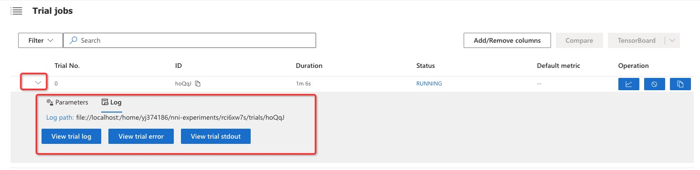

### 手动停止某组实验超参

如果某些参数的结果不太好，可以进行手动停止。
例如停止第一组参数。
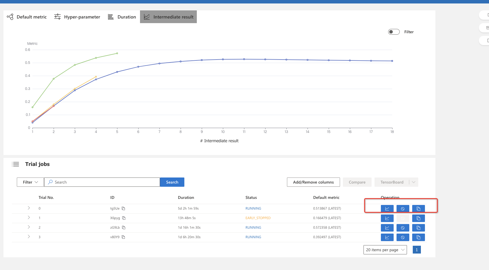

### 多目标default metric查看

假设用户配置的metric_config为如下，那么UI中Default metric中显示3项；该组trial最终的metric

- default=auc\*0.5+accuracy\*0.5
- auc即为最终的auc值
- accuracy即为最终的accuracy值

```
auc=0.5
accuracy=0.5
```

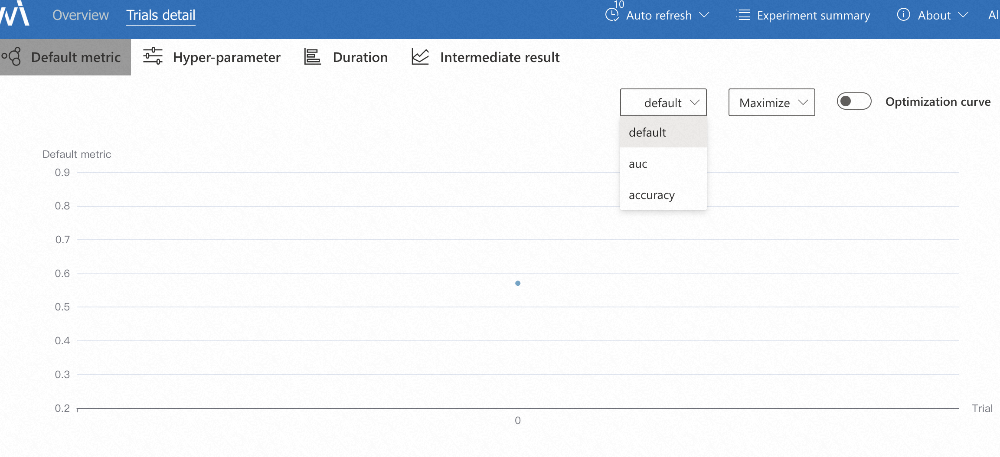

### 最优模型和参数

可以按照metric排序，获取最优精度的参数，这组实验id kfv91xl5 和trial_id zuKwM,代码中默认设置模型保存路径为以下方式，因此可以在对应的路径下找到该模型
-Dmodel_dir='oss://lcl-bj/eval_dist_test/model\_${exp_id}\_${trial_id}'
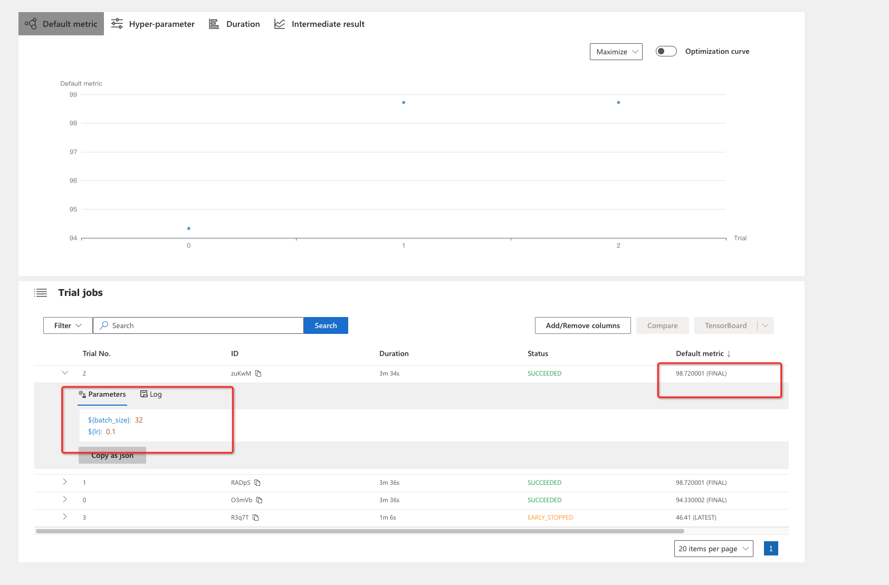

### 多组参数比较

点击Trail NO，选中后，点击compare, 就可以查看对应参数的相关信
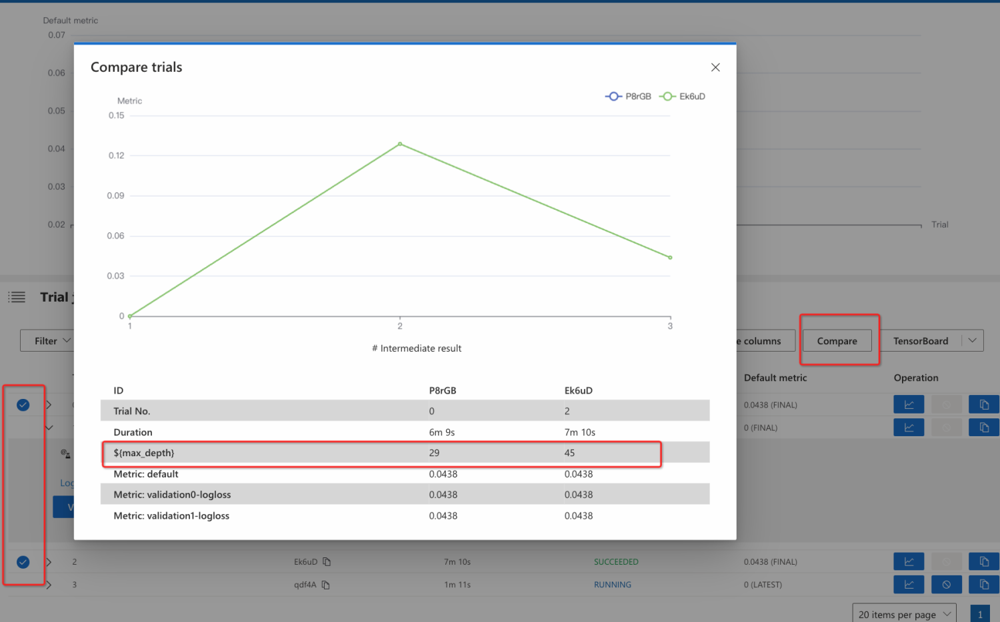

### 多组实验查看

多组实验可以点击All experiments,然后点击具体的实验ID进入对应的实验详情
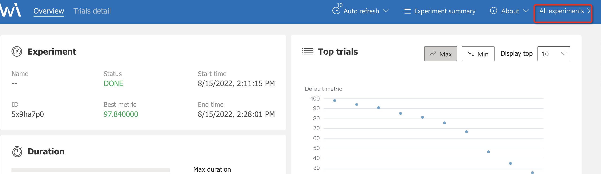

## finetune训练（可选）

由于推荐业务每天都有实时更新的数据，如果用户采用先训练一批历史数据，后面每天finetune更新模型的话，可以利用以上begin调优的最优结果，再在新数据上微调。如果用户每次更新模型都是重新开始训练的话，则不需要此步骤。

### 调优经验

例如：用户有40天历史数据，可以先利用以上步骤调优30天数据，然后根据搜索出的最优参数，再finetuen剩余10天。
经验是：根据begin训练得出的最优参数，将learning_rate设置为begin结束时的learning_rate。
例如：
begin训练时learning_rate如下,begin训练总计为8000步，因此可以设置finetune时initial_learning_rate=1e-6或者1e-7：

```
learning_rate {
        exponential_decay_learning_rate {
          initial_learning_rate: 0.001
          decay_steps: 1000
          decay_factor: 0.1
          min_learning_rate: 1e-07
        }
      }
```

支持手动修改，也支持代码修改配置，修改效果如下：
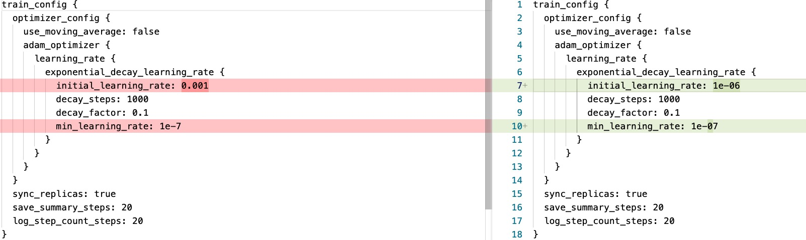

#### 使用代码修改配置(可选)

支持本地上pipeline文件修改

```bash
python modify_pipeline_config.py --pipeline_config_path=./samples/pipeline.config --save_path=./samples/pipeline_finetune.config --learning_rate=1e-6
```

也支持oss上pipeline文件直接修改

```bash
python modify_pipeline_config.py  --pipeline_config_path=oss://easyrec/pipeline889.config --save_path=oss://easyrec/pipeline889-f.config --learning_rate=1e-6 --oss_config=../config/.ossutilconfig
```

如果用户想要看是否有更优参数，可以看下级目录启动调优。

### 启动调优(可选)

```bash
nnictl create --config config_finetune.yml --port=8617
```

#### config_finetune.ini

```
[platform_config]
name=MaxCompute






cmd1_{{bizdate}}="PAI -name=easy_rec_ext
    -project=algo_public
    -Dscript='oss://automl-nni/easyrec/easy_rec_ext_615_res.tar.gz'
    -Dtrain_tables='odps://pai_rec_dev/tables/rec_sv_rebuild_acc_rnk_rank_sample_embedding_modify/dt={{bizdate}}'
    -Deval_tables='odps://pai_rec_dev/tables/rec_sv_rebuild_acc_rnk_rank_sample_embedding_modify/dt={{eval_ymd}}'
    -Dcmd=train
    -Deval_method=separate
    -Dfine_tune_checkpoint="oss://automl-nni/easyrec/finetune/{{predate}}_finetune_model_nni_622"
    -Dconfig='oss://automl-nni/easyrec/config/easyrec_model_${exp_id}_${trial_id}.config'
    -Dmodel_dir='oss://automl-nni/easyrec/finetune/{{bizdate}}_finetune_model_nni_622/${exp_id}_${trial_id}'
    -Dselected_cols='is_valid_play,ln_play_time,is_like,is_comment,features,content_features'
    -Dbuckets='oss://automl-nni/'
    -Darn='xxx'
    -DossHost='oss-cn-beijing-internal.aliyuncs.com'
    -Dcluster={"ps":{"count":1,"cpu":1600,"memory":40000 },"worker":{"count":12,"cpu":1600,"memory":40000}} "


cmd1_{{bizdate}}="PAI -name=easy_rec_ext
    -project=algo_public
    -Dscript='oss://automl-nni/easyrec/easy_rec_ext_615_res.tar.gz'
    -Dtrain_tables='odps://pai_rec_dev/tables/rec_sv_rebuild_acc_rnk_rank_sample_embedding_modify/dt={{bizdate}}'
    -Deval_tables='odps://pai_rec_dev/tables/rec_sv_rebuild_acc_rnk_rank_sample_embedding_modify/dt={{eval_ymd}}'
    -Dcmd=train
    -Deval_method=separate
    -Dfine_tune_checkpoint="oss://automl-nni/easyrec/finetune/{{predate}}_finetune_model_nni_622/${exp_id}_${trial_id}"
    -Dconfig='oss://automl-nni/easyrec/config/easyrec_model_${exp_id}_${trial_id}.config'
    -Dmodel_dir='oss://automl-nni/easyrec/finetune/{{bizdate}}_finetune_model_nni_622/${exp_id}_${trial_id}'
    -Dselected_cols='is_valid_play,ln_play_time,is_like,is_comment,features,content_features'
    -Dbuckets='oss://automl-nni/'
    -Darn='xxx'
    -DossHost='oss-cn-beijing-internal.aliyuncs.com'
    -Dcluster={"ps":{"count":1,"cpu":1600,"memory":40000 },"worker":{"count":12,"cpu":1600,"memory":40000}} "





[metric_config]
# metric type is summary/table
metric_type=summary


metric_source_{{bizdate}}=oss://automl-nni/easyrec/finetune/{{bizdate}}_finetune_model_nni_622/${exp_id}_${trial_id}/eval_val/

# best/final/avg,default=best
final_mode=final
source_list_final_mode=avg
auc_is_valid_play=0.5
auc_is_like=0.25
auc_is_comment=0.25
```

与begin训练的`差异点`:

- 每个配置模块支持jinja模版渲染
- 配置finetune日期
- 配置finetune开始日志，Dfine_tune_checkpoint开始日期和后续日期采取的model路径不一样
- 假设每天finetune：
  - {bizdate} 必须保留，将会在代码中根据当天日期进行替换
  - {eval_ymd} 必须保留，将会在代码中根据第二天日期进行替换
  - {predate} 必须保留，将会在代码中根据前一天日期进行替换
- metric_source也是多条路径，每一天训练结果为summary的最终结果，整组参数finetune的结果为这些天的平均值

#### 配置超参搜索空间search_space.json

参考begin训练阶段中想要搜索的参数即可，注意由于是finetune训练，网络结构相关的参数不要进行搜索，经验是搜索LR

## EarlyStop算法

### 算法介绍

支持将该组中的实验结果和同组中的所有历史进行比较，如果不满足比较标准（例如小于中位数），则停止该组超参数的运行。比如说设置最大运行次数max_trial_num， 实际使用量会显著小于max_trial_num，但具体数量就和实际跑的任务及随机到的超参有关系了。例如max_trial_num=50时，可能最终可能不到 25 次，并且差不多已经是完整探索了50组超参。
在config.yml中：

- optimize_mode： 最大化优化的方向
- start_step: 从第2步开始进行早停判定
- moving_avg: 早停判断时，采用所有历史的滑动平均值作为判断标准
- proportion： 本次超参搜索的最优值和历史记录的proportion值比较
- platform: 目前支持LOCAL/PAI/DLC/DATASCIENCE/MAXCOMPUTE/TRAININGSERVICE

```
assessor:
  name: PAIAssessor
  classArgs:
    platform: MAXCOMPUTE
    optimize_mode: maximize
    start_step: 1
    moving_avg: true
    proportion: 0.5
```

### 算法修改

如果您想设置自定义停止策略，例如到达多少步，精度还没到达0.9，可以修改代码，来加速搜索，可以参考NNI CustomizeAssessor
注意继承对应平台的assessor函数: hpo_tools/core/assessor/pai_assessor.PAIAssessor
trial_end函数，该函数是用来当一个实验被停止时，去将平台上运行的任务关闭，同时会去将监听metric的线程给kill掉。

```
def trial_end(self, trial_job_id, success):
        logging.info('trial end')
        # user_cancelled or early_stopped
        if not success:
            if self.platform == 'DATASCIENCE':
                DataScienceTask(trial_id=trial_job_id).stop_job()
            elif self.platform in ['LOCAL', 'PAI']:
                logging.info(
                    "the platform is local or pai, don't need to stop remote job"
                )
            elif self.platform == 'DLC':
                DLCTask(trial_id=trial_job_id).stop_job()
            elif self.platform == 'MAXCOMPUTE':
                MaxComputeTask(trial_id=trial_job_id).stop_job()
            elif self.platform == 'TRAININGSERVICE':
                TrainingServiceTask(trial_id=trial_job_id).stop_job()
            else:
                raise TypeError(
                    f"the self.platform {self.platform} not "
                    f"in DATASCIENCE,DLC,MAXCOMPUTE,LOCAL,PAI,TRAININGSERVICE "
                )
            # remove json file
            remove_filepath(trial_id=trial_job_id)
```

## FAQ

- 如果是用MAC安装，遇到nni启动权限问题，可以手动解决下

  ```
  chmod 777 /Users/liuchenglong/opt/anaconda3/envs/easyrec-nni/lib/python3.8/site-packages/nni-2.8-py3.8-macosx-10.9-x86_64.egg/nni_node/node
  ```

  报错如下：
  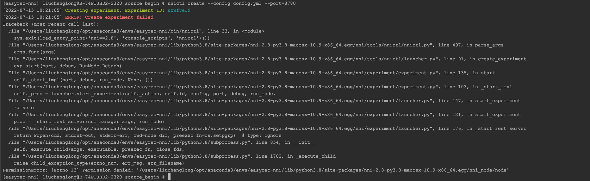

- 如果实验异常，可以查看具体的日志.

  - 找到配置的实验目录experimentWorkingDirectory，可以去{exp_dir}/{nni_exp_id}/log下查看nni-manager的日志；{exp_dir}/{nni_exp_id}/trials查看所有实验的日志.

    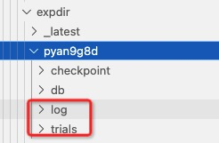

  - 可以在实验启动的UI上查看日志

  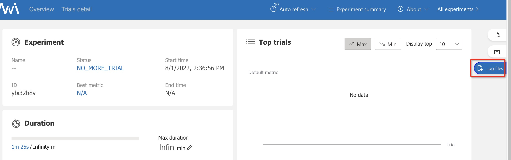
  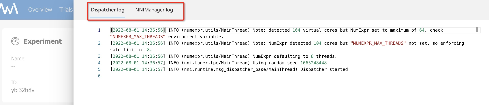

- 建议使用长周期的服务器去启动，如果是自己的笔记本，建议保持电脑待机

- 如果NNICTL启动不成功，找到配置的实验目录experimentWorkingDirectory，例如exp_dir/$experiment_id/log/nnictl_stderr.log去查看具体的问题

  - 例如报错：Error: /lib64/libstdc++.so.6: version \`CXXABI_1.3.8' not found，可参考

  ```
    sudo mv libstdc++.so.6.0.26 /usr/lib64
    cd /usr/lib64
    sudo mv libstdc++.so.6 libstdc++.so.6.bak
    sudo ln -s libstdc++.so.6.0.26 libstdc++.so.6
  ```

- 如果NNICTL一开始成功，后续突然不成功，可以清空ECS环境中的python进程，重试

  例如/mnt/data/project/project/exp/$experiment_id/log/nnictl_stderr.log中无报错，但是Failed to establish a new connection: \[Errno 111\] Connection refused'))

  命令：ps -ef|grep python|grep -v grep|cut -c 9-15|xargs kill -15

- 如果对应平台的作业未启动成功，可能是AK、SK、NAS配置不正确
