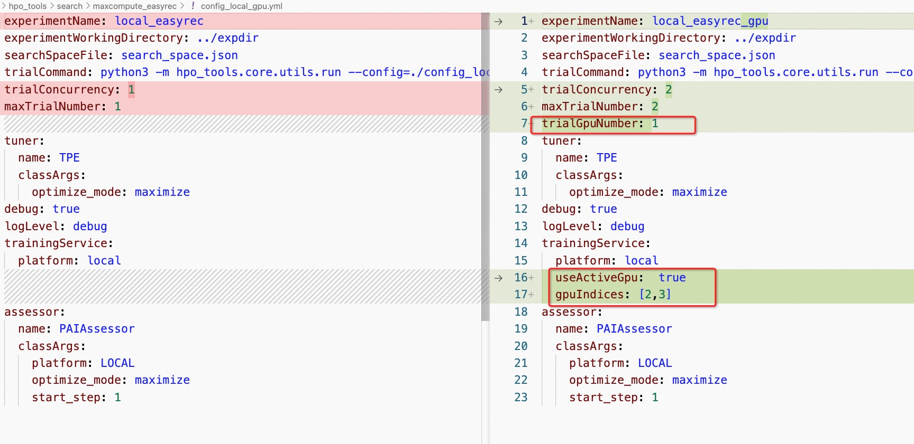

# PAI-NNI-HPO

HPO是对模型参数、训练超参数（opt、lr）等进行自动搜索调优的一个工具，从而获取较优参数，提升模型效果。可以大大地节省算法同学调参的时间，聚焦在建模和业务上。我们对NNI、PAI产品和算法等进行集成，支持多平台0代码修改调参，并做了加速、监控、调度、续跑等功能增强。

[NNI参考](https://nni.readthedocs.io/en/stable/hpo/overview.html)

### 安装

系统：Ubuntu >= 18.04, Windows 10 >= 21H2, macOS >= 11.

python环境：注意NNI仅支持python>=3.7,因此请配置python>=3.7的环境

java环境：如果需要运行MC的PAI命令，需要java8

#### 下载安装hpo-tools

安装命令为

```
source install_hpo_tools.sh $1 $2
```

- 第一个参数为下载examples的位置，默认下载在输入路径下面的examples下; 如果没写目录，默认生成在根目录下。
- 第二个参数为aliyun/eflops/mac-dlc/mac-arm-dlc，用来控制安装dlc的版本，如果没写，则默认安装aliyun版本的dlc

##### Linux

```
wget https://automl-nni.oss-cn-beijing.aliyuncs.com/nni/hpo_tools/scripts/install_hpo_tools.sh
source install_hpo_tools.sh ./ aliyun
source ~/.bashrc
```

##### MAC

```
# 如果是mac系统 将zsh->bash
chsh -s /bin/bash

# 如果是mac系统，aliyun/eflops/mac-dlc/mac-arm-dlc
wget https://automl-nni.oss-cn-beijing.aliyuncs.com/nni/hpo_tools/scripts/install_hpo_tools.sh
source install_hpo_tools.sh ./ mac-dlc

source ~/.bashrc
```

##### MAC ARM

```
# 如果是mac系统 将zsh->bash
chsh -s /bin/bash

# 如果是mac系统，aliyun/eflops/mac-dlc/mac-arm-dlc
wget https://automl-nni.oss-cn-beijing.aliyuncs.com/nni/hpo_tools/scripts/install_hpo_tools.sh
source install_hpo_tools.sh ./ mac-arm-dlc

source ~/.bashrc
```

- 注意如果有旧版本，会先卸载旧版本，升级新版本hpo-tools
- 注意会注册PAIAssessor，用于earlystop和手动停止
- 注意会下载examples，用于开启demo
- 默认会安装dlc命令行工具，用于提交dlc作业
- 默认会安装odpscmd命令行工具，用于提交maxcompute作业

#### 提供镜像包（可选）

提供镜像用于用户免安装使用，支持local/dlc/mc/trainingservice/paiflow

- 弹外GPU镜像：registry.cn-shanghai.aliyuncs.com/mybigpai/nni:gpu-latest
- 弹外CPU镜像：registry.cn-shanghai.aliyuncs.com/mybigpai/nni:cpu-latest

##### 启动镜像

```
mkdir -p ./examples
cd examples
echo $(pwd)

# 挂载&获取container id
container_id=`docker run -td --network host  -v $(pwd):/HpoTools/test registry.cn-shanghai.aliyuncs.com/mybigpai/nni:cpu-latest`
echo $container_id

# get examples:cp docker examples to local
docker cp $container_id:/HpoTools/examples/search $(pwd)
# 配置案例路径
ls $(pwd)/search

# 运行镜像
docker exec -ti $container_id /bin/bash
cd /HpoTools/test/search

### 查看具体案例 去本地修改$(pwd)/search下面的实验配置，第2章节
### 查看具体案例 去容器/HpoTools/test/search 启动调优，第3章节
### 查看具体案例 去本地UI查看调优结果，第4章节
```

### 配置

HPO启动配置包含exp.yml. trial.ini, search_space.json三个模块。

HPO的启动命令是：

```
nnictl create --config exp.yml
```

- 启动入口为exp.yml
- 通过trialCommand: python3 -m hpo_tools.core.utils.run --config=./trial.ini  连接用户的具体的启动任务。
- 通过字段searchSpaceFile: search_space.json    连接 search_space.json;

配置案例均可以在安装目录examples/search目录下，细节请参考[HPO配置介绍](./hpo_config.md)

#### exp.yml 示例

```
experimentName: maxcompute_easyrec
experimentWorkingDirectory: ../expdir
searchSpaceFile: search_space.json
trialCommand: python3 -m hpo_tools.core.utils.run --config=./trial.ini
trialConcurrency: 1
maxTrialNumber: 1
tuner:
  name: TPE
  classArgs:
    optimize_mode: maximize
trainingService:
  platform: local
assessor:
  name: PAIAssessor
  classArgs:
    optimize_mode: maximize
    start_step: 1
```

#### trial.ini 示例

可以查看安装目录下examples/search/maxcompute_easyrec/trial.ini,执行在PAI MaxCompute平台

```
[oss_config]
endpoint=http://oss-cn-beijing.aliyuncs.com
accessKeyID=${AK}
accessKeySecret=${SK}

[odps_config]
access_id=${AK}
access_key=${SK}
project_name=pai_rec_dev
end_point=http://service.odps.aliyun.com/api

[params_config]
# easy_rec config replace KEY->search params value
params_src_dst_filepath=/root/test_nni/AutoML/HpoTools/hpo_tools/search/maxcompute_easyrec/samples/pipeline_params.config,oss://lcl-bj/eval_test/config/easyrec_model_${exp_id}_${trial_id}.config

[platform_config]
name=MaxCompute
cmd1=PAI -name=easy_rec_ext
            -project=algo_public
            -Dversion="0.4.2"
            -Dconfig='oss://lcl-bj/eval_test/config/easyrec_model_${exp_id}_${trial_id}.config'
            -Dcmd='train'
            -Dtrain_tables='odps://pai_rec_dev/tables/dwd_avazu_ctr_deepmodel_train_10000'
            -Deval_tables='odps://pai_rec_dev/tables/dwd_avazu_ctr_deepmodel_test_1000'
            -Dcluster='{"ps":{"count":1,"cpu":1000 },"worker":{"count":3,"cpu":1000,"memory":40000}}'
            -Darn='xxx'
            -Dbuckets='oss://lcl-bj/'
            -Dmodel_dir='oss://lcl-bj/eval_dist_test/model_${exp_id}_${trial_id}'
            -DossHost='oss-cn-beijing-internal.aliyuncs.com'
            -Deval_method='separate'


[metric_config]
# metric type is summary/table
metric_type=summary
metric_source=oss://lcl-bj/eval_dist_test/model_${exp_id}_${trial_id}/eval_val/
# best/final/avg,default=best
final_mode=final
metric_dict={'auc':1}

```

#### trial_local.ini 示例

可以查看安装目录下examples/local_easyrec/trial.ini其中执行的命令的是在本地的，而不是在PAI MaxCompute平台

```
[params_config]
# easy_rec config replace KEY->search params value
params_src_dst_filepath=./samples/pipeline_local.config,${NNI_OUTPUT_DIR}/pai/easyrec_model_${exp_id}_${trial_id}.config

[platform_config]
name=Local
cmd1=python -m easy_rec.python.train_eval --pipeline_config_path ${NNI_OUTPUT_DIR}/pai/easyrec_model_${exp_id}_${trial_id}.config --model_dir=${NNI_OUTPUT_DIR}/pai/model/easyrec_model_${exp_id}_${trial_id} --train_input_path=./samples/data/taobao_train_data --eval_input_path=./samples/data/taobao_test_data

[metric_config]
# metric type is summary/table
metric_type=summary
metric_source=${NNI_OUTPUT_DIR}/pai/model/easyrec_model_${exp_id}_${trial_id}/eval_val/
# best/final/avg,default=best
final_mode=final
metric_dict={'auc':1}
```

##### CPU/GPU

[NNI Local配置参考手册](https://nni.readthedocs.io/zh/stable/reference/experiment_config.html#localconfig)

- 如果想将任务执行在GPU上，则使用config_local_gpu.yml，配置了GPU相关的信息
- 如果想将任务执行在CPU上，则使用config_local.yml
  

#### 配置超参搜索空间search_space.json

- key是Dconfig中的参数名称，相关配置参考[EasyRecConfig参考手册](../reference.md)
- type是nni中定义的搜索类型，相关配置参考[NNI searchSpace参考手册](https://nni.readthedocs.io/en/v2.2/Tutorial/SearchSpaceSpec.html)
- value是根据业务、经验设置相关搜索值

```json
{
    "${initial_learning_rate}":{"_type":"choice","_value":[1e-6,1e-7]}
}
```

常见搜索空间可以参考：samples/hpo/search_space.json

##### key配置注意项

${initial_learning_rate} 为search_space.json中的key，需要在easyrec pipeline config中提前进行替换，原理是采用变量替换的方式去引入新的超参

```
train_config {
  log_step_count_steps: 200
  # fine_tune_checkpoint: ""
  optimizer_config: {
    adam_optimizer: {
      learning_rate: {
        exponential_decay_learning_rate {
          initial_learning_rate: ${initial_learning_rate}
          decay_steps: 10000
          decay_factor: 0.5
          min_learning_rate: 0.0000001
        }
      }
    }
    use_moving_average: false
  }
```

##### type配置注意事项

[NNI searchSpace参考手册](https://nni.readthedocs.io/en/v2.2/Tutorial/SearchSpaceSpec.html)

- {"\_type": "choice", "\_value": options}：从options中选取一个。
- {"\_type": "randint", "\_value": \[lower, upper\]}：\[low,upper)之间选择一个随机整数。
- {"\_type": "uniform", "\_value": \[low, high\]}：\[low,upper\]之间随机采样。

#### 高级

finetune搜索高级用法参考[HPO finetune](./finetune_config.md)

### 启动调优

```bash
nnictl create --config config.yml --port=8780
```

其中port可以是机器上任意未使用的端口号。需要注意的是，NNI实验不会自动退出，如果需要关闭实验请运行nnictl stop主动关闭。如果遇到问题，请查看FAQ。

您也可以参考[NNI参考手册](https://nni.readthedocs.io/en/stable/reference/nnictl.html)
查看nnictl的更多用法。

启动成功界面：


如果启动失败，请先查看第6章节FAQ

### HPO调优结果

点击生成的URL，例如http://127.0.0.1:8780,可以看到webUI

查看调优结果没问题后，可以调整最大Trial运行数量MaxTrialNo和并发度Concurrency。
如果需要更详细的调优结果，可查看[HPO调优结果](./hpo_res.md)

参考[NNI WebPortal 相关介绍](https://nni.readthedocs.io/en/stable/experiment/web_portal/web_portal.html)

### FAQ

- 如果是用MAC安装，遇到nni启动权限问题，可以手动解决下

  ```
  chmod 777 /Users/liuchenglong/opt/anaconda3/envs/easyrec-nni/lib/python3.8/site-packages/nni-2.8-py3.8-macosx-10.9-x86_64.egg/nni_node/node
  ```

  报错如下：
  

- 如果实验异常，可以查看具体的日志.

  - 找到配置的实验目录experimentWorkingDirectory，可以去{exp_dir}/{nni_exp_id}/log下查看nni-manager的日志；{exp_dir}/{nni_exp_id}/trials查看所有实验的日志.

    

  - 可以在实验启动的UI上查看日志

  
  

- 建议使用长周期的服务器去启动，如果是自己的笔记本，建议保持电脑待机

- 如果NNICTL启动不成功，找到配置的实验目录experimentWorkingDirectory，例如exp_dir/$experiment_id/log/nnictl_stderr.log去查看具体的问题

  - 例如报错：Error: /lib64/libstdc++.so.6: version \`CXXABI_1.3.8' not found，可参考

  ```
    wget https://automl-nni.oss-cn-beijing.aliyuncs.com/nni/hpo_tools/libstdc.so_.6.0.26.zip
    unzip libstdc.so_.6.0.26.zip
    sudo mv libstdc++.so.6.0.26 /usr/lib64
    cd /usr/lib64
    sudo mv libstdc++.so.6 libstdc++.so.6.bak
    sudo ln -s libstdc++.so.6.0.26 libstdc++.so.6
  ```

- 如果NNICTL一开始成功，后续突然不成功，可以清空ECS环境中的python进程，重试

  例如/mnt/data/project/project/exp/$experiment_id/log/nnictl_stderr.log中无报错，但是Failed to establish a new connection: \[Errno 111\] Connection refused'))

  命令：ps -ef|grep python|grep -v grep|cut -c 9-15|xargs kill -15

- 如果对应平台的作业未启动成功，可能是AK、SK、NAS配置不正确
