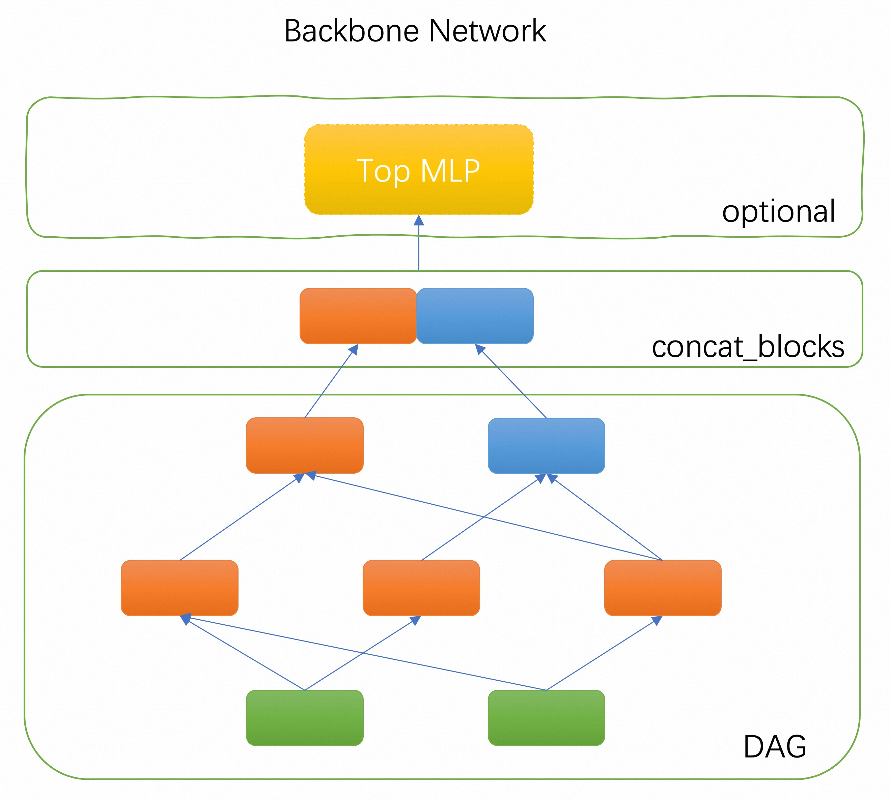
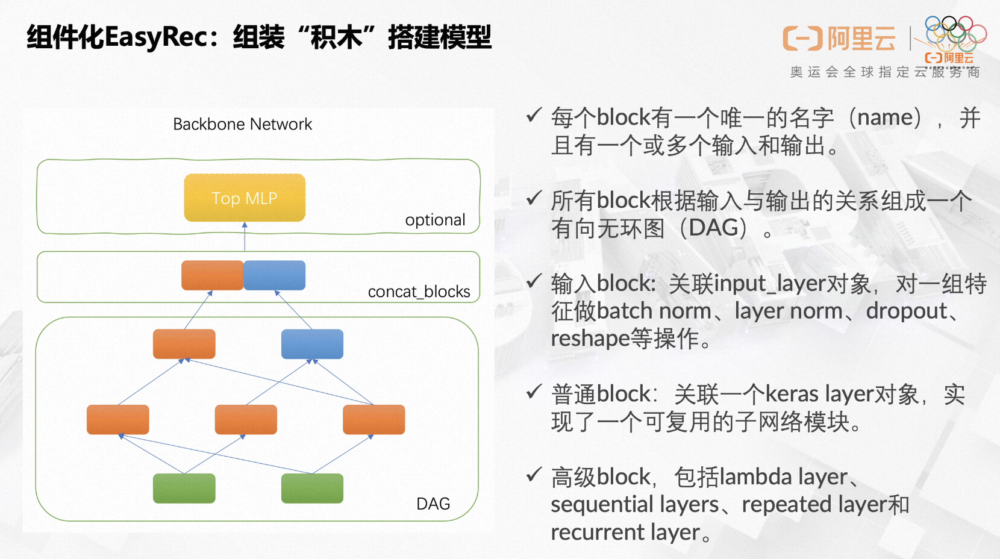
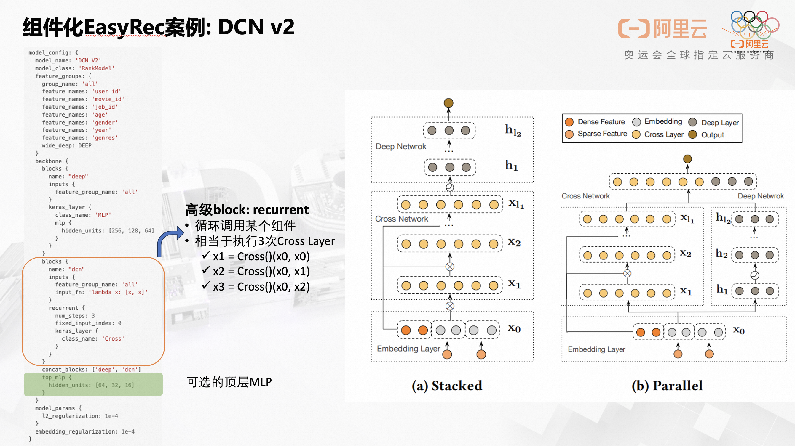
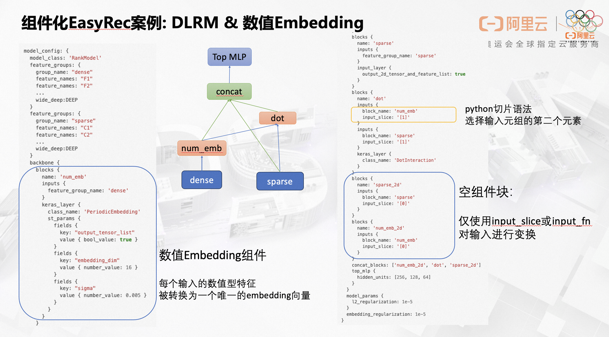

# 为何需要组件化

## 1. 灵活搭建模型，所思即所得

依靠动态可插拔的公共组件，以“搭积木”的方式快速构建想要的模型结构。框架提供了"胶水"语法，实现组件间的无缝衔接。

## 2. 实现组件复用，一次开发到处可用

很多模型之所以被称之为一个新的模型，是因为引入了一个或多个特殊的子模块（组件），然而这些子模块并不仅仅只能用在该模型中，通过组合各个不同的子模块可以轻易组装一个新的模型。

过去一个新开发的公共可选模块，比如`Dense Feature Embedding Layer`、 `SENet`添加到现有模型中，需要修改所有模型的代码才能用上新的特性，过程繁琐易出错。随着模型数量和公共模块数量的增加，为所有模型集成所有公共可选模块将产生组合爆炸的不可控局面。

组件化实现了底层公共模块与上层模型的解耦。

## 3. 提高实验迭代效率，好的想法值得快速验证

为已有模型添加新特性将变得十分方便。开发一个新的模型，只需要实现特殊的新模块，其余部分可以通过组件库中的已有组件拼装。

现在我们只需要为新的特征开发一个Keras Layer类，并在指定package中添加import语句，框架就能自动识别并添加到组件库中，不需要额外操作。新人不再需要熟悉EasyRec的方方面面就可以为框架添加功能，开发效率大大提高。

# 组件化的目标

```{hint} 目标
不再需要实现新的模型，只需要实现新的组件！ 模型通过组装组件完成。
```

各个组件专注自身功能的实现，模块中代码高度聚合，只负责一项任务，也就是常说的单一职责原则。

# 主干网络

组件化EasyRec模型使用一个可配置的主干网络作为核心部件。主干网络是由多个`组件块`组成的一个有向无环图（DAG），框架负责按照DAG的拓扑排序执行个`组件块`关联的代码逻辑，构建TF Graph的一个子图。DAG的输出节点由`concat_blocks`配置项定义，各输出`组件块`的输出tensor拼接之后输入给一个可选的顶部MLP层，或者直接链接到最终的预测层。




## 案例1. Wide&Deep 模型

配置文件：[wide_and_deep_backbone_on_movielens.config](https://github.com/alibaba/EasyRec/tree/master/examples/configs/wide_and_deep_backbone_on_movielens.config)

```protobuf
model_config: {
  model_name: "WideAndDeep"
  model_class: "RankModel"
  feature_groups: {
    group_name: 'wide'
    feature_names: 'user_id'
    feature_names: 'movie_id'
    feature_names: 'job_id'
    feature_names: 'age'
    feature_names: 'gender'
    feature_names: 'year'
    feature_names: 'genres'
    wide_deep: WIDE
  }
  feature_groups: {
    group_name: 'deep'
    feature_names: 'user_id'
    feature_names: 'movie_id'
    feature_names: 'job_id'
    feature_names: 'age'
    feature_names: 'gender'
    feature_names: 'year'
    feature_names: 'genres'
    wide_deep: DEEP
  }
  backbone {
    blocks {
      name: 'wide'
      inputs {
        feature_group_name: 'wide'
      }
      input_layer {
        only_output_feature_list: true
        wide_output_dim: 1
      }
    }
    blocks {
      name: 'deep_logit'
      inputs {
        feature_group_name: 'deep'
      }
      keras_layer {
        class_name: 'MLP'
        mlp {
          hidden_units: [256, 256, 256, 1]
          use_final_bn: false
          final_activation: 'linear'
        }
      }
    }
    blocks {
      name: 'final_logit'
      inputs {
        block_name: 'wide'
        input_fn: 'lambda x: tf.add_n(x)'
      }
      inputs {
        block_name: 'deep_logit'
      }
      merge_inputs_into_list: true
      keras_layer {
        class_name: 'Add'
      }
    }
    concat_blocks: 'final_logit'
  }
  model_params {
    l2_regularization: 1e-4
  }
  embedding_regularization: 1e-4
}
```

MovieLens-1M数据集效果对比：

| Model               | Epoch | AUC    |
| ------------------- | ----- | ------ |
| Wide&Deep           | 1     | 0.8558 |
| Wide&Deep(Backbone) | 1     | 0.8854 |

备注：通过组件化的方式搭建的模型效果比内置的模型效果更好是因为`MLP`组件有更好的初始化方法。

通过protobuf message `backbone` 来定义主干网络，主干网络有多个积木块（`block`）组成，每个`block`代表一个可复用的组件。

- 每个`block`有一个唯一的名字（name），并且有一个或多个输入和输出。
- 每个输入只能是某个`feature group`的name，或者另一个`block`的name，或者是一个`block package`的名字。当一个`block`有多个输入时，会自动执行merge操作（输入为list时自动合并，输入为tensor时自动concat）。
- 所有`block`根据输入与输出的关系组成一个有向无环图（DAG），框架自动解析出DAG的拓扑关系，按照拓扑排序执行块所关联的模块。
- 当`block`有多个输出时，返回一个python元组（tuple），下游`block`可以配置`input_slice`通过python切片语法获取到输入元组的某个元素作为输入，或者通过自定义的`input_fn`配置一个lambda表达式函数获取元组的某个值。
- 每个`block`关联的模块通常是一个keras layer对象，实现了一个可复用的子网络模块。框架支持加载自定义的keras layer，以及所有系统内置的keras layer。
- 可以为`block`关联一个`input_layer`对输入的`feature group`配置的特征做一些额外的加工，比如执行`batch normalization`、`layer normalization`、`feature dropout`等操作，并且可以指定输出的tensor的格式（2d、3d、list等）。注意：**当`block`关联的模块是`input_layer`时，必须设定feature_group_name为某个`feature group`的名字**,当`block`关联的模块不是`input_layer`时，block的name不可与某个`feature group`重名。
- 还有一些特殊的`block`关联了一个特殊的模块，包括`lambda layer`、`sequential layers`、`repeated layer`和`recurrent layer`。这些特殊layer分别实现了自定义表达式、顺序执行多个layer、重复执行某个layer、循环执行某个layer的功能。
- DAG的输出节点名由`concat_blocks`配置项指定，配置了多个输出节点时自动执行tensor的concat操作。
- 如果不配置`concat_blocks`，框架会自动拼接DAG的所有叶子节点并输出。
- 可以为主干网络配置一个可选的`MLP`模块。


## 案例2：DeepFM 模型

配置文件：[deepfm_backbone_on_movielens.config](https://github.com/alibaba/EasyRec/tree/master/examples/configs/deepfm_backbone_on_movielens.config)

这个Case重点关注下两个特殊的`block`，一个使用了`lambda`表达式配置了一个自定义函数；另一个的加载了一个内置的keras layer [`tf.keras.layers.Add`](https://keras.io/api/layers/merging_layers/add/)。

```protobuf
model_config: {
  model_name: 'DeepFM'
  model_class: 'RankModel'
  feature_groups: {
    group_name: 'wide'
    feature_names: 'user_id'
    feature_names: 'movie_id'
    feature_names: 'job_id'
    feature_names: 'age'
    feature_names: 'gender'
    feature_names: 'year'
    feature_names: 'genres'
    wide_deep: WIDE
  }
  feature_groups: {
    group_name: 'features'
    feature_names: 'user_id'
    feature_names: 'movie_id'
    feature_names: 'job_id'
    feature_names: 'age'
    feature_names: 'gender'
    feature_names: 'year'
    feature_names: 'genres'
    feature_names: 'title'
    wide_deep: DEEP
  }
  backbone {
    blocks {
      name: 'wide_logit'
      inputs {
        feature_group_name: 'wide'
      }
      input_layer {
        wide_output_dim: 1
      }
    }
    blocks {
      name: 'features'
      inputs {
        feature_group_name: 'features'
      }
      input_layer {
        output_2d_tensor_and_feature_list: true
      }
    }
    blocks {
      name: 'fm'
      inputs {
        block_name: 'features'
        input_slice: '[1]'
      }
      keras_layer {
        class_name: 'FM'
      }
    }
    blocks {
      name: 'deep'
      inputs {
        block_name: 'features'
        input_slice: '[0]'
      }
      keras_layer {
        class_name: 'MLP'
        mlp {
          hidden_units: [256, 128, 64, 1]
          use_final_bn: false
          final_activation: 'linear'
        }
      }
    }
    blocks {
      name: 'add'
      inputs {
        block_name: 'wide_logit'
        input_fn: 'lambda x: tf.reduce_sum(x, axis=1, keepdims=True)'
      }
      inputs {
        block_name: 'fm'
      }
      inputs {
        block_name: 'deep'
      }
      merge_inputs_into_list: true
      keras_layer {
        class_name: 'Add'
      }
    }
    concat_blocks: 'add'
  }
  model_params {
    l2_regularization: 1e-4
  }
  embedding_regularization: 1e-4
}
```

MovieLens-1M数据集效果对比：

| Model            | Epoch | AUC    |
| ---------------- | ----- | ------ |
| DeepFM           | 1     | 0.8867 |
| DeepFM(Backbone) | 1     | 0.8872 |

## 案例3：DCN 模型

配置文件：[dcn_backbone_on_movielens.config](https://github.com/alibaba/EasyRec/tree/master/examples/configs/dcn_backbone_on_movielens.config)

这个Case重点关注一个特殊的 DCN `block`，用了`recurrent layer`实现了循环调用某个模块多次的效果。通过该Case还是在DAG之上添加了MLP模块。

```protobuf
model_config: {
  model_name: 'DCN V2'
  model_class: 'RankModel'
  feature_groups: {
    group_name: 'all'
    feature_names: 'user_id'
    feature_names: 'movie_id'
    feature_names: 'job_id'
    feature_names: 'age'
    feature_names: 'gender'
    feature_names: 'year'
    feature_names: 'genres'
    wide_deep: DEEP
  }
  backbone {
    blocks {
      name: "deep"
      inputs {
        feature_group_name: 'all'
      }
      keras_layer {
        class_name: 'MLP'
        mlp {
          hidden_units: [256, 128, 64]
        }
      }
    }
    blocks {
      name: "dcn"
      inputs {
        feature_group_name: 'all'
        input_fn: 'lambda x: [x, x]'
      }
      recurrent {
        num_steps: 3
        fixed_input_index: 0
        keras_layer {
          class_name: 'Cross'
        }
      }
    }
    concat_blocks: ['deep', 'dcn']
    top_mlp {
      hidden_units: [64, 32, 16]
    }
  }
  model_params {
    l2_regularization: 1e-4
  }
  embedding_regularization: 1e-4
}
```

上述配置对`Cross` Layer循环调用了3次，逻辑上等价于执行如下语句：

```python
x1 = Cross()(x0, x0)
x2 = Cross()(x0, x1)
x3 = Cross()(x0, x2)
```

MovieLens-1M数据集效果对比：

| Model             | Epoch | AUC    |
| ----------------- | ----- | ------ |
| DCN （内置）          | 1     | 0.8576 |
| DCN_v2 （backbone） | 1     | 0.8770 |

备注：新实现的`Cross`组件对应了参数量更多的v2版本的DCN，而内置的DCN模型对应了v1版本的DCN。



## 案例4：DLRM 模型

配置文件：[dlrm_backbone_on_criteo.config](https://github.com/alibaba/EasyRec/tree/master/examples/configs/dlrm_backbone_on_criteo.config)

```protobuf
model_config: {
  model_name: 'DLRM'
  model_class: 'RankModel'
  feature_groups: {
    group_name: "dense"
    feature_names: "F1"
    feature_names: "F2"
    ...
    wide_deep:DEEP
  }
  feature_groups: {
    group_name: "sparse"
    feature_names: "C1"
    feature_names: "C2"
    feature_names: "C3"
    ...
    wide_deep:DEEP
  }
  backbone {
    blocks {
      name: 'bottom_mlp'
      inputs {
        feature_group_name: 'dense'
      }
      keras_layer {
        class_name: 'MLP'
        mlp {
          hidden_units: [64, 32, 16]
        }
      }
    }
    blocks {
      name: 'sparse'
      inputs {
        feature_group_name: 'sparse'
      }
      input_layer {
        output_2d_tensor_and_feature_list: true
      }
    }
    blocks {
      name: 'dot'
      inputs {
        block_name: 'bottom_mlp'
      }
      inputs {
        block_name: 'sparse'
        input_slice: '[1]'
      }
      keras_layer {
        class_name: 'DotInteraction'
      }
    }
    blocks {
      name: 'sparse_2d'
      inputs {
        block_name: 'sparse'
        input_slice: '[0]'
      }
    }
    concat_blocks: ['sparse_2d', 'dot']
    top_mlp {
      hidden_units: [256, 128, 64]
    }
  }
  model_params {
    l2_regularization: 1e-5
  }
  embedding_regularization: 1e-5
}
```

Criteo数据集效果对比：

| Model           | Epoch | AUC     |
| --------------- | ----- | ------- |
| DLRM            | 1     | 0.79785 |
| DLRM (backbone) | 1     | 0.7993  |

备注：`DotInteraction` 是新开发的特征两两交叉做内积运算的模块。

这个案例中'dot' block的第一个输入是一个tensor，第二个输入是一个list，这种情况下第一个输入会插入到list中，合并成一个更大的list，作为block的输入。

## 案例5：为 DLRM 模型添加一个新的数值特征Embedding组件

配置文件：[dlrm_on_criteo_with_periodic.config](https://github.com/alibaba/EasyRec/tree/master/examples/configs/dlrm_on_criteo_with_periodic.config)

与上一个案例相比，多了一个`PeriodicEmbedding` Layer，组件化编程的**灵活性与可扩展性**由此可见一斑。

重点关注一下`PeriodicEmbedding` Layer的参数配置方式，这里并没有使用自定义protobuf message的传参方式，而是采用了内置的`google.protobuf.Struct`对象作为自定义Layer的参数。实际上，该自定义Layer也支持通过自定义message传参。框架提供了一个通用的`Parameter` API 用通用的方式处理两种传参方式。

```protobuf
model_config: {
  model_class: 'RankModel'
  feature_groups: {
    group_name: "dense"
    feature_names: "F1"
    feature_names: "F2"
    ...
    wide_deep:DEEP
  }
  feature_groups: {
    group_name: "sparse"
    feature_names: "C1"
    feature_names: "C2"
    ...
    wide_deep:DEEP
  }
  backbone {
    blocks {
      name: 'num_emb'
      inputs {
        feature_group_name: 'dense'
      }
      keras_layer {
        class_name: 'PeriodicEmbedding'
        st_params {
          fields {
            key: "output_tensor_list"
            value { bool_value: true }
          }
          fields {
            key: "embedding_dim"
            value { number_value: 16 }
          }
          fields {
            key: "sigma"
            value { number_value: 0.005 }
          }
        }
      }
    }
    blocks {
      name: 'sparse'
      inputs {
        feature_group_name: 'sparse'
      }
      input_layer {
        output_2d_tensor_and_feature_list: true
      }
    }
    blocks {
      name: 'dot'
      inputs {
        block_name: 'num_emb'
        input_slice: '[1]'
      }
      inputs {
        block_name: 'sparse'
        input_slice: '[1]'
      }
      keras_layer {
        class_name: 'DotInteraction'
      }
    }
    blocks {
      name: 'sparse_2d'
      inputs {
        block_name: 'sparse'
        input_slice: '[0]'
      }
    }
    blocks {
      name: 'num_emb_2d'
      inputs {
        block_name: 'num_emb'
        input_slice: '[0]'
      }
    }
    concat_blocks: ['num_emb_2d', 'dot', 'sparse_2d']
    top_mlp {
      hidden_units: [256, 128, 64]
    }
  }
  model_params {
    l2_regularization: 1e-5
  }
  embedding_regularization: 1e-5
}
```



Criteo数据集效果对比：

| Model           | Epoch | AUC     |
| --------------- | ----- | ------- |
| DLRM            | 1     | 0.79785 |
| DLRM (backbone) | 1     | 0.7993  |
| DLRM (periodic) | 1     | 0.7998  |

## 案例6：使用内置的keras layer搭建DNN模型

配置文件：[mlp_on_movielens.config](https://github.com/alibaba/EasyRec/tree/master/examples/configs/mlp_on_movielens.config)

该案例只为了演示可以组件化EasyRec可以使用TF内置的原子粒度keras layer作为通用组件，实际上我们已经有了一个自定义的MLP组件，使用会更加方便。

该案例重点关注一个特殊的`sequential block`，这个组件块内可以定义多个串联在一起的layers，前一个layer的输出作为后一个layer的输入。相比定义多个普通`block`的方式，`sequential block`会更加方便。

备注：调用系统内置的keras layer，自能通过`google.proto.Struct`的格式传参。

```protobuf
model_config: {
  model_class: "RankModel"
  feature_groups: {
    group_name: 'features'
    feature_names: 'user_id'
    feature_names: 'movie_id'
    feature_names: 'job_id'
    feature_names: 'age'
    feature_names: 'gender'
    feature_names: 'year'
    feature_names: 'genres'
    wide_deep: DEEP
  }
  backbone {
    blocks {
      name: 'mlp'
      inputs {
        feature_group_name: 'features'
      }
      layers {
        keras_layer {
          class_name: 'Dense'
          st_params {
            fields {
              key: 'units'
              value: { number_value: 256 }
            }
            fields {
              key: 'activation'
              value: { string_value: 'relu' }
            }
          }
        }
      }
      layers {
        keras_layer {
          class_name: 'Dropout'
          st_params {
            fields {
              key: 'rate'
              value: { number_value: 0.5 }
            }
          }
        }
      }
      layers {
        keras_layer {
          class_name: 'Dense'
          st_params {
            fields {
              key: 'units'
              value: { number_value: 256 }
            }
            fields {
              key: 'activation'
              value: { string_value: 'relu' }
            }
          }
        }
      }
      layers {
        keras_layer {
          class_name: 'Dropout'
          st_params {
            fields {
              key: 'rate'
              value: { number_value: 0.5 }
            }
          }
        }
      }
      layers {
        keras_layer {
          class_name: 'Dense'
          st_params {
            fields {
              key: 'units'
              value: { number_value: 1 }
            }
          }
        }
      }
    }
    concat_blocks: 'mlp'
  }
  model_params {
    l2_regularization: 1e-4
  }
  embedding_regularization: 1e-4
}
```

MovieLens-1M数据集效果：

| Model | Epoch | AUC    |
| ----- | ----- | ------ |
| MLP   | 1     | 0.8616 |

## 案例7：对比学习（使用组件包）

配置文件：[contrastive_learning_on_movielens.config](https://github.com/alibaba/EasyRec/tree/master/examples/configs/contrastive_learning_on_movielens.config)

该案例为了演示`block package`的使用，`block package`可以打包一组`block`，构成一个可被复用的子网络，即被打包的子网络以共享参数的方式在同一个模型中调用多次。与之相反，没有打包的`block`是不能被多次调用的（但是可以多次复用结果）。

`block package`主要为自监督学习、对比学习等场景设计。

```protobuf
model_config: {
  model_name: "ContrastiveLearning"
  model_class: "RankModel"
  feature_groups: {
    group_name: 'user'
    feature_names: 'user_id'
    feature_names: 'job_id'
    feature_names: 'age'
    feature_names: 'gender'
    wide_deep: DEEP
  }
  feature_groups: {
    group_name: 'item'
    feature_names: 'movie_id'
    feature_names: 'year'
    feature_names: 'genres'
    wide_deep: DEEP
  }
  backbone {
    blocks {
      name: 'user_tower'
      inputs {
        feature_group_name: 'user'
      }
      keras_layer {
        class_name: 'MLP'
        mlp {
          hidden_units: [256, 128]
        }
      }
    }
    packages {
      name: 'item_tower'
      blocks {
        name: 'item'
        inputs {
          feature_group_name: 'item'
        }
        input_layer {
          dropout_rate: 0.2
        }
      }
      blocks {
        name: 'item_encoder'
        inputs {
          block_name: 'item'
        }
        keras_layer {
          class_name: 'MLP'
          mlp {
            hidden_units: [256, 128]
          }
        }
      }
    }
    blocks {
      name: 'contrastive_learning'
      inputs {
        package_name: 'item_tower'
      }
      inputs {
        package_name: 'item_tower'
      }
      merge_inputs_into_list: true
      keras_layer {
        class_name: 'AuxiliaryLoss'
        st_params {
          fields {
            key: 'loss_type'
            value: { string_value: 'info_nce' }
          }
          fields {
            key: 'loss_weight'
            value: { number_value: 0.1 }
          }
          fields {
            key: 'temperature'
            value: { number_value: 0.2 }
          }
        }
      }
    }
    blocks {
      name: 'top_mlp'
      inputs {
        block_name: 'contrastive_learning'
        ignore_input: true
      }
      inputs {
        block_name: 'user_tower'
      }
      inputs {
        package_name: 'item_tower'
        reset_input {}
      }
      keras_layer {
        class_name: 'MLP'
        mlp {
          hidden_units: [128, 64]
        }
      }
    }
    concat_blocks: 'top_mlp'
  }
  model_params {
    l2_regularization: 1e-4
  }
  embedding_regularization: 1e-4
}
```

`AuxiliaryLoss`是用来计算对比学习损失的layer，详见'[组件详细参数](component.md#id7)'。

额外的input配置:

- ignore_input: true 表示忽略当前这路的输入；添加该路输入只是为了控制拓扑结构的执行顺序
- reset_input: 重置本次`package`调用时input_layer的配置项；可以配置与`package`定义时不同的参数

注意这个案例没有为名为`item_tower`的package配置`concat_blocks`，框架会自动设置为DAG的叶子节点。

在当前案例中，`item_tower`被调用了3次，前2次调用时输入层dropout配置生效，用于计算对比学习损失函数；最后1次调用时重置了输入层配置，不执行dropout。
主模型的`item_tower`与对比学习辅助任务中的`item_tower`共享参数；辅助任务中的`item_tower`通过对输入特征embedding做dropout来生成augmented sample；主模型的`item_tower`不执行数据增强操作。

MovieLens-1M数据集效果：

| Model               | Epoch | AUC    |
| ------------------- | ----- | ------ |
| MultiTower          | 1     | 0.8814 |
| ContrastiveLearning | 1     | 0.8728 |

一个更复杂一点的对比学习模型案例：[CL4SRec](../models/cl4srec.md)

## 案例8：多目标模型 MMoE

多目标模型的model_class一般配置为"MultiTaskModel"，并且需要在`model_params`里配置多个目标对应的Tower。`model_name`为任意自定义字符串，仅有注释作用。

```protobuf
model_config {
  model_name: "MMoE"
  model_class: "MultiTaskModel"
  feature_groups {
    group_name: "all"
    feature_names: "user_id"
    feature_names: "cms_segid"
    ...
    feature_names: "tag_brand_list"
    wide_deep: DEEP
  }
  backbone {
    blocks {
      name: 'all'
      inputs {
        feature_group_name: 'all'
      }
      input_layer {
        only_output_feature_list: true
      }
    }
    blocks {
      name: "senet"
      inputs {
        block_name: "all"
      }
      keras_layer {
        class_name: 'SENet'
        senet {
          reduction_ratio: 4
        }
      }
    }
    blocks {
      name: "mmoe"
      inputs {
        block_name: "senet"
      }
      keras_layer {
        class_name: 'MMoE'
        mmoe {
          num_task: 2
          num_expert: 3
          expert_mlp {
            hidden_units: [256, 128]
          }
        }
      }
    }
  }
  model_params {
    task_towers {
      tower_name: "ctr"
      label_name: "clk"
      dnn {
        hidden_units: [128, 64]
      }
      num_class: 1
      weight: 1.0
      loss_type: CLASSIFICATION
      metrics_set: {
       auc {}
      }
    }
    task_towers {
      tower_name: "cvr"
      label_name: "buy"
      dnn {
        hidden_units: [128, 64]
      }
      num_class: 1
      weight: 1.0
      loss_type: CLASSIFICATION
      metrics_set: {
       auc {}
      }
    }
    l2_regularization: 1e-06
  }
  embedding_regularization: 5e-05
}
```

注意这个案例没有为backbone配置`concat_blocks`，框架会自动设置为DAG的叶子节点。

## 案例9：多目标模型 DBMTL

多目标模型的model_class一般配置为"MultiTaskModel"，并且需要在`model_params`里配置多个目标对应的Tower。`model_name`为任意自定义字符串，仅有注释作用。

```protobuf
model_config {
  model_name: "DBMTL"
  model_class: "MultiTaskModel"
  feature_groups {
    group_name: "all"
    feature_names: "user_id"
    feature_names: "cms_segid"
    ...
    feature_names: "tag_brand_list"
    wide_deep: DEEP
  }
  backbone {
    blocks {
      name: "mask_net"
      inputs {
        feature_group_name: "all"
      }
      keras_layer {
        class_name: 'MaskNet'
        masknet {
          mask_blocks {
            aggregation_size: 512
            output_size: 256
          }
          mask_blocks {
            aggregation_size: 512
            output_size: 256
          }
          mask_blocks {
            aggregation_size: 512
            output_size: 256
          }
          mlp {
            hidden_units: [512, 256]
          }
        }
      }
    }
  }
  model_params {
    task_towers {
      tower_name: "ctr"
      label_name: "clk"
      loss_type: CLASSIFICATION
      metrics_set: {
        auc {}
      }
      dnn {
        hidden_units: [256, 128, 64]
      }
      relation_dnn {
        hidden_units: [32]
      }
      weight: 1.0
    }
    task_towers {
      tower_name: "cvr"
      label_name: "buy"
      loss_type: CLASSIFICATION
      metrics_set: {
        auc {}
      }
      dnn {
        hidden_units: [256, 128, 64]
      }
      relation_tower_names: ["ctr"]
      relation_dnn {
        hidden_units: [32]
      }
      weight: 1.0
    }
    l2_regularization: 1e-6
  }
  embedding_regularization: 5e-6
}
```

DBMTL模型需要在`model_params`里为每个子任务的Tower配置`relation_dnn`，同时还需要通`relation_tower_names`配置任务间的依赖关系。

这个案例同样没有为backbone配置`concat_blocks`，框架会自动设置为DAG的叶子节点。

## 案例10：MaskNet + PPNet + MMoE

```protobuf
model_config: {
  model_name: 'MaskNet + PPNet + MMoE'
  model_class: "MultiTaskModel"
  feature_groups: {
    group_name: 'memorize'
    feature_names: 'user_id'
    feature_names: 'adgroup_id'
    feature_names: 'pid'
    wide_deep: DEEP
  }
  feature_groups: {
    group_name: 'general'
    feature_names: 'age_level'
    feature_names: 'shopping_level'
    ...
    wide_deep: DEEP
  }
  backbone {
    blocks {
      name: "mask_net"
      inputs {
        feature_group_name: "general"
        input_fn: "lambda x: [x, x]"
      }
      repeat {
        num_repeat: 3
        keras_layer {
          class_name: "MaskBlock"
          mask_block {
            output_size: 512
            aggregation_size: 1024
          }
        }
      }
    }
    blocks {
      name: "ppnet"
      inputs {
        block_name: "mask_net"
      }
      inputs {
        feature_group_name: "memorize"
      }
      merge_inputs_into_list: true
      repeat {
        num_repeat: 3
        input_fn: "lambda x, i: [x[0][i], x[1]]"
        keras_layer {
          class_name: "PPNet"
          ppnet {
            mlp {
              hidden_units: [256, 128, 64]
            }
            gate_params {
              output_dim: 512
            }
            mode: "eager"
            full_gate_input: false
          }
        }
      }
    }
    blocks {
      name: "mmoe"
      inputs {
        block_name: "ppnet"
      }
      inputs {
        feature_group_name: "general"
      }
      keras_layer {
        class_name: "MMoE"
        mmoe {
          num_task: 2
          num_expert: 3
        }
      }
    }
  }
  model_params {
    l2_regularization: 0.0
    task_towers {
      tower_name: "ctr"
      label_name: "is_click"
      metrics_set {
        auc {
          num_thresholds: 20000
        }
      }
      loss_type: CLASSIFICATION
      num_class: 1
      dnn {
        hidden_units: 64
        hidden_units: 32
      }
      weight: 1.0
    }
    task_towers {
      tower_name: "cvr"
      label_name: "is_train"
      metrics_set {
        auc {
          num_thresholds: 20000
        }
      }
      loss_type: CLASSIFICATION
      num_class: 1
      dnn {
        hidden_units: 64
        hidden_units: 32
      }
      weight: 1.0
    }
  }
}
```

该案例体现了如何应用[重复组件块](#id21)。

## 更多案例

两个新的模型：

- FiBiNet模型配置文件：[fibinet_on_movielens.config](https://github.com/alibaba/EasyRec/tree/master/examples/configs/fibinet_on_movielens.config)
- MaskNet模型配置文件：[masknet_on_movielens.config](https://github.com/alibaba/EasyRec/tree/master/examples/configs/masknet_on_movielens.config)

MovieLens-1M数据集效果：

| Model   | Epoch | AUC    |
| ------- | ----- | ------ |
| MaskNet | 1     | 0.8872 |
| FibiNet | 1     | 0.8893 |

序列模型：

- DIN模型配置文件：[DIN_backbone.config](https://github.com/alibaba/EasyRec/blob/master/samples/model_config/din_backbone_on_taobao.config)
- BST模型配置文件：[BST_backbone.config](https://github.com/alibaba/EasyRec/blob/master/samples/model_config/bst_backbone_on_taobao.config)
- CL4SRec模型：[CL4SRec](../models/cl4srec.md)

其他模型：

- Highway Network: [highway network](../models/highway.md)
- Cross Decoupling Network: [CDN](../models/cdn.md)
- DLRM+SENet: [dlrm_senet_on_criteo.config](https://github.com/alibaba/EasyRec/tree/master/examples/configs/dlrm_senet_on_criteo.config)

# 组件库介绍

## 1.基础组件

| 类名                | 功能     | 说明                              | 示例                                                                                                                                       |
| ----------------- | ------ | ------------------------------- | ---------------------------------------------------------------------------------------------------------------------------------------- |
| MLP               | 多层感知机  | 可定制激活函数、initializer、Dropout、BN等 | [案例1](#wide-deep)                                                                                                                        |
| Highway           | 类似残差链接 | 可用来对预训练embedding做增量微调           | [highway network](../models/highway.html)                                                                                                |
| Gate              | 门控     | 多个输入的加权求和                       | [Cross Decoupling Network](../models/cdn.html#id2)                                                                                       |
| PeriodicEmbedding | 周期激活函数 | 数值特征Embedding                   | [案例5](#dlrm-embedding)                                                                                                                   |
| AutoDisEmbedding  | 自动离散化  | 数值特征Embedding                   | [dlrm_on_criteo_with_autodis.config](https://github.com/alibaba/EasyRec/tree/master/examples/configs/dlrm_on_criteo_with_autodis.config) |
| TextCNN           | 文本卷积   | 提取文本序列的特征                       | [text_cnn_on_movielens.config](https://github.com/alibaba/EasyRec/tree/master/examples/configs/text_cnn_on_movielens.config)             |

**备注**：Gate组件的第一个输入是权重向量，后面的输入拼凑成一个列表，权重向量的长度应等于列表的长度

## 2.特征交叉组件

| 类名             | 功能                    | 说明               | 示例                                                                                                                         |
| -------------- | --------------------- | ---------------- | -------------------------------------------------------------------------------------------------------------------------- |
| FM             | 二阶交叉                  | DeepFM模型的组件      | [案例2](#deepfm)                                                                                                             |
| DotInteraction | 二阶内积交叉                | DLRM模型的组件        | [案例4](#dlrm)                                                                                                               |
| Cross          | bit-wise交叉            | DCN v2模型的组件      | [案例3](#dcn)                                                                                                                |
| BiLinear       | 双线性                   | FiBiNet模型的组件     | [fibinet_on_movielens.config](https://github.com/alibaba/EasyRec/tree/master/examples/configs/fibinet_on_movielens.config) |
| FiBiNet        | SENet & BiLinear      | FiBiNet模型        | [fibinet_on_movielens.config](https://github.com/alibaba/EasyRec/tree/master/examples/configs/fibinet_on_movielens.config) |
| Attention      | Dot-product attention | Transformer模型的组件 |                                                                                                                            |

## 3.特征重要度学习组件

| 类名        | 功能                | 说明           | 示例                                                    |
| --------- | ----------------- | ------------ | ----------------------------------------------------- |
| SENet     | 建模特征重要度           | FiBiNet模型的组件 | [MMoE](../models/mmoe.html#id4)                       |
| MaskBlock | 建模特征重要度           | MaskNet模型的组件 | [Cross Decoupling Network](../models/cdn.html#id2)    |
| MaskNet   | 多个串行或并行的MaskBlock | MaskNet模型    | [DBMTL](../models/dbmtl.html#dbmtl-based-on-backbone) |
| PPNet     | 参数个性化网络           | PPNet模型      | [PPNet](../models/ppnet.html#id2)                     |

## 4. 序列特征编码组件

| 类名         | 功能               | 说明                  | 示例                                                                                                                       |
| ---------- | ---------------- | ------------------- | ------------------------------------------------------------------------------------------------------------------------ |
| DIN        | target attention | DIN模型的组件            | [DIN_backbone.config](https://github.com/alibaba/EasyRec/blob/master/samples/model_config/din_backbone_on_taobao.config) |
| BST        | transformer      | BST模型的组件            | [BST_backbone.config](https://github.com/alibaba/EasyRec/blob/master/samples/model_config/bst_backbone_on_taobao.config) |
| SeqAugment | 序列数据增强           | crop, mask, reorder | [CL4SRec](../models/cl4srec.html#id2)                                                                                    |

## 5. 多目标学习组件

| 类名   | 功能                          | 说明        | 示例           |
| ---- | --------------------------- | --------- | ------------ |
| MMoE | Multiple Mixture of Experts | MMoE模型的组件 | [案例8](#mmoe) |

## 6. 辅助损失函数组件

| 类名            | 功能         | 说明        | 示例          |
| ------------- | ---------- | --------- | ----------- |
| AuxiliaryLoss | 用来计算辅助损失函数 | 常用在自监督学习中 | [案例7](#id7) |

各组件的详细参数请查看"[组件详细参数](component.md)"。

# 如何自定义组件

在 `easy_rec/python/layers/keras` 目录下新建一个`py`文件，也可直接添加到一个已有的文件中。我们建议目标类似的组件定义在同一个文件中，减少文件数量；比如特征交叉的组件都放在`interaction.py`里。

定义一个继承[`tf.keras.layers.Layer`](https://keras.io/api/layers/base_layer/)的组件类，至少实现两个方法：`__init__`、`call`。

```python
def __init__(self, params, name='xxx', reuse=None, **kwargs):
  pass
def call(self, inputs, training=None, **kwargs):
  pass
```

`__init__`方法的第一个参数`params`接受框架传递给当前组件的参数。支持两种参数配置的方式：`google.protobuf.Struct`、自定义的protobuf message对象。params对象封装了对这两种格式的参数的统一读取接口，如下：

- 检查必传参数，缺失时报错退出：
  `params.check_required(['embedding_dim', 'sigma'])`
- 用点操作符读取参数：
  `sigma = params.sigma`；支持连续点操作符，如`params.a.b`：
- 注意数值型参数的类型，`Struct`只支持float类型，整型需要强制转换：
  `embedding_dim = int(params.embedding_dim)`
- 数组类型也需要强制类型转换: `units = list(params.hidden_units)`
- 指定默认值读取，返回值会被强制转换为与默认值同类型：`activation = params.get_or_default('activation', 'relu')`
- 支持嵌套子结构的默认值读取：`params.field.get_or_default('key', def_val)`
- 判断某个参数是否存在：`params.has_field(key)`
- 【不建议，会限定传参方式】获取自定义的proto对象：`params.get_pb_config()`
- 读写`l2_regularizer`属性：`params.l2_regularizer`，传给Dense层或dense函数。

【可选】如需要自定义protobuf message参数，先在`easy_rec/python/protos/layer.proto`添加参数message的定义，
再把参数注册到定义在`easy_rec/python/protos/keras_layer.proto`的`KerasLayer.params`消息体中。

`__init__`方法的`reuse`参数表示该Layer对象的权重参数是否需要被复用。
开发时需要按照可复用的逻辑来实现Layer对象，推荐严格按照keras layer的规范来实现。
推荐在`__init__`方法中声明需要依赖的keras layer对象；
**非常不建议使用`tf.layers.*`函数，因为可能会在使用`DistributeStrategy`时出错**，如一定要用需要传递reuse参数。

```{tips}
提示：实现Layer对象时尽量使用原生的 tf.keras.layers.* 对象，且全部在 __init__ 方法中预先声明好。
```

`call`方法用来实现主要的模块逻辑，其`inputs`参数可以是一个tenor，或者是一个tensor列表。可选的`training`参数用来标识当前是否是训练模型。

最后也是最重要的一点，新开发的Layer需要在`easy_rec.python.layers.keras.__init__.py`文件中导出才能被框架识别为组件库中的一员。例如要导出`blocks.py`文件中的`MLP`类，则需要添加：`from .blocks import MLP`。

FM layer的代码示例：

```python
class FM(tf.keras.layers.Layer):
  """Factorization Machine models pairwise (order-2) feature interactions without linear term and bias.

  References
    - [Factorization Machines](https://www.csie.ntu.edu.tw/~b97053/paper/Rendle2010FM.pdf)
  Input shape.
    - List of 2D tensor with shape: ``(batch_size,embedding_size)``.
    - Or a 3D tensor with shape: ``(batch_size,field_size,embedding_size)``
  Output shape
    - 2D tensor with shape: ``(batch_size, 1)``.
  """

  def __init__(self, params, name='fm', reuse=None, **kwargs):
    super(FM, self).__init__(name, **kwargs)
    self.reuse = reuse
    self.use_variant = params.get_or_default('use_variant', False)

  def call(self, inputs, **kwargs):
    if type(inputs) == list:
      emb_dims = set(map(lambda x: int(x.shape[-1]), inputs))
      if len(emb_dims) != 1:
        dims = ','.join([str(d) for d in emb_dims])
        raise ValueError('all embedding dim must be equal in FM layer:' + dims)
      with tf.name_scope(self.name):
        fea = tf.stack(inputs, axis=1)
    else:
      assert inputs.shape.ndims == 3, 'input of FM layer must be a 3D tensor or a list of 2D tensors'
      fea = inputs

    with tf.name_scope(self.name):
      square_of_sum = tf.square(tf.reduce_sum(fea, axis=1))
      sum_of_square = tf.reduce_sum(tf.square(fea), axis=1)
      cross_term = tf.subtract(square_of_sum, sum_of_square)
      if self.use_variant:
        cross_term = 0.5 * cross_term
      else:
        cross_term = 0.5 * tf.reduce_sum(cross_term, axis=-1, keepdims=True)
    return cross_term
```

# 如何搭建模型

`组件块`和`组件包`是搭建主干网络的核心部件，本小节将会介绍`组件块`的类型、功能和配置参数；同时还会介绍专门为参数共享子网络设计的`组件包`。

通过`组件块`和`组件包`搭建模型的配置方法请参考上文描述的各个 [案例](#wide-deep)。

`组件块`的protobuf定义如下：

```protobuf
message Block {
    required string name = 1;
    // the input names of feature groups or other blocks
    repeated Input inputs = 2;
    optional int32 input_concat_axis = 3 [default = -1];
    optional bool merge_inputs_into_list = 4;
    optional string extra_input_fn = 5;

    // sequential layers
    repeated Layer layers = 6;
    // only take effect when there are no layers
    oneof layer {
        InputLayer input_layer = 101;
        Lambda lambda = 102;
        KerasLayer keras_layer = 103;
        RecurrentLayer recurrent = 104;
        RepeatLayer repeat = 105;
    }
}
```

`组件块`会自动合并多个输入：

1. 若多路输入中某一路的输入类型是`list`，则最终结果被Merge成一个大的list，保持顺序不变；
1. 若多路输入中的每一路输入都是tensor，默认是执行输入tensors按照最后一个维度做拼接(concat)，以下配置项可以改变默认行为：

- `input_concat_axis` 用来指定输入tensors拼接的维度
- `merge_inputs_into_list` 设为true，则把输入合并到一个列表里，不做concat操作

```protobuf
message Input {
    oneof name {
        string feature_group_name = 1;
        string block_name = 2;
        string package_name = 3;
    }
    optional string input_fn = 11;
    optional string input_slice = 12;
}
```

- 每一路输入可以配置一个可选的`input_fn`，指定一个lambda函数对输入做一些简单的变换。比如配置`input_fn: 'lambda x: [x]'`可以把输入变成列表格式。
- `input_slice`可以用来获取输入元组/列表的某个切片。比如，当某路输入是一个列表对象是，可以用`input_slice: '[1]'`配置项获取列表的第二个元素值作为这一路的输入。
- `extra_input_fn` 是一个可选的配置项，用来对合并后的多路输入结果做一些额外的变换，需要配置成lambda函数的格式。

目前总共有7种类型的`组件块`，分别是`空组件块`、`输入组件块`、`Lambda组件块`、`KerasLayer组件块`、`循环组件块`、`重复组件块`、`序列组件块`。

## 1. 空组件块

当一个`block`不配置任何layer时就称之为`空组件块`，`空组件块`只执行多路输入的Merge操作。

## 2. 输入组件块

`输入组件块`关联一个`input_layer`，获取、加工并返回原始的特征输入。

`输入组件块`比较特殊，它只能有且只有一路输入，并且只能用`feature_group_name`项配置输入为一个`feature_group`的`name`。

`输入组件块`有一个特权：它的名字可以与其输入的`feature_group`同名。其他`组件块`则无此殊荣。

配置示例：

```protobuf
blocks {
  name: 'all'
  inputs {
    feature_group_name: 'all'
  }
  input_layer {
    only_output_feature_list: true
  }
}
```

InputLayer可以通过配置获取不同格式的输入，并且可以执行一下如`dropout`之类的额外操作，其参数定义的protobuf如下：

```protobuf
message InputLayer {
    optional bool do_batch_norm = 1;
    optional bool do_layer_norm = 2;
    optional float dropout_rate = 3;
    optional float feature_dropout_rate = 4;
    optional bool only_output_feature_list = 5;
    optional bool only_output_3d_tensor = 6;
    optional bool output_2d_tensor_and_feature_list = 7;
    optional bool output_seq_and_normal_feature = 8;
}
```

输入层的定义如上，配置下说明如下：

- `do_batch_norm` 是否对输入特征做`batch normalization`
- `do_layer_norm` 是否对输入特征做`layer normalization`
- `dropout_rate` 输入层执行dropout的概率，默认不执行dropout
- `feature_dropout_rate` 对特征整体执行dropout的概率，默认不执行
- `only_output_feature_list` 输出list格式的各个特征
- `only_output_3d_tensor` 输出`feature group`对应的一个3d tensor，在`embedding_dim`相同时可配置该项
- `output_2d_tensor_and_feature_list` 是否同时输出2d tensor与特征list
- `output_seq_and_normal_feature` 是否输出(sequence特征, 常规特征）元组

## 3. Lambda组件块

`Lambda组件块`可以配置一个lambda函数，执行一些较简单的操作。示例如下：

```protobuf
blocks {
  name: 'wide_logit'
  inputs {
    feature_group_name: 'wide'
  }
  lambda {
    expression: 'lambda x: tf.reduce_sum(x, axis=1, keepdims=True)'
  }
}
```

## 4. KerasLayer组件块

`KerasLayer组件块`是最核心的组件块，负责加载、执行组件代码逻辑。

- `class_name`是要加载的Keras Layer的类名，支持加载自定义的类和系统内置的Layer类。
- `st_params`是以`google.protobuf.Struct`对象格式配置的参数；
- 还可以用自定义的protobuf message的格式传递参数给加载的Layer对象。

配置示例：

```protobuf
keras_layer {
  class_name: 'MLP'
  mlp {
    hidden_units: [64, 32, 16]
  }
}

keras_layer {
  class_name: 'Dropout'
  st_params {
    fields {
      key: 'rate'
      value: { number_value: 0.5 }
    }
  }
}
```

## 5. 循环组件块

`循环组件块`可以实现类似RNN的循环调用结构，可以执行某个Layer多次，每次执行的输入包含了上一次执行的输出。在[DCN](https://github.com/alibaba/EasyRec/tree/master/examples/configs/dcn_backbone_on_movielens.config)网络中有循环组件块的示例，如下：

```protobuf
recurrent {
  num_steps: 3
  fixed_input_index: 0
  keras_layer {
    class_name: 'Cross'
  }
}
```

上述配置对`Cross` Layer循环调用了3次，逻辑上等价于执行如下语句：

```python
x1 = Cross()(x0, x0)
x2 = Cross()(x0, x1)
x3 = Cross()(x0, x2)
```

- `num_steps` 配置循环执行的次数
- `fixed_input_index` 配置每次执行的多路输入组成的列表中固定不变的元素；比如上述示例中的`x0`
- `keras_layer` 配置需要执行的组件

## 6. 重复组件块

`重复组件块` 可以使用相同的输入重复执行某个组件多次，实现`multi-head`的逻辑。示例如下：

```protobuf
repeat {
  num_repeat: 2
  keras_layer {
    class_name: "MaskBlock"
    mask_block {
      output_size: 512
      aggregation_size: 2048
      input_layer_norm: false
    }
  }
}
```

- `num_repeat` 配置重复执行的次数
- `output_concat_axis` 配置多次执行结果tensors的拼接维度，若不配置则输出多次执行结果的列表
- `keras_layer` 配置需要执行的组件
- `input_slice` 配置每个执行组件的输入切片，例如`[i]`获取输入列表的第 i 个元素作为第 i 次重复执行时的输入；不配置时获取所有输入
- `input_fn` 配置每个执行组件的输入函数，例如`input_fn: "lambda x, i: [x[0][i], x[1]]"`

`重复组件块` 的使用案例[MaskNet+PPNet+MMoE](#masknet-ppnet-mmoe)。

## 7. 序列组件块

`序列组件块`可以依次执行配置的多个Layer，前一个Layer的输出是后一个Layer的输入。`序列组件块`相对于配置多个首尾相连的普通组件块要更加简单。示例如下：

```protobuf
blocks {
  name: 'mlp'
  inputs {
    feature_group_name: 'features'
  }
  layers {
    keras_layer {
      class_name: 'Dense'
      st_params {
        fields {
          key: 'units'
          value: { number_value: 256 }
        }

        fields {
          key: 'activation'
          value: { string_value: 'relu' }
        }
      }
    }
  }
  layers {
    keras_layer {
      class_name: 'Dropout'
      st_params {
        fields {
          key: 'rate'
          value: { number_value: 0.5 }
        }
      }
    }
  }
  layers {
    keras_layer {
      class_name: 'Dense'
      st_params {
        fields {
          key: 'units'
          value: { number_value: 1 }
        }
      }
    }
  }
}
```

## 通过`组件包`实现参数共享的子网络

`组件包`封装了由多个`组件块`搭建的一个子网络DAG，作为整体可以被以参数共享的方式多次调用，通常用在 *自监督学习* 模型中。

`组件包`的protobuf消息定义如下：

```protobuf
message BlockPackage {
    // package name
    required string name = 1;
    // a few blocks generating a DAG
    repeated Block blocks = 2;
    // the names of output blocks
    repeated string concat_blocks = 3;
}
```

`组件块`通过`package_name`参数配置一路输入来调用`组件包`。

一个使用`组件包`来实现 *对比学习* 的案例如下：

```protobuf
model_config {
  model_class: "RankModel"
  feature_groups {
    group_name: "all"
    feature_names: "adgroup_id"
    feature_names: "user"
    ...
    feature_names: "pid"
    wide_deep: DEEP
  }

  backbone {
    packages {
      name: 'feature_encoder'
      blocks {
        name: "fea_dropout"
        inputs {
          feature_group_name: "all"
        }
        input_layer {
          dropout_rate: 0.5
          only_output_3d_tensor: true
        }
      }
      blocks {
        name: "encode"
        inputs {
          block_name: "fea_dropout"
        }
        layers {
          keras_layer {
            class_name: 'BSTCTR'
            bst {
              hidden_size: 128
              num_attention_heads: 4
              num_hidden_layers: 3
              intermediate_size: 128
              hidden_act: 'gelu'
              max_position_embeddings: 50
              hidden_dropout_prob: 0.1
              attention_probs_dropout_prob: 0
            }
          }
        }
        layers {
          keras_layer {
            class_name: 'Dense'
            st_params {
              fields {
                key: 'units'
                value: { number_value: 128 }
              }
              fields {
                key: 'kernel_initializer'
                value: { string_value: 'zeros' }
              }
            }
          }
        }
      }
    }
    blocks {
      name: "all"
      inputs {
        name: "all"
      }
      input_layer {
        only_output_3d_tensor: true
      }
    }
    blocks {
      name: "loss_ctr"
      merge_inputs_into_list: true
      inputs {
        package_name: 'feature_encoder'
      }
      inputs {
        package_name: 'feature_encoder'
      }
      inputs {
        package_name: 'all'
      }
      keras_layer {
        class_name: 'LOSSCTR'
        st_params{
          fields {
            key: 'cl_weight'
            value: { number_value: 1 }
          }
          fields {
            key: 'au_weight'
            value: { number_value: 0.01 }
          }
        }
      }
    }
  }
  model_params {
    l2_regularization: 1e-5
  }
  embedding_regularization: 1e-5
}
```
