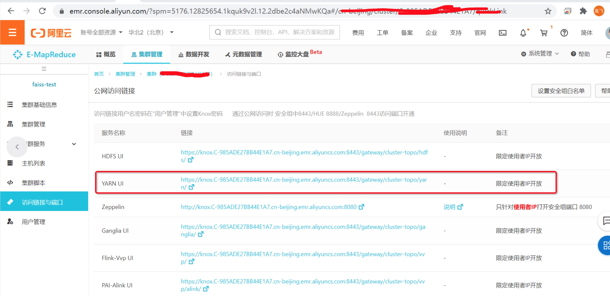
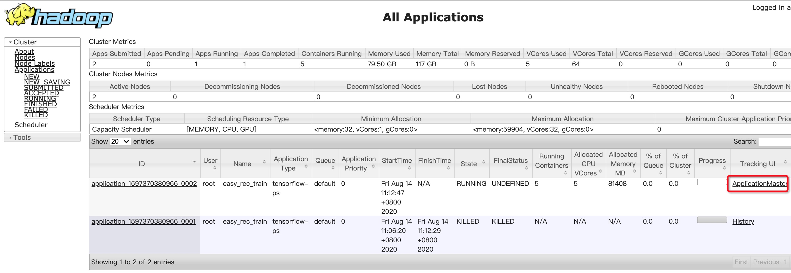
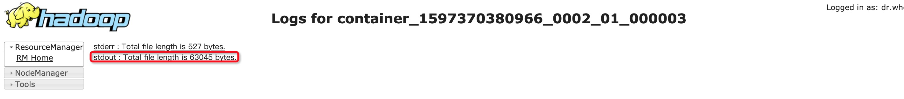
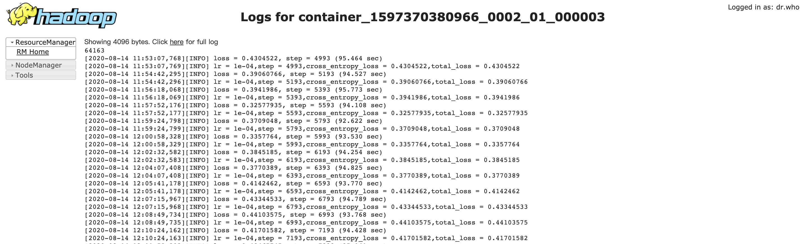

## 任务运行时

#### 1. 登录阿里云，访问E-MapReduce控制台



#### 2. 访问YARN UI






## 任务结束以后

在header上执行

```bash
# applicationId可以在执行el_submit的日志中查看
# 仅在任务结束了以后可以用这个方式看日志
yarn logs -applicationId=application_1596459377740_0015
```

可以查看log

## 打洞查看

也可以打洞进行查看, 详细见 [通过SSH隧道方式访问开源组件Web UI](https://help.aliyun.com/document_detail/169151.html)

```bash
# 在mac上执行
ssh -N -D 8157 root@39.104.103.119
/Applications/Google\ Chrome.app/Contents/MacOS/Google\ Chrome  --proxy-server="socks5://localhost:8157" --host-resolver-rules="MAP * 0.0.0.0 , EXCLUDE localhost" --user-data-dir=/tmp/
```

在浏览器中输入: http://emr-header-1:8088

### 任务未结束

界面和[不打洞方式](#y09Xq)相同

### 任务结束以后


