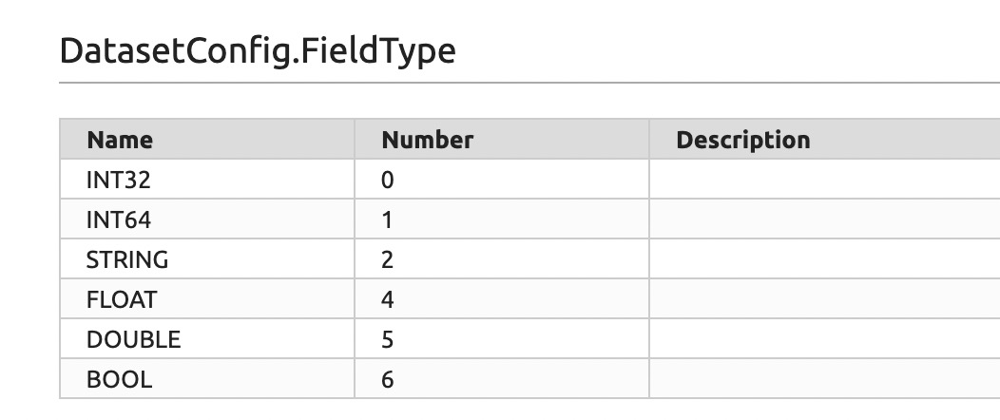
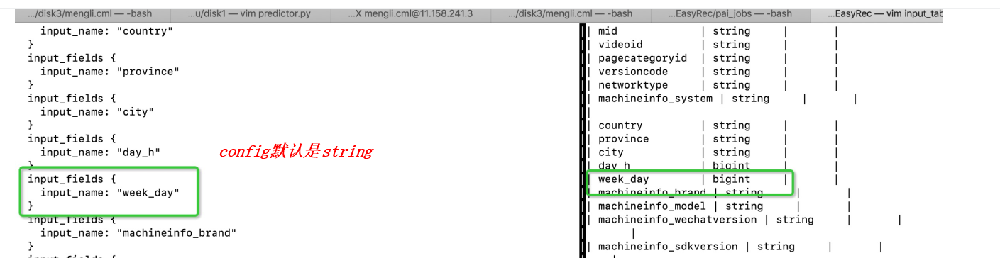

# FAQ

#### 如何查看tensorboard?

具体请参考[优化](./optimize.md)。

#### 能否支持zip或者tar.gz压缩的csv文件?

暂时不支持

#### 支持'\\001', '\\002'等不可见字符作为Separator吗?

支持

#### Separator设置错误或者数据错误：

```bash
2020-07-30 12:10:38.673426: W tensorflow/core/framework/op_kernel.cc:1261] Unknown: AssertionError: sep[b','] maybe invalid: field_num=7, required_num=131
Traceback (most recent call last):

  File "/apsarapangu/disk3/mengli.cml/anaconda3/envs/tf_12_py36/lib/python3.6/site-packages/tensorflow/python/ops/script_ops.py", line 206, in __call__
    ret = func(*args)

  File "/apsarapangu/disk3/mengli.cml/easy-rec/easy_rec/python/input/csv_input.py", line 21, in _check_data
    (sep, field_num, len(record_defaults))

AssertionError: sep[b','] maybe invalid: field_num=7, required_num=131
```

数据的列数和data_configs里面的input_fields数目不一致

```bash
#查看数据列数
head -5 train.csv | awk -v FS=',' '{ print NF }'
#查看config里面的input_fields数目
grep input_fields easy_rec.config | wc -l
```

#### 多余的feature_configs

如下所示, device_make在feature_groups里面没有出现，所以报下面的错误:

```bash
  File "/usr/lib/python3.7/site-packages/easy_rec/python/feature_column/feature_column.py", line 46, in __init__
    self.parse_id_feaure(config)
  File "/usr/lib/python3.7/site-packages/easy_rec/python/feature_column/feature_column.py", line 119, in parse_id_feaure
    if self.is_wide(config):
  File "/usr/lib/python3.7/site-packages/easy_rec/python/feature_column/feature_column.py", line 86, in is_wide
    return self._wide_deep_dict[feature_name] in [ WideOrDeep.WIDE,
KeyError: 'device_make'
```

#### PAI上数据字段配置错误

```
InvalidArgumentError (see above for traceback): Column size of the record to be saved: '588' does not match the default record column size: '17'.
```

config中每个input_fields需要与数据表一一对齐。上图错误为数据表588列数据，input_fields只配置了17列。如有大量字段在训练中用不到，建议把使用的列从全量表里select出来，形成单独的表，也较少了io消耗，提高训练速度。
其它未知的string_to_number错误，或者field number不一致，或者TagFeature的Id数和Weight数不一致，都有可能是odps table column和config的不一致导致的。

#### PAI上数据类型配置错误

**1**

```
[2020-08-10 11:37:14.903966] [FATAL] [70#292] [tensorflow/core/framework/tensor.cc:626] Check failed: dtype() == expected_dtype (1 vs. 2) double expected, got float
xargs: ../python_bin: terminated by signal 6
```

比如实际是bigint类型，data_config里面的input_type写成了FLOAT类型。
建议: describe table; 看一下字段类型。

**2**

```
tensorflow.python.framework.errors_impl.InternalError: Unable to get element as bytes.
terminate called after throwing an instance of 'apsara::odps::algo::BaseException'
what():  build/release64/algo/data_io/table_writer/cluster/sql_record_writer.cpp(103): BaseException: |Commit to master failed
```

场景:在执行predict命令的时候报错如上
问题：模型导出的配置文件的某数据类型和预测表的数据类型不一致


#### 模型导出错误

条件：上海区域，新开的buckets

```
命令
pai -name easy_rec_ext
  -project algo_public_dev
  -Dres_project=algo_public_dev
  -Dconfig=oss://yanzhen1/easy_rec_test/deepfm.config
  -Dcmd=export
  -Dexport_dir=oss://yanzhen1/easy_rec_test/export/
  -Dcluster='{"worker" : {"count":1, "cpu":1000, "memory":40000}}'
  -Darn=acs:ram::1730760139076263:role/aliyunodpspaidefaultrole
  -Dbuckets=oss://yanzhen1/
  -DossHost=oss-cn-beijing-internal.aliyuncs.com;
 错误
 Traceback (most recent call last):
  File "run.py", line 252, in <module>
    tf.app.run()
  File "/usr/lib/python2.7/site-packages/tensorflow/python/platform/app.py", line 128, in run
    _sys.exit(main(argv))
  File "run.py", line 246, in main
    easy_rec.export(FLAGS.export_dir, config, FLAGS.checkpoint_path)
  File "/worker/tensorflow_jobs/easy_rec/python/main.py", line 350, in export
    export_dir_base=export_dir, serving_input_receiver_fn=serving_input_fn)
  File "/usr/lib/python2.7/site-packages/tensorflow/python/estimator/estimator.py", line 694, in export_savedmodel
    mode=model_fn_lib.ModeKeys.PREDICT)
  File "/usr/lib/python2.7/site-packages/tensorflow/python/estimator/estimator.py", line 820, in _export_saved_model_for_mode
    strip_default_attrs=strip_default_attrs)
  File "/usr/lib/python2.7/site-packages/tensorflow/python/estimator/estimator.py", line 959, in _export_all_saved_models
    gfile.Rename(temp_export_dir.decode("utf-8") + '/', export_dir)
  File "/usr/lib/python2.7/site-packages/tensorflow/python/lib/io/file_io.py", line 456, in rename
    compat.as_bytes(oldname), compat.as_bytes(newname), overwrite, status)
  File "/usr/lib/python2.7/site-packages/tensorflow/python/framework/errors_impl.py", line 528, in __exit__
    c_api.TF_GetCode(self.status.status))
tensorflow.python.framework.errors_impl.UnavailableError: req_id: 5F225E6AD0E798313135AFAF, http status code: 400, error code: InvalidRequest, message: It is forbidden to copy appendable object in versioning state, oss host:oss-cn-beijing-internal.aliyuncs.com, path:/yanzhen1/easy_rec_test/export_tmp/temp-1596087897/assets/pipeline.config.
```

#### 提交任务后卡死，无法查看log

一般是资源不够，比如申请了1ps+3worker，但集群里面只有3台机器(不包含header)。

#### OOM: out of memory

关键词: Killing container.

```bash
2020-09-04 11:43:51,536 INFO  [AMRM Callback Handler Thread] master.RMCommunicator (RMCommunicator.java:onContainersCompleted(40)) - got container status for containerID=container_1598507699008_0094_01_000010, state=COMPLETE, exitStatus=-104, diagnostics=Container [pid=8788,containerID=container_1598507699008_0094_01_000010] is running beyond physical memory limits. Current usage: 9.8 GB of 9.8 GB physical memory used; 43.0 GB of 47.6 TB virtual memory used. Killing container.
Dump of the process-tree for container_1598507699008_0094_01_000010 :
  |- PID PPID PGRPID SESSID CMD_NAME USER_MODE_TIME(MILLIS) SYSTEM_TIME(MILLIS) VMEM_USAGE(BYTES) RSSMEM_USAGE(PAGES) FULL_CMD_LINE
  |- 8795 8788 8788 8788 (java) 2011 1219 2151108608 64952 /usr/lib/jvm/java-1.8.0/bin/java -Xmx256M com.aliyu
```

#### RuntimeError: Collective ops must be configured at program startup

```bash
Currently there is a limitation in MultiWorkerMirroredStrategy where TensorFlow ops need to be created after the instance of strategy is created. If you see RuntimeError: Collective ops must be configured at program startup, try creating the instance of MultiWorkerMirroredStrategy at the beginning of the program and put the code that may create ops after the strategy is instantiated.
```

#### Loss很大(>9), 不收敛

raw features没有做离散化或者归一化

#### NanLossDuringTrainingError

```bash
File "/worker/venv/lib/python2.7/site-packages/tensorflow/python/training/basic_session_run_hooks.py", line 792, in after_run
    raise NanLossDuringTrainingError
tensorflow.python.training.basic_session_run_hooks.NanLossDuringTrainingError: NaN loss during training.
Failed to execute system command. (exit code: 251.)
```

解决办法：

1. 调小学习率
1. 数据打散，可参考如下代码：

```sql
SELECT *, ROW_NUMBER() OVER(ORDER BY k) r
FROM(
  SELECT
  	*, RAND() AS k
  FROM table
) tmp ;
```

#### Odps上使用TableRecordDataset columns数目和default values数目不一致

Column size of the record to be saved: '6' does not match the default record column size: '2'.

#### 内存超出被KILL了

Killing container

```
2020-09-22 15:37:59,464 INFO  [AMRM Callback Handler Thread] master.RMCommunicator (RMCommunicator.java:onContainersCompleted(40)) - got container status for containerID=container_1598507699008_0170_01_000002, state=COMPLETE, exitStatus=-104, diagnostics=Container [pid=16012,containerID=container_1598507699008_0170_01_000002] is running beyond physical memory limits. Current usage: 19.6 GB of 19.5 GB physical memory used; 82.3 GB of 95.2 TB virtual memory used. Killing container.
Dump of the process-tree for container_1598507699008_0170_01_000002 :
  ...

Container killed on request. Exit code is 143
```

Odps上使用了CSVInput:

```
Traceback (most recent call last):
  File "run.py", line 300, in <module>
    tf.app.run()
  File "/worker/venv/lib/python2.7/site-packages/tensorflow/python/platform/app.py", line 128, in run
    _sys.exit(main(argv))
  File "run.py", line 243, in main
    train_and_evaluate_impl(pipeline_config, continue_train=FLAGS.continue_train)
  File "/worker/tensorflow_jobs/easy_rec/python/main.py", line 289, in _train_and_evaluate_impl
    _train_and_evaluate(estimator, train_spec, eval_spec)
  File "/worker/venv/lib/python2.7/site-packages/tensorflow/python/estimator/training.py", line 471, in train_and_evaluate
    return executor.run()
  File "/worker/venv/lib/python2.7/site-packages/tensorflow/python/estimator/training.py", line 637, in run
    getattr(self, task_to_run)()
  File "/worker/venv/lib/python2.7/site-packages/tensorflow/python/estimator/training.py", line 642, in run_chief
    return self._start_distributed_training()
  File "/worker/venv/lib/python2.7/site-packages/tensorflow/python/estimator/training.py", line 788, in _start_distributed_training
    saving_listeners=saving_listeners)
  File "/worker/venv/lib/python2.7/site-packages/tensorflow/python/estimator/estimator.py", line 385, in train
    loss = self._train_model(input_fn, hooks, saving_listeners)
  File "/worker/venv/lib/python2.7/site-packages/tensorflow/python/estimator/estimator.py", line 1242, in _train_model
    return self._train_model_default(input_fn, hooks, saving_listeners)
  File "/worker/venv/lib/python2.7/site-packages/tensorflow/python/estimator/estimator.py", line 1337, in _train_model_default
    input_fn, model_fn_lib.ModeKeys.TRAIN))
  File "/worker/venv/lib/python2.7/site-packages/tensorflow/python/estimator/estimator.py", line 1107, in _get_features_and_labels_from_input_fn
    self._call_input_fn(input_fn, mode))
  File "/worker/venv/lib/python2.7/site-packages/tensorflow/python/estimator/estimator.py", line 1194, in _call_input_fn
    return input_fn(**kwargs)
  File "/worker/tensorflow_jobs/easy_rec/python/input/input.py", line 315, in _input_fn
    dataset = self._build(mode, params)
  File "/worker/tensorflow_jobs/easy_rec/python/input/csv_input.py", line 52, in _build
    file_paths = tf.gfile.Glob(self._input_path)
  File "/worker/venv/lib/python2.7/site-packages/tensorflow/python/lib/io/file_io.py", line 385, in get_matching_files
    compat.as_bytes(single_filename), status)
  File "/worker/venv/lib/python2.7/site-packages/tensorflow/python/framework/errors_impl.py", line 528, in __exit__
    c_api.TF_GetCode(self.status.status))
tensorflow.python.framework.errors_impl.UnimplementedError: GetChildren not implemented
Failed to execute system command. (exit code: 123.)

```

#### ODPS上退不出来的问题

可能是模型路径写错了，如下忘记写冒号了: oss://

```protobuf
oss//easyrec/test/din/model/model.ckpt.
```

#### 运行 predict 时报错

有时报错为：currently only savedmodel is supported.
先检查路径：saved_model_dir; 路径正确的情况下，可能是 oss_bucket 写错了，要保证 oss_bucket 和路径一致。

#### StringToNumberOp could not correctly convert string 
检查特征配置是否正确，说明这里的特征不是一个数值型的RawFeature，可以配置成IdFeature

#### 其它错误:

```bash
# 在数据里面搜索Traceback
yarn logs -applicationId application_id > error.log
grep Traceback error.log -A 100
grep "Starting python process" error.log -A 100
```

如果无法定位错误，请把error.log发给我们协助debug。
