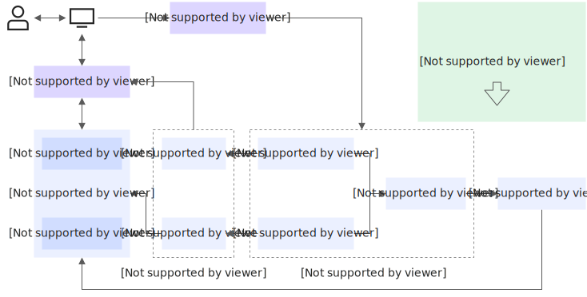

# Feature Generator

[特征生成（FeatureGenerator，下文简称FG）](https://help.aliyun.com/zh/airec/what-is-pai-rec/user-guide/feature-generation-overview-and-configuration)
是一套把原始输入转换为模型所需输入（特征）的数据变换过程，用来保证离线、在线样本生成结果的一致性。
特征生成也可以理解为特征变换，对单个特征或者多个特征做变换。我们提供了各种类型的FG算子来完成各种特征变换操作。

特征生成只关注同时需要在离线和在线样本生成过程中的变换操作。如果某个变换操作只需要作用在离线阶段，则不需要定义为FG的操作。

FG模块在推荐系统架构中的位置如下图所示：



特征生成过程由一系列特征变换算子（下文简称为FG算子）按照配置文件定义的DAG图的拓扑顺序并行执行。

- FG，解决实时预测需要的特征工程需求；它是属于模型之外的前置数据加工模块。详见[FG文档](https://help.aliyun.com/zh/airec/what-is-pai-rec/user-guide/feature-generator/)。
- FG能够以比较高的效率生成一些复杂的交叉特征，如`expr feature`和`lookup feature`等，详见文档《[内置特征算子](https://help.aliyun.com/zh/airec/what-is-pai-rec/user-guide/built-in-feature-operator)》。
- 其生成的特征可以接入EasyRec进行训练。
- 线上部署的时候提供带FG功能的[EasyRec Processor](../predict/processor.md)一键部署。
- FG模块支持复杂类型(array, map)；支持[python API](https://help.aliyun.com/zh/airec/what-is-pai-rec/user-guide/quick-start)；支持[自定义特征变换算子](https://help.aliyun.com/zh/airec/what-is-pai-rec/user-guide/custom-feature-operator)；支持分箱操作（离散化）；支持特征间互相依赖。
- FG模块以多线程的方式执行由配置文件`fg.json`定义的特征变换DAG图。

### 训练

#### 编写配置文件`fg.json`

- 包含了features配置和全局配置两个部分,  示例:

```json
{
  "features": [
     {"expression": "user:user_id", "feature_name": "user_id", "feature_type":"id_feature", "value_type":"String"},
     {"expression": "user:cms_segid", "feature_name": "cms_segid", "feature_type":"id_feature", "value_type":"String"},
     ...
     {"expression": "item:price", "feature_name": "price", "feature_type":"raw_feature", "value_type":"float"},
     {"expression": "item:pid", "feature_name": "pid", "feature_type":"id_feature", "value_type":"String"},
     {"expression": "user:tag_category_list", "feature_name": "user_tag_cate", "feature_type":"id_feature"},
     {"map": "user:tag_brand_list", "key":"item:brand", "feature_name": "combo_brand", "feature_type":"lookup_feature"},
     {"map": "user:tag_category_list", "key":"item:cate_id", "feature_name": "combo_cate_id", "feature_type":"lookup_feature"}
 ],


 "reserves": [
   "user_id", "campaign_id", "clk"
 ]
}
```

- Feature配置说明请[查看文档](https://help.aliyun.com/zh/airec/what-is-pai-rec/user-guide/feature-generation-overview-and-configuration#bf3dfc9387m0l)

#### 生成样本

- 详见文档：《[在MaxCompute Job中使用FG](https://help.aliyun.com/zh/airec/what-is-pai-rec/user-guide/use-fg-in-offline-tasks)》

#### 配置EasyRec的config

FG支持的特征变换算子与EasyRec支持的特征（`Feature Column`）之间没有严格的对应关系，大致可以参加如下表格：

| FG 算子                 | EasyRec Feature Column              |
| :-------------------- | :---------------------------------- |
| id_feature            | IdFeature 或 TagFeature              |
| raw_feature           | RawFeature                          |
| expr_feature          | RawFeature                          |
| combo_feature         | IdFeature 或 TagFeature              |
| lookup_feature        | RawFeature 或 IdFeature 或 TagFeature |
| match_feature         | RawFeature 或 IdFeature 或 TagFeature |
| overlap_feature       | RawFeature                          |
| sequence_feature      | SequenceFeature 或 TagFeature        |
| bm25_feature          | RawFeature                          |
| kv_dot_product        | RawFeature                          |
| tokenize_feature      | TagFeature                          |
| text_normalizer       | IdFeature                           |
| regex_replace_feature | IdFeature                           |

备注：**FG的执行结果输出给EasyRec模型，两种之间是串联的关系**。

#### 启动训练

- 上传fg.config到oss
- 启动训练

```sql
pai -name easy_rec_ext
-Dversion='0.8.5'
-Dcmd=train
-Dconfig=oss://bucket-name/easy_rec_test/fg.config
-Dtrain_tables=odps://project-name/tables/taobao_fg_train_out
-Deval_tables=odps://project-name/tables/taobao_fg_test_out
-Dcluster='{"ps":{"count":1, "cpu":1000}, "worker" : {"count":3, "cpu":1000, "gpu":100, "memory":40000}}'
-Darn=acs:ram::xxx:role/ev-ext-test-oss
-Dbuckets=oss://bucket-name/
-DossHost=oss-cn-xxx.aliyuncs.com
-Deval_method=separate;
```

- 参数说明: [请参考](../train.md#on-pai)

#### 模型导出

```sql
pai -name easy_rec_ext
    -Dversion='0.8.5'
    -Dcmd=export
    -Dconfig=oss://easyrec/easy_rec_test/fg.config
    -Dexport_dir=oss://<bucket-name>/export_dir
    -Dbuckets=oss://<bucket-name>/
    -Darn=acs:ram::xxx:role/aliyunodpspaidefaultrole
    -DossHost=oss-hangzhou-internal.aliyuncs.com
    -Dedit_config_json='{"export_config.multi_placeholder":true, "feature_config.features[:].max_partitions":1}';

```

- 参数说明: [请参考](../export.md#pai)
- 注意事项:
  - 请检查fg.config, 保证导出的模型是支持多个placeholder的输入\[每个特征一个placeholder\]

    ```
    export_config {
      multi_placeholder: true
    }
    ```

    如果不是, 可以通过-Dedit_config_json='{"export_config.multi_placeholder":true}' 进行修改

  - 如果有设置feature_config.features.max_partitions, 请加入下面的命令重置:

    - -Dedit_config_json='{"feature_config.features\[:\].max_partitions":1}'进行修改, 可以获得更好的性能

#### 特征筛选

- 可以筛选fg.json里面的部分特征用于训练
- 方法: 在easyrec.config的model_config.feature_groups里面把不需要的特征注释掉即可

### 预测

#### 服务部署

- 部署的 service.json 示例如下

```shell
bizdate=$1
cat << EOF > echo.json
{
  "name":"ali_rec_rnk",
  "metadata": {
    "resource": "eas-r-xxxx",
    "cpu": 8,
    "memory": 20000,
    "instance": 2,
    "rpc": {
      "enable_jemalloc": 1,
      "max_queue_size": 100
    }
  },
  "model_config": {
    "remote_type": "hologres",
    "url": "postgresql://<AccessKeyID>:<AccessKeySecret>@<域名>:<port>/<database>",
    "tables": [{"name":"<schema>.<table_name>","key":"<index_column_name>","value": "<column_name>"}],
    "period": 2880,
    "fg_mode": "tf",
    "outputs":"probs_ctr,probs_cvr",
  },
  "processor": "easyrec-3.0",
  "storage": [
    {
      "mount_path": "/home/admin/docker_ml/workspace/model/",
      "oss": {
        "endpoint": "oss-cn-hangzhou-internal.aliyuncs.com",
        "path": "oss://easyrec/ali_rec_sln_acc_rnk/20221122/export/final_with_fg"
      }
    }
  ]
}

EOF
# 执行部署命令。
eascmd -i <AccessKeyID>  -k  <AccessKeySecret>   -e <EndPoint> create echo.json
eascmd -i <AccessKeyID>  -k  <AccessKeySecret>   -e <EndPoint> update ali_rec_rnk -s echo.json
```

详见文档：[EasyRec Processor（推荐打分服务）](https://help.aliyun.com/zh/pai/user-guide/easyrec)

- processor: easyrec processor, 目前最新的版本为easyrec-3.0, [历史版本](../predict/processor.md#release).
- model_config: eas 部署配置。主要控制把 item 特征加载到内存中。目前数据源支持redis和holo
  - period: item feature reload period, 单位minutes
  - url: holo url, 格式为postgresql://<AccessKeyID>:<AccessKeySecret>@<域名>:<port>/<database>
  - fg_mode: 支持tf和normal两种模式, tf模式表示fg是以TF算子的方式执行的, 性能更好
  - tables: item特征存储在hologres表里面, 支持分多个表存储
    - key: 必填, itemId列的名字;
    - value: 可选，需要加载的列名, 多个列名之间用逗号(,)分割;
    - condition: 可选，where子语句支持筛选item, 如itemId \< 10000;
    - timekey: 可选，用于item的增量更新，支持的格式: timestamp和int
    - static: 可选, 表示是静态特征，不用周期性更新
    - 支持多个item表, 如果多张表有重复的列, 后面的表覆盖前面的表
      - "tables": [{"key":"table1", ...},{"key":"table2", ...}]
      - 如果多张表有重复的列，后面的表将覆盖前面的表
    - hologres表里面每一列存储一个item特征,示例:
      <table class="docutils" border=1>
       <tr><th>adgroup_id</th><th>cate_id</th><th>campaign_id</th><th>customer</th><th>brand</th><th>price</th></tr>
       <tr><td>100038</td><td>5480</td><td>37448</td><td>117182</td><td>6077</td><td>4</td></tr>
       <tr><td>100039</td><td>10344</td><td>122588</td><td>96590</td><td>14287</td><td>97</td></tr>
       <tr><td>...</td><td>...</td><td>...</td><td>...</td><td>...</td><td>...</td></tr>
      </table>
  - remote_type: Item特征数据源, 目前支持：`hologres`, `none`
    - hologres：通过SQL接口进行数据读取和写入，适用于海量数据的存储和查询
    - none: 不使用Item特征缓存，item特征通过请求传入，此时tables应设置为[]
- storage: 将oss的模型目录mount到docker的指定目录下
  - mount_path: docker内部的挂载路径, 与示例保持一致即可
  - 配置了storage就不需要配置model_path了
  - 优点: 部署速度快
- model_path: 将模型拷贝到docker内部
  - 缺点: 部署速度慢, 需要将模型保存到docker内部
  - 建议仅在无法通过storage挂载的情况下使用model_path
- 其它参数是所有EAS服务通用的, 请参考[EAS文档](https://help.aliyun.com/zh/pai/user-guide/parameters-of-model-services).

#### 客户端请求

和TFRequest类似, EasyRec Processor也是使用ProtoBuffer 作为传输协议. [proto文件定义](https://github.com/pai-eas/eas-java-sdk/blob/master/src/main/proto/easyrec_predict.proto). Java客户端可以通过PAI-EAS Java SDK调用服务, 在pom.xml里面加入:

```
<dependency>
  <groupId>com.aliyun.openservices.eas</groupId>
  <artifactId>eas-sdk</artifactId>
  <version>2.0.9</version>
</dependency>
```

代码参考：

```java
import com.aliyun.openservices.eas.predict.http.*;
import com.aliyun.openservices.eas.predict.request.EasyRecRequest;

PredictClient client = new PredictClient(new HttpConfig());

// 使用网络直连功能, 为了提升吞吐降低RT, 建议使用网络直连
// Endpoint需要根据相应的region进行修改
client.setDirectEndpoint("pai-eas-vpc.cn-hangzhou.aliyuncs.com");

// 通过普通网关访问时，需要使用以用户UID开头的Endpoint
//    在PAI-EAS控制台服务的调用信息中可以获得该信息
client.setEndpoint("xxxxxxx.vpc.cn-hangzhou.pai-eas.aliyuncs.com");

client.setModelName("ali_rec_rnk");
// 设置服务Token信息
client.setToken("atxjzk****");

EasyRecRequest easyrecRequest = new EasyRecRequest(separator);
easyrecRequest.appendUserFeatureString(userFeatures);
easyrecRequest.appendContextFeatureString(contextFeatures);
easyrecRequest.appendItemStr(itemIdStr, ",");

PredictProtos.PBResponse response = client.predict(easyrecRequest);

for (Map.Entry<String, PredictProtos.Results> entry : response.getResultsMap().entrySet()) {
    String key = entry.getKey();
    PredictProtos.Results value = entry.getValue();
    System.out.print("key: " + key);
    for (int i = 0; i < value.getScoresCount(); i++) {
        System.out.format("value: %.6g\n", value.getScores(i));
    }
}
```

- client.setDirectEndpoint: [网络直连](https://help.aliyun.com/zh/pai/user-guide/call-a-service-over-the-vpc-direct-connection-channel)可以减少网络传输时间, 显著提升性能

  - 请从上述文档查看不同region对应的direct endpoint地址

- EasyRecRequest类方法列表

  <table class="docutils" border=1>
    <tr><th>方法</th><th>描述</th></tr>
    <tr><td>setSeparator(String sep)</td><td>设置user特征分隔符, 默认是"\u0002", 即CTRL_B</td></tr>
    <tr><td>addUserFeature(String key, T value)</td><td>增加一个user特征, key是特征名, value是特征值, value支持的类型包括String, float, long, int</td></tr>
    <tr><td>appendUserFeatureString</td><td>增加一组user特征,特征之间以separator分隔,特征内部使用":"分隔特征名和特征值</td></tr>
    <tr><td>appendItemId(String itemId)</td><td>增加一个itemId</td></tr>
    <tr><td>appendItemStr(String itemIdStr)</td><td>增加一组itemIds, 以","分隔</td></tr>
    <tr><td>addContextFeature(String key, List<Object> contextFeatures)</td><td>增加一个context特征, key是特征名, contextFeatures是特征值的列表, 列表中的元素和itemId一一对应</td></tr>
    <tr><td>addContextFeatureString(String contextStr)</td><td>增加一个context特征,特征名和特征值,特征值和特征值之间以":"分割,分割后的长度应该等于len(itemIds) + 1</td></tr>
    <tr><td>getRequest()</td><td>返回build好的EasyRecPredictProtos.PBRequest</td></tr>
  </table>

- 验证特征一致性

  ```java
  // 获取FG之后的特征，以便和离线的特征对比一致性
  // 将DebugLevel设置成1，即可返回生成的特征
  easyrecRequest.setDebugLevel(1);
  PredictProtos.PBResponse response = client.predict(easyrecRequest);
  Map<String, String> genFeas = response.getGenerateFeaturesMap();
  for(String itemId: genFeas.keySet()) {
      System.out.println(itemId);
      System.out.println(genFeas.get(itemId));
  }
  ```

- setDebugLevel: 设置调试标志, 方便排查问题, 参数的取值范围如下:

  - 0: 仅返回预测结果, 不返回调试信息
  - 1: 只返回FG之后特征的值, 格式为key:value格式, 不返回预测结果
  - 2: 返回预测结果和FG之后的特征值
  - 3: 返回FG之后特征值, 格式为表格格式, 特征之间用\\u0002分隔, 适用于ODL[实时样本](./odl_sample.md)构造的场景
  - 4: 将FG之后生成的特征值直接写入datahub, 不通过rpc返回, 适用于ODL[实时样本](./odl_sample.md)构造的场景
  - 100: 保存请求到模型目录下, 同时返回预测结果
  - 101: 保存timeline
  - 102: 适用于召回模型, 返回user向量和Faiss检索结果

- 注意: 生产环境调用的时候设置debug_level=0，否则会导致rt上升, qps下降.
