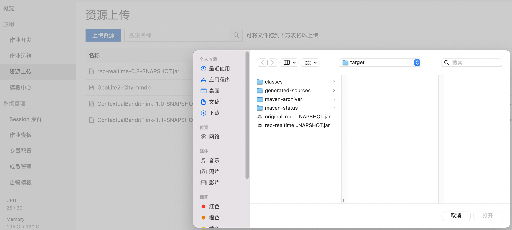
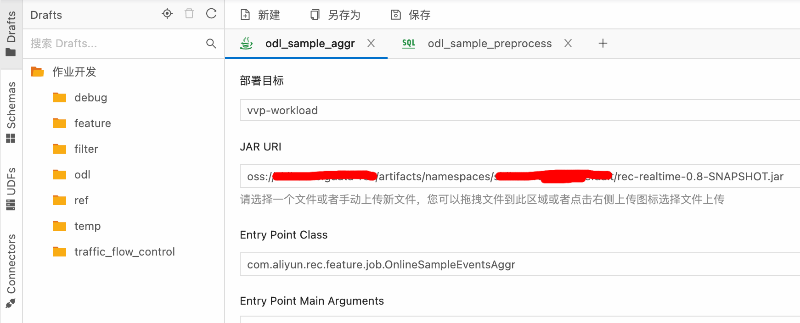
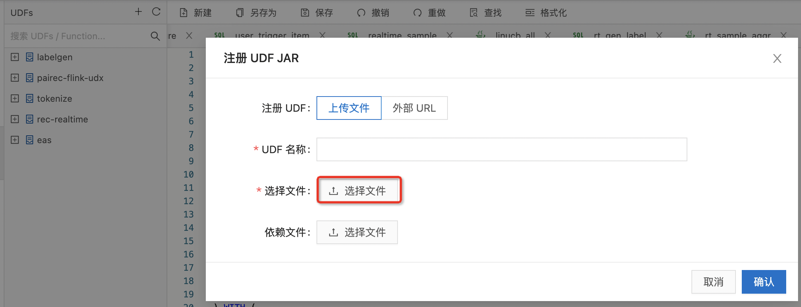
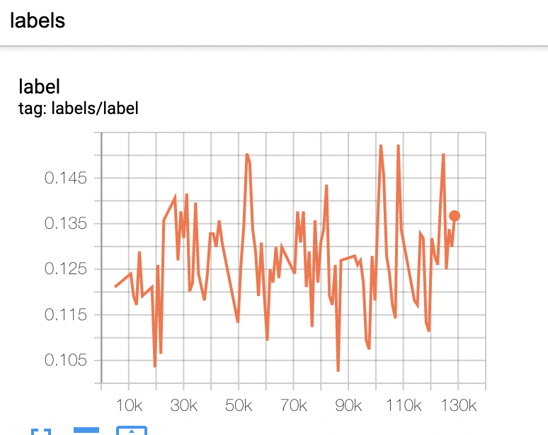

# 样本

## 离线样本

- 离线样本可以使用SQL在MaxCompute或者Hive/Spark平台上构造.
- 可以使用 [推荐算法定制](https://pairec.yuque.com/books/share/72cb101c-e89d-453b-be81-0fadf09db4dd) 来自动生成离线特征 和 离线样本的流程.

## 样本权重

- 指定输入一列为sample_weight
  - data_config.sample_weight
- 示例:
  ```protobuf
    data_config {
      input_fields {
        input_name: 'clk'
        input_type: DOUBLE
      }
      input_fields {
        input_name: 'field1'
        input_type: STRING
      }
      ...
      input_fields {
        input_name: 'sw'
        input_type: DOUBLE
      }

      sample_weight: 'sw'

      label_fields: 'clk'
      batch_size: 1024
      input_type: CSVInput
    }
  ```

## 实时样本

### 前置条件

- 服务开通:
  - 除了MaxCompute, OSS, Dataworks, Hologres, 需要额外开通Flink, Datahub(或者Kafka)
  - 产品具体开通手册，参考PAI-REC最佳实践里面的[开通手册](https://pairec.yuque.com/staff-nodpws/kwr84w/wz2og0)

### 数据准备

- 用户行为实时流
  - 通过datahub接入
  - 包含字段:
    - event_type, 事件类型: exposure / click / buy / like / play /...
    - event_time, 时间发生时间
    - duration, 持续时间，可选
    - request_id, 请求id
    - user_id, 用户id
    - item_id, 商品id
    - 其他信息，可选
- 特征埋点(callback)
  - 需要部署EAS callback服务, 服务配置和[EAS打分服务](./rtp_fg.html#id9)一致

    - 单独部署EAS callback服务的原因是避免影响EAS打分服务的性能
    - EAS callback对rt的要求低于EAS打分服务

  - 通过[PAI-REC推荐引擎](http://pai-vision-data-hz.oss-cn-zhangjiakou.aliyuncs.com/pairec/docs/pairec/html/intro/callback_api.html)写入Datahub

    - PAI-REC[配置](./pai_rec_callback_conf.md)
    - 特征保存在Datahub topic: odl_callback_log, schema:

    <table class="docutils" border=1>
    <tr><th>request_id</th><th>request_time</th><th>module</th><th>user_id</th><th>item_id</th><th>scene</th><th>context_features</th><th>generate_features</th><th>raw_features</th><th>request_info</th><th>item_features</th><th>user_features</th><th>callback_log</th></tr>
    <tr><td>string</td><td>bigint</td><td>string</td><td>string</td><td>string</td><td>string</td><td>string</td><td>string</td><td>string</td><td>string</td><td>string</td><td>string</td><td>string</td></tr>
    <tr><td>请求id</td><td>请求时间</td><td>算法id</td><td>用户id</td><td>商品id</td><td>场景</td><td>context特征</td><td>FG生成的特征</td><td>原始特征</td><td>请求信息</td><td>商品特征</td><td>用户特征</td><td>callback日志</td></tr>
    </table>

    - request_id, user_id, item_id, request_time, generate_features 是后续需要的字段

  - Custom推荐引擎:

    - 调用EAS服务获取全埋点特征, 调用方式[参考文档](./rtp_fg.html#id10)
      - 请求的item list为下发列表,不是排序阶段的列表
      - EasyrecRequest.setDebugLevel(3), 生成EasyRec训练所需要的特征
    - 通过PBResponse.getGenerateFeaturesMap获取生成的特征
    - 特征写入Datahub topic: odl_callback_log

### 样本生成

1. 样本预处理

   - 提取曝光、点击等事件信息:

     ```sql
       create temporary table user_click_log ...

       create temporary table user_expose_log ...

       create temporary table odl_sample_preprocess (
           request_id string,
           `user_id` string,
           item_id string,
           event_type string,
           event_time bigint,
           scene string
       ) with (
         'connector' = 'datahub',
         'endPoint' = 'http://dh-cn-beijing-int-vpc.aliyuncs.com/',
         'project' = 'easy_rec_proj',
         'topic' = 'odl_sample_preprocess',
         'subId' = '166987972XXXXXXX',
         'accessId' = 'LTAIXXXXXXXX',
         'accessKey' = 'XYZXXXXXXXX'
       );

       begin STATEMENT SET;
       insert into odl_sample_preprocess
       select aa as request_id, bb as user_id, cc as item_id, dd as event_type,
           ee as event_time, ff as scene
       from user_click_log;

       insert into odl_sample_preprocess
       select aa as request_id, bb as user_id, cc as item_id, 'expose' as event_type,
           ee as event_time, ff as scene
       from user_expose_log;
       end;
     ```

     - project: datahub project
     - topic: datahub topic
     - subId: datahub订阅id, 每个flink sql任务需要单独创建订阅id, 否则会有冲突
     - scene: 附带信息, 可选字段

1. 样本Events聚合(OnlineSampleAggr):

   - 上传资源包: [rec-realtime-1.0-SNAPSHOT.jar](http://easyrec.oss-cn-beijing.aliyuncs.com/deploy/rec-realtime-1.0-SNAPSHOT.jar)
     

   - 入口参数: com.aliyun.rec.feature.job.OnlineSampleEventsAggr
     

   - flink配置:

     ```sql
       datahub.endpoint: 'http://dh-cn-beijing-int-vpc.aliyuncs.com/'
       datahub.accessId: xxx
       datahub.accessKey: xxx
       datahub.inputTopic: user_behavior_log
       datahub.sinkTopic: odl_sample_aggr
       datahub.projectName: odl_sample_preprocess
       datahub.startInSecs: -900

       input.userid: user_id
       input.itemid: item_id
       input.request-id: request_id
       input.event-type: event
       input.event-duration: play_time
       input.event-ts: ts
       input.expose-event: expose
       input.event-extra: scene
       input.wait-positive-secs: 900
       input.subId: 167XXXXXXX
       state.ttl: 86400
       debug-mode: false
     ```

     - datahub参数配置
       - accessId: 鉴权id
       - accessKey: 鉴权secret
       - projectName: 项目名称
       - endpoint: 使用带vpc的endpoint
       - inputTopic: 读取的datahub topic
       - sinkTopic: 写入的datahub topic
       - startInSecs: 开始读取的位点,单位是seconds
     - input: datahub输入topic schema配置
       - userid: userid字段名
       - itemid: itemid字段名
       - request-id: request_id字段名
       - event-duration: event持续时间, 可选配置
         - 如不需要构造时长label，可以不设置
       - event-type: event类型字段
       - event-ts: event发生时间字段(seconds)
       - expose-event: 曝光事件类型
         - 曝光事件延迟不再下发
         - 其它事件延迟会补充下发
       - event-extra: 其它event相关字段,多个字段以","分割
       - wait-positive-secs: 等待正样本的时间, 单位是seconds
         - 等待时间越长label越准确, 但是消耗的内存也越大, 样本下发延迟也越大
     - state:
       - ttl: event在flink中保存的时间, 一般设成1天比较准确, 如果内存不够，可以视情况设小
       - state的存储格式是MapState\<String, EventData>, key是event_type, value是event信息
       - 内部实现有两个辅助state:
         - timer state: 记录timer是否触发
         - event number state: 记录该request_id, item_id下面发生的event数目
     - debug-mode: 默认是false, 为true时, 打印详细的event信息和timer注册以及触发的信息
     - datahub topic schema:
       - inputTopic: user_behavior_log
         <table class="docutils" border=1>
         <tr><th> request_id </th><th> user_id </th><th> item_id </th><th> play_time </th><th> event  </th><th>  ts    </th><th> scene  </th><th> ... </th>
         <tr><td>   string   </td><td>  string </td><td>  string </td><td>   double  </td><td> string </td><td> bigint </td><td> string </td><td> ... </td>
         </table>
       - sinkTopic: odl_sample_aggr
         <table class="docutils" border=1>
          <tr> <th>request_id </th><th> user_id </th><th> item_id </th><th> events </th></tr>
          <tr> <td>  string   </td><td>  string </td><td> string  </td><td> string </td></tr>
         </table>
       - events数据格式:
         ```json
         [
          {"duration":6493,"eventTime":1659667790,"eventType":"play","scene":"main"},
          {"duration":6259,"eventTime":1659667796,"eventType":"play","scene":"main"}
         ]
         ```

1. label生成, 目前提供三种[python udf](http://easyrec.oss-cn-beijing.aliyuncs.com/deploy/label_gen.zip):

   - playtime: sum_over(events, 'playtime')
   - click:  has_event(events, 'click')
   - min_over / max_over: min_over(events, 'eventTime')
   - 可以使用python自定义任意udf, [参考文档](https://flink.apache.org/2020/04/09/pyflink-udf-support-flink.html)
   - udf 上传([vvp-console](https://vvp.console.aliyun.com/)):
     
   - 示例:
     ```sql
       insert into odl_sample_with_lbl
       select request_id, user_id, item_id,
           ln(if(playtime < 0, 0, playtime) + 1) as ln_play_time,
           cast((playtime > 10 or is_like > 0) as bigint) as is_valid_play,
           is_like, ts
       from (
           select *, sum_over(events, 'duration', TRUE) / 1000.0 as playtime,
               has_event(events, 'likes') as is_like,
               min_over(events, 'eventTime') as ts
           from odl_sample_aggr
       );
     ```

1. label join 特征

   - 上传资源包: [rec-realtime-1.0-SNAPSHOT.jar](http://easyrec.oss-cn-beijing.aliyuncs.com/deploy/rec-realtime-1.0-SNAPSHOT.jar)
     

   - 入口参数: com.aliyun.rec.feature.job.SampleFeatureJoinJob

   - flink配置:

     ```sql
       datahub.endpoint: 'http://dh-cn-hangzhou-int-vpc.aliyuncs.com/'
       datahub.accessId: LTAIxxxxxxxxx
       datahub.accessKey: Jdqtxxxxxxxx
       datahub.projectName: xxx_proj
       callback.table_name: pairec_callback_log
       callback.request_id: request_id
       callback.user_id: user_id
       callback.item_id: item_id
       callback.user_fea: user_features
       callback.generate_fea: generate_features
       callback.request_time: request_time
       callback.subId: 1671540xxxxxxxxxxx
       sample.table_name: odl_sample_with_lbl
       sample.request_id: request_id
       sample.user_id: user_id
       sample.item_id: style_id
       sample.event_ts: min_ts
       sample.labels: 'ln_play_time:double,is_valid_play:bigint'
       sample.subId: 16715xxxxxxxxxxxxx
       output.table_name: odl_sample_with_feature_and_lbl
       datahub.startInSecs: '-600'
       timer.max_wait_ts: '300'
       state.ttl: '2400'
       state.user_fea_ttl: '7200'
       eas.end_point: 13010xxxxxxxxxxx.vpc.cn-beijing.pai-eas.aliyuncs.com
       eas.model_name: rank_callback_public
       eas.token: YTcwZGU1ZTxxxxxxx
       taskmanager.memory.network.max: 64mb
     ```

     - datahub参数配置
       - accessId: 鉴权id
       - accessKey: 鉴权secret
       - projectName: 项目名称
       - endpoint: 使用带vpc的endpoint
       - startInSecs: 开始读取的位点,单位是seconds
       - sinkTopic: 输出表配置
     - callback topic配置: 样本特征回流埋点配置
       - table_name: 样本特征回流topic
       - request_id: 请求id, string类型
       - user_id: 用户id, string类型
       - item_id: 商品id, string类型
       - user_fea: 用户特征
       - generate_fea: fg之后生成的特征
       - request_time: 请求时间, bigint类型, 用于设置watermark
       - subId: 订阅Id, 注意不要和其它的任务重复
     - sample topic配置
       - table_name: 样本topic
       - request_id: 请求id, string类型
       - user_id: 用户id, string类型
       - item_id: 商品id, string类型
       - event_ts: 样本时间, 用于设置watermark
       - labels: 样本label
         - 格式为label_name:label_type,多个label之间用","分割
         - 也可以放一些其它要写入join的表的列, 如comments等
       - subId: datahub订阅id
     - output topic配置:
       - table_name: 输出topic
       - request_id: 请求id, 可选配置, 默认和sample.request_id一致
       - user_id: 用户id, 可选配置, 默认和sample.user_id一致
       - item_id: 商品id, 可选配置, 默认和sample.item_id一致
       - features: 样本特征, 可选配置, 默认: "features"
       - subId: datahub订阅id
     - timer.max_wait_ts: sample到了之后, 等待特征到达的时间
       - 等待时间越长，鲁棒性越好，但是消耗的内存越多
     - state.ttl: 单位seconds
       - generate_feature在state中的保留时间
       - 一般要大于timer.max_wait_ts, 否则join成功率比较低
       - 越大join的成功率越高, 但是消耗的内存也越多
     - state.user_fea_ttl: 单位seconds
       - 如果内存不够, 同时又配置了callback_eas, 可以将user_fea存储的久一点
       - 当generate_feature过期之后, 仍然可以通过user_fea请求eas获得完整的样本特征
     - callback_eas: 针对延迟的样本, 是否需要重新请求eas获得特征, 默认是true
     - eas: 如果callback_eas是true, 需要设置eas相关参数
       - end_point: 请求url
       - model_name: 模型名称
       - token: 鉴权token
     - debug-mode: 可选配置, 默认是false
       - 设置成true打印调试信息, 排查join问题
       - 任务稳定后, 建议关闭, 避免影响性能
     - taskmanager.memory.network.max: flink系统配置, 减少network的内存消耗

   - 备选方案: 也可以使用flink sql实现label和feature的join

     - [参考文档](./odl_sample_join_sql.md)
     - 优点:更灵活
     - 缺点: 性能不高, 内存消耗大

### 数据诊断

- 实时样本需要关注下面的信息和离线是否一致:

  - 样本总量: 因为样本延迟和全埋点特征join不上，导致样本量下降，需要增加interval join的区间和state ttl
  - 正负样本比例: 因为正样本延迟到达导致的延迟下发导致在线正样本占比偏低, 增加wait-positive-secs
  - 特征一致性: EAS callback服务和EAS打分引擎配置是否一样.

- 校验方法:

  - 实时样本落到maxcompute / hive, 和离线的数据作对比
  - EasyRec训练的summary里面查看label的正负样本比
    

### 实时训练

- 训练和预测: [文档](../online_train.md)
