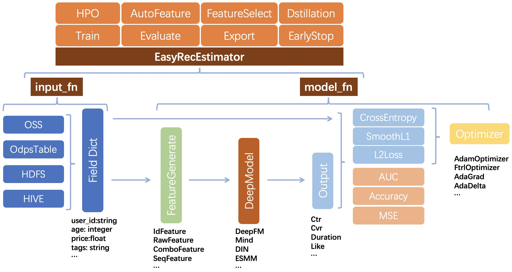

# EasyRec简介

## What is EasyRec?

### EasyRec is an easy-to-use framework for Recommendation

EasyRec implements state of the art machine learning models used in common recommedation tasks: candidate generation(matching), scoring(ranking), and multi-task learning. It improves the efficiency of generating high performance models by simple configuration and hyper parameter tuning(HPO).

[EasyRec视频介绍](https://cloud.video.taobao.com/play/u/2248819/p/1/e/6/t/1/325898294308.mp4)

## Why EasyRec?

### Run everywhere

- [MaxCompute](https://help.aliyun.com/product/27797.html) / [DataScience](https://help.aliyun.com/document_detail/170836.html) / [DLC](https://www.alibabacloud.com/help/zh/doc-detail/165137.htm?spm=a2c63.p38356.b99.79.4c0734a4bVav8D) / Local
- TF1.12-1.15 / TF2.x / PAI-TF

### Diversified input data

- MaxCompute Table
- HDFS files
- [OSS files](https://help.aliyun.com/product/31815.html?spm=5176.7933691.1309819.8.5bb52a66ZQOobj)
- Kafka Streams
- Local CSV

### Simple to config

- Flexible feature config and simple model config
- Efficient and robust feature generation\[used in taobao\]
- Nice web interface in development

### It is smart

- EarlyStop / Best Checkpoint Saver
- Hyper Parameter Search / AutoFeatureCross
- In development: NAS, Knowledge Distillation, MultiModal

### Large scale and easy deployment

- Support large scale embedding, incremental saving
- Many parallel strategies: ParameterServer, Mirrored, MultiWorker
- Easy deployment to [EAS](https://help.aliyun.com/document_detail/113696.html?spm=a2c4g.11174283.6.745.344d1987M3j15E): automatic scaling, easy monitoring
- Consistency guarantee: train and serving

### A variety of models

- [DSSM](models/dssm.md) / [MIND](models/mind.md) / [DropoutNet](models/dropoutnet.md) / [CoMetricLearningI2I](models/co_metric_learning_i2i.md) / [PDN](models/pdn.md)
- [W&D](models/wide_and_deep.md) / [DeepFM](models/deepfm.md) / [MultiTower](models/multi_tower.md) / [DCN](models/dcn.md) / [DIN](models/din.md) / [BST](models/bst.md)
- [MMoE](models/mmoe.md) / [ESMM](models/esmm.md) / [DBMTL](models/dbmtl.md) / [PLE](models/ple.md)
- [CMBF](models/cmbf.md) / [UNITER](models/uniter.md)
- More models in development

### Easy to customize

- Easy to implement customized models
- Not need to care about data pipelines

### Fast vector retrieve

- Run [`knn algorithm`](vector_retrieve.md) of vectors in distribute environment

### Contact

- DingDing Group: 32260796. (EasyRec usage general discussion.)
- DingDing Group: 37930014162, click [this url](https://qr.dingtalk.com/action/joingroup?code=v1,k1,oHNqtNObbu+xUClHh77gCuKdGGH8AYoQ8AjKU23zTg4=&_dt_no_comment=1&origin=11) or scan QrCode to join
