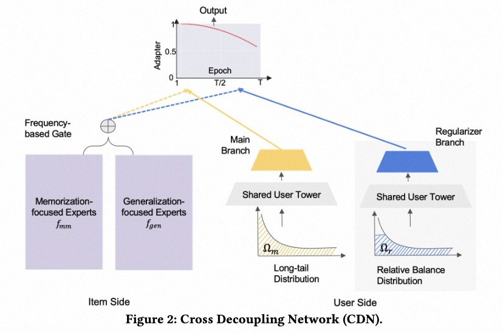

# Cross Decoupling Network

### 简介

推荐系统中的item反馈通常是长尾分布的，即满足二八定律，少数item接收了大部分用户的反馈。在长尾分布下，推荐的item是有偏的，这会导致推荐效果变差。
交叉解耦网络CDN针对这类问题提出了相应的方法。

- 通过混合专家结构，在item段解耦记忆和泛化的学习过程
- 通过正则化的BBN（BBN是图像分类领域提出的方法）从不同分布中解耦用户表征（可参考这篇文章：BBN: Bilateral-Branch Network with Cumulative Learning for Long-Tailed Visual Recognition）
- 使用一种新的适配器来聚合解耦的向量，并将训练注意力转移到长尾item上。



### 配置说明

```protobuf
model_config: {
  model_name: 'Cross Decoupling Network'
  model_class: 'RankModel'
  feature_groups: {
    group_name: 'memorize'
    feature_names: 'user_id'
    feature_names: 'adgroup_id'
    wide_deep: DEEP
  }
  feature_groups: {
    group_name: 'general'
    feature_names: 'cms_segid'
    feature_names: 'cms_group_id'
    feature_names: 'age_level'
    feature_names: 'pvalue_level'
    feature_names: 'shopping_level'
    feature_names: 'occupation'
    feature_names: 'new_user_class_level'
    feature_names: 'cate_id'
    feature_names: 'campaign_id'
    feature_names: 'customer'
    feature_names: 'brand'
    feature_names: 'price'
    feature_names: 'tag_category_list'
    feature_names: 'tag_brand_list'
    wide_deep: DEEP
  }
  feature_groups: {
    group_name: 'frequency'
    feature_names: 'pid'
    wide_deep: DEEP
  }
  backbone {
    blocks {
      name: "mem_expert"
      inputs {
        feature_group_name: "memorize"
      }
      keras_layer {
        class_name: "MLP"
        mlp {
          hidden_units: [512, 256]
        }
      }
    }
    blocks {
      name: "gen_experts"
      inputs {
        feature_group_name: "general"
        input_fn: "lambda x: [x, x]"
      }
      repeat {
        num_repeat: 3
        keras_layer {
          class_name: "MaskBlock"
          mask_block {
            output_size: 256
            aggregation_size: 1024
          }
        }
      }
    }
    blocks {
      name: "gate_weight"
      inputs {
        feature_group_name: "frequency"
      }
      keras_layer {
        class_name: "MLP"
        mlp {
          hidden_units: 4
          use_final_bn: false
          final_activation: "softmax"
        }
      }
    }
    blocks {
      name: "gate"
      inputs {
        block_name: "gate_weight"
        input_fn: "lambda x: [x]"
      }
      inputs {
        block_name: "mem_expert"
        input_fn: "lambda x: [x]"
      }
      inputs {
        block_name: "gen_experts"
      }
      keras_layer {
        class_name: "Gate"
      }
    }
    top_mlp {
      hidden_units: [128, 64]
    }
  }
  model_params {
    l2_regularization: 1e-6
  }
  embedding_regularization: 1e-5
}
```

- model_name: 任意自定义字符串，仅有注释作用
- model_class: 'RankModel', 不需要修改, 通过组件化方式搭建的单目标排序模型都叫这个名字
- feature_groups: 配置一组特征。
- backbone: 通过组件化的方式搭建的主干网络，[参考文档](../component/backbone.md)
  - blocks: 由多个`组件块`组成的一个有向无环图（DAG），框架负责按照DAG的拓扑排序执行个`组件块`关联的代码逻辑，构建TF Graph的一个子图
  - name/inputs: 每个`block`有一个唯一的名字（name），并且有一个或多个输入(inputs)和输出
  - keras_layer: 加载由`class_name`指定的自定义或系统内置的keras layer，执行一段代码逻辑；[参考文档](../component/backbone.md#keraslayer)
  - repeat: 重复组件块，可多次执行某个keras_layer，默认输出一个list，[参考文档](../component/backbone.md#id21)
  - mask_block: MaskNet的基础组件，参数详见[参考文档](../component/component.md#id4)
  - Gate: 门控组件，实现对输入的加权求和；第一个输入是权重向量，后面的输入拼凑成一个列表，权重向量的长度应等于列表的长度
  - concat_blocks: DAG的输出节点由`concat_blocks`配置项定义，如果不配置`concat_blocks`，框架会自动拼接DAG的所有叶子节点并输出。
- model_params:
  - l2_regularization: (可选) 对DNN参数的regularization, 减少overfit
- embedding_regularization: 对embedding部分加regularization, 减少overfit

### 示例Config

[cdn_on_taobao.config](https://github.com/alibaba/EasyRec/tree/master/samples/model_config/cdn_on_taobao.config)

### 参考论文

[Cross Decoupling Network](https://arxiv.org/pdf/2210.14309.pdf)
