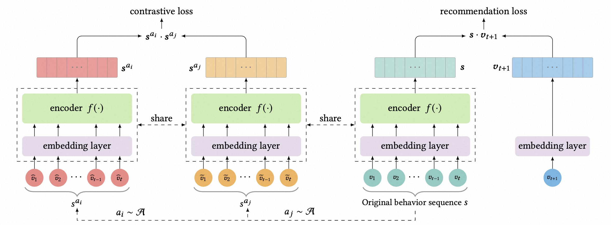

# Contrastive Learning for Sequential Recommendation

### 简介

序列推荐的方法常以序列预测任务来优化大量的参数，具有数据稀疏性的问题，难以学习到高质量的用户表示。
CL4SRec利用对比学习框架从用户行为序列生成自监督信息，以提取更有信息量的用户行为并进行encode。
另外还采用了三种序列数据增强方式(crop/mask/reorder)构建自监督信息。



### 配置说明

```protobuf
model_config: {
  model_name: 'CL4SRec'
  model_class: 'RankModel'
  feature_groups: {
    group_name: 'item'
    feature_names: 'adgroup_id'
    feature_names: 'campaign_id'
    feature_names: 'cate_id'
    feature_names: 'brand'
    feature_names: 'customer'
    feature_names: 'price'
    feature_names: 'pid'
    wide_deep: DEEP
  }
  feature_groups: {
    group_name: 'user'
    feature_names: 'user_id'
    feature_names: 'cms_segid'
    feature_names: 'cms_group_id'
    feature_names: 'age_level'
    feature_names: 'pvalue_level'
    feature_names: 'shopping_level'
    feature_names: 'occupation'
    feature_names: 'new_user_class_level'
    wide_deep: DEEP
  }
  feature_groups: {
    group_name: 'user_seq'
    feature_names: "tag_brand_list"
    feature_names: "tag_category_list"
    wide_deep: DEEP
  }
  backbone {
    blocks {
      name: 'user_seq'
      inputs {
        feature_group_name: 'user_seq'
      }
      input_layer {
        output_seq_and_normal_feature: true
      }
    }
    packages {
      name: 'seq_augment'
      blocks {
        name: 'augment'
        inputs {
          block_name: 'user_seq'
        }
        keras_layer {
          class_name: 'SeqAugment'
          seq_aug {
            mask_rate: 0.6
            crop_rate: 0.2
            reorder_rate: 0.6
          }
        }
      }
    }
    packages {
      name: 'seq_encoder'
      blocks {
        name: 'BST'
        inputs {
          use_package_input: true
        }
        keras_layer {
          class_name: 'BST'
          bst {
            hidden_size: 128
            num_attention_heads: 2
            num_hidden_layers: 2
            intermediate_size: 128
            hidden_act: 'gelu'
            max_position_embeddings: 50
            hidden_dropout_prob: 0.1
            attention_probs_dropout_prob: 0
            output_all_token_embeddings: false
          }
        }
      }
    }
    blocks {
      name: 'contrastive'
      inputs {
        package_name: 'seq_encoder'
        package_input: 'seq_augment'
        package_input_fn: 'lambda x: list(x) + [None]'
      }
      inputs {
        package_name: 'seq_encoder'
        package_input: 'seq_augment'
        package_input_fn: 'lambda x: list(x) + [None]'
      }
      merge_inputs_into_list: true
      keras_layer {
        class_name: 'AuxiliaryLoss'
        st_params {
          fields {
            key: 'loss_type'
            value: { string_value: 'nce_loss' }
          }
          fields {
            key: 'loss_weight'
            value: { number_value: 0.1 }
          }
          fields {
            key: 'temperature'
            value: { number_value: 0.15 }
          }
        }
      }
    }
    blocks {
      name: 'main'
      inputs {
        package_name: 'seq_encoder'
        package_input: 'user_seq'
      }
      inputs {
        feature_group_name: 'user'
      }
      inputs {
        feature_group_name: 'item'
      }
    }
    concat_blocks: 'main'
    top_mlp {
      hidden_units: [256, 128, 64]
    }
  }
  model_params {
    l2_regularization: 0
  }
  embedding_regularization: 0
}
```

- model_name: 任意自定义字符串，仅有注释作用
- model_class: 'RankModel', 不需要修改, 通过组件化方式搭建的单目标排序模型都叫这个名字
- feature_groups: 配置一组特征。
- backbone: 通过组件化的方式搭建的主干网络，[参考文档](../component/backbone.md)
  - blocks: 由多个`组件块`组成的一个有向无环图（DAG），框架负责按照DAG的拓扑排序执行个`组件块`关联的代码逻辑，构建TF Graph的一个子图
  - name/inputs: 每个`block`有一个唯一的名字（name），并且有一个或多个输入(inputs)和输出
  - keras_layer: 加载由`class_name`指定的自定义或系统内置的keras layer，执行一段代码逻辑；[参考文档](../component/backbone.md#keraslayer)
  - SeqAugment: 序列数据增强的组件，参数详见[参考文档](../component/component.md#id4)
  - AuxiliaryLoss: 计算辅助任务损失函数的组件
  - concat_blocks: DAG的输出节点由`concat_blocks`配置项定义，如果不配置`concat_blocks`，框架会自动拼接DAG的所有叶子节点并输出。
- model_params:
  - l2_regularization: (可选) 对DNN参数的regularization, 减少overfit
- embedding_regularization: 对embedding部分加regularization, 减少overfit

### 示例Config

[cdn_on_taobao.config](https://github.com/alibaba/EasyRec/tree/master/samples/model_config/cdn_on_taobao.config)

### 参考论文

[Cross Decoupling Network](https://arxiv.org/pdf/2210.14309.pdf)
