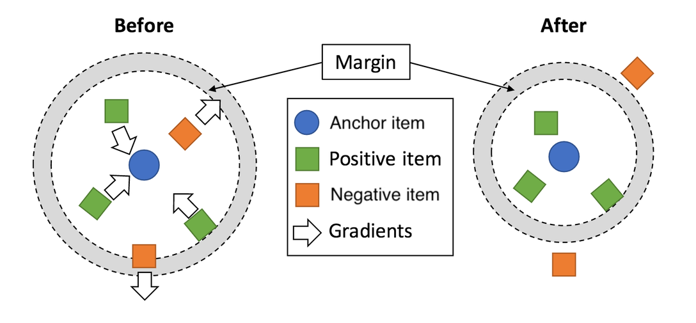

# CoMetricLearningI2I

### 简介

Collaborative Metric Learning I2I 召回模型，基于session点击数据计算item与item的相似度。
在同一session内任意两个被点击的item pair彼此构成正样本对`<anchor item, positive item>`；
`anchor item`与任意一个未被点击的negative item构成负样本对`<anchor item, negative item>`。

Metric Learning需要保证 `anchor item` 与 `negative item` 的语义向量之间的距离
相比 `anchor item` 与 `positive item` 的语义向量之间的距离大，且至少间隔距离为margin（超参数）。



目前可选的损失函数（loss function）包括：

- circle loss
- multi-similarity loss

Collaborative Metric Learning I2I 模型接受的训练样本的格式如下：

```angular2html
  < session_id, item_features, label(is_click) >
```

在训练过程中，同一`mini batch`内同一个`session_id`下`label=1`的所有item彼此之间互相构成
`<anchor item, positive item>`, 而`mini batch`内的其他所有item(不管session_id的值)则
与该pair对构成`negative item`。

因此，需要通过`N Way K Shot`的方式构建训练样本和评估样本。也就是说要保证每个`mini batch`内包含
N个session的数据，且每个session下面随机采样K个item，同时还需要保证这K个item中至少有两个对应的`label=1`。

### 配置说明

```protobuf
model_config: {
  model_class: "CoMetricLearningI2I"
  feature_groups: {
    group_name: "item"
    feature_names: 'adgroup_id'
    feature_names: 'cate_id'
    feature_names: 'campaign_id'
    feature_names: 'customer'
    feature_names: 'brand'
    feature_names: 'price'
    feature_names: 'pid'
    wide_deep:DEEP
  }
  loss_type: CIRCLE_LOSS
  metric_learning {
    input: "item"
    session_id: "user_id"
    dnn {
      hidden_units: [256, 128, 64, 32]
      # dropout_ratio : [0.1, 0.1, 0.1, 0.1]
    }
    l2_regularization: 1e-6
    circle_loss: {
      margin: 0.25
      gamma: 64
    }
  }
  embedding_regularization: 5e-5
}
```

- model_class: 'CoMetricLearningI2I', 不需要修改
- feature_groups: 输入特征
- metric_learning: 模型相关的参数
  - input: item feature group name
  - session_id: session id 的输入field
  - dnn: deep part的参数配置
    - hidden_units: dnn每一层的channel数目，即神经元的数目
  - circle_loss: circle loss 损失函数的超参数
- embedding_regularization: 对embedding部分加regularization，防止overfit

### 示例Config

[CoMetricLearningI2I_demo.config](https://easyrec.oss-cn-beijing.aliyuncs.com/config/metric_learning_on_taobao.config)

### 效果评估

[效果评估](https://easyrec.oss-cn-beijing.aliyuncs.com/docs/recall_eval.pdf)

### 参考论文

- [Circle Loss.pdf](https://arxiv.org/pdf/2002.10857)
- [Multi-Similarity Loss](https://arxiv.org/pdf/1904.06627)
