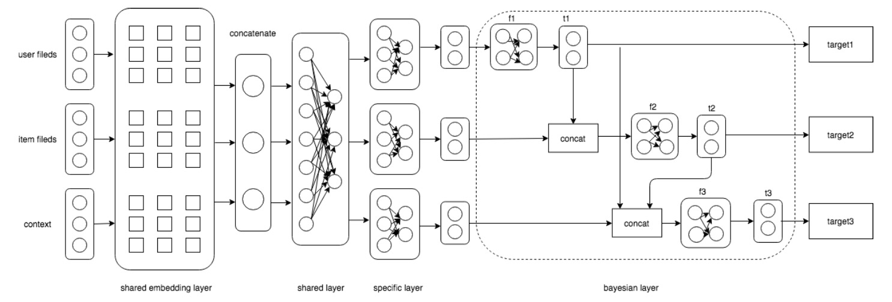
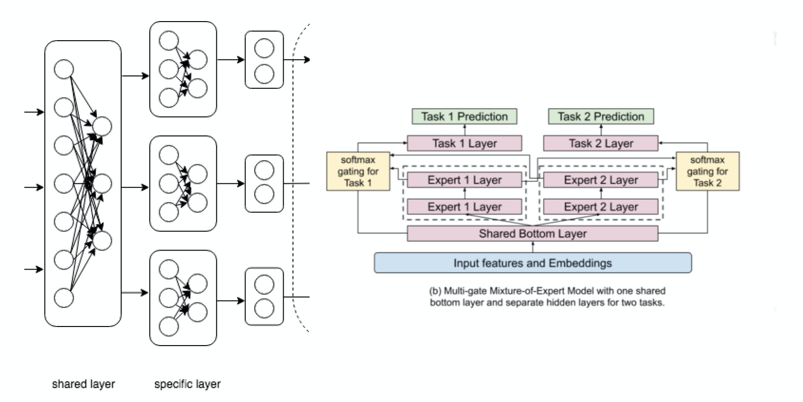

# DBMTL

### 简介

DBMTL构建了多个目标之间的贝叶斯网络，显式建模了多个目标之间可能存在的因果关系，通过对不同任务间的贝叶斯关系来同时优化场景中的多个指标。


底层的shared layer和specific layer是通过hard parameter sharing方式来人工配置的，而google的MMoE是基于soft parameter sharing来实现不同任务底层特征和网络共享，并在Youtube场景中取得了不错的效果。因此DBMTL同样支持将shared layer和specific layer模块替换成MMoE模块，即通过task gate的方式在多组expert参数中加权组合出对应task的feature。



在多模态（图像、视频、文本）推荐场景，DBMTL支持使用[CMBF模型](cmbf.md)作为底层的`shared layer`，以便充分利用多模态特征，取到更好的推荐效果。

### 配置说明

#### DBTML

```protobuf
model_config {
  model_class: "DBMTL"
  feature_groups {
    group_name: "all"
    feature_names: "user_id"
    feature_names: "cms_segid"
    ...
    feature_names: "tag_brand_list"
    wide_deep: DEEP
  }
  dbmtl {
    bottom_dnn {
      hidden_units: [1024, 512, 256]
    }
    task_towers {
      tower_name: "ctr"
      label_name: "clk"
      loss_type: CLASSIFICATION
      metrics_set: {
        auc {}
      }
      dnn {
        hidden_units: [256, 128, 64, 32]
      }
      relation_dnn {
        hidden_units: [32]
      }
      weight: 1.0
    }
    task_towers {
      tower_name: "cvr"
      label_name: "buy"
      loss_type: CLASSIFICATION
      metrics_set: {
        auc {}
      }
      dnn {
        hidden_units: [256, 128, 64, 32]
      }
      relation_tower_names: ["ctr"]
      relation_dnn {
        hidden_units: [32]
      }
      weight: 1.0
    }
    l2_regularization: 1e-6
  }
  embedding_regularization: 5e-6
}
```

- model_class: 'DBMTL', 不需要修改
- feature_groups: 配置一个名为'all'的feature_group。
- dbmtl: dbmtl相关的参数
  - experts
    - expert_name
    - dnn deep part的参数配置
      - hidden_units: dnn每一层的channel数目，即神经元的数目
  - task_towers 根据任务数配置task_towers
    - tower_name
    - dnn deep part的参数配置
      - hidden_units: dnn每一层的channel数目，即神经元的数目
    - 默认为二分类任务，即num_class默认为1，weight默认为1.0，loss_type默认为CLASSIFICATION，metrics_set为auc
    - 注：label_fields需与task_towers一一对齐。
  - embedding_regularization: 对embedding部分加regularization，防止overfit

#### DBMTL+MMOE

```protobuf
model_config {
  model_class: "DBMTL"
  feature_groups {
    group_name: "all"
    feature_names: "user_id"
    feature_names: "cms_segid"
    ...
    feature_names: "tag_brand_list"
    wide_deep: DEEP
  }
  dbmtl {
    bottom_dnn {
      hidden_units: [1024]
    }
    expert_dnn {
      hidden_units: [256, 128, 64, 32]
    }
    num_expert: 8
    task_towers {
      tower_name: "ctr"
      label_name: "clk"
      loss_type: CLASSIFICATION
      metrics_set: {
        auc {}
      }
      dnn {
        hidden_units: [256, 128, 64, 32]
      }
      relation_dnn {
        hidden_units: [32]
      }
      weight: 1.0
    }
    task_towers {
      tower_name: "cvr"
      label_name: "buy"
      loss_type: CLASSIFICATION
      metrics_set: {
        auc {}
      }
      dnn {
        hidden_units: [256, 128, 64, 32]
      }
      relation_tower_names: ["ctr"]
      relation_dnn {
        hidden_units: [32]
      }
      weight: 1.0
    }
    l2_regularization: 1e-6
  }
  embedding_regularization: 5e-6
}
```

- dbmtl
  - expert_dnn: MMOE的专家DNN配置
    - hidden_units: dnn每一层的channel数目，即神经元的数目
  - expert_num: 专家DNN的数目
  - 其余与dbmtl一致

DBMTL模型每个塔的输出名为："logits\_" / "probs\_" / "y\_" + tower_name
其中，logits/probs/y对应: sigmoid之前的值/概率/回归模型的预测值
DBMTL模型每个塔的指标为：指标名+ "\_" + tower_name

#### DBMTL+CMBF

多模态、多目标推荐模型

```protobuf
model_config: {
  model_class: 'DBMTL'
  feature_groups: {
    group_name: 'image'
    feature_names: 'embedding'
    wide_deep: DEEP
  }
  feature_groups: {
    group_name: 'general'
    feature_names: 'user_id'
    feature_names: 'movie_id'
    feature_names: 'gender'
    feature_names: 'age'
    feature_names: 'occupation'
    feature_names: 'zip_id'
    feature_names: 'movie_year_bin'
    feature_names: 'score_year_diff'
    feature_names: 'score_time'
    wide_deep: DEEP
  }
  feature_groups: {
    group_name: 'text'
    feature_names: 'title'
    feature_names: 'genres'
    wide_deep: DEEP
  }
  dbmtl {
    bottom_cmbf {
      multi_head_num: 2
      image_head_size: 8
      text_head_size: 8
      image_feature_dim: 64
      image_self_attention_layer_num: 2
      text_self_attention_layer_num: 2
      cross_modal_layer_num: 3
      image_cross_head_size: 8
      text_cross_head_size: 16
      max_position_embeddings: 16
      use_token_type: true
    }
    task_towers {
      tower_name: "classify"
      label_name: "label"
      loss_type: CLASSIFICATION
      metrics_set: {
        auc {}
      }
      metrics_set: {
        gauc {
          uid_field: 'user_id'
        }
      }
      dnn {
        hidden_units: [256, 128, 64]
      }
      relation_dnn {
        hidden_units: [32]
      }
      weight: 1.0
    }
    task_towers {
      tower_name: "rating"
      label_name: "rating"
      loss_type: L2_LOSS
      metrics_set: {
        mean_squared_error {}
      }
      dnn {
        hidden_units: [256, 128, 64]
      }
      relation_tower_names: ["classify"]
      relation_dnn {
        hidden_units: [32]
      }
      weight: 1.0
    }
    l2_regularization: 1e-6
  }
  embedding_regularization: 1e-6
}
```

- dbmtl
  - bottom_cmbf: 跨模态融合模型CMBF的相关配置，请参考[CMBF模型](cmbf.md)配置。
    - image_feature_dim: 在单模态学习模块之前做图像特征维度调整，调整到该参数指定的维度
    - multi_head_num: 跨模态融合模块中的 head 数量，默认为1
    - image_multi_head_num: 图像单模态学习模块中的 head 数量，默认为1
    - text_multi_head_num: 文本单模态学习模块中的 head 数量，默认为1
    - image_head_size: 单模态学习模块中的图像tower，multi-headed self-attention的每个head的size
    - text_head_size: 单模态学习模块中的文本tower，multi-headed self-attention的每个head的size
    - image_feature_patch_num: \[可选，默认值为1\] 当只有一个image feature时生效，表示该图像特征是一个复合embedding，维度为`image_feature_patch_num * embedding_size`。
    - image_self_attention_layer_num: 单模态学习模块中的图像tower，multi-headed self-attention的层数
    - text_self_attention_layer_num: 单模态学习模块中的文本tower，multi-headed self-attention的层数
    - cross_modal_layer_num: 跨模态融合模块的层数，建议设在1到5之间，默认为1
    - image_cross_head_size: 跨模模态学习模块中的图像tower，multi-headed attention的每个head的size
    - text_cross_head_size: 跨模模态学习模块中的文本tower，multi-headed attention的每个head的size
    - attention_probs_dropout_prob: self/cross attention模块attention权重的dropout概率
    - hidden_dropout_prob: multi-headed attention模块中FC layer的dropout概率
    - use_token_type: bool，default is false；是否使用token type embedding区分不同的text sequence feature
    - use_position_embeddings: bool, default is true；是否为文本序列添加位置编码
    - max_position_embeddings: 文本序列的最大位置，当`use_position_embeddings`为true时，必须配置；并且必须大于或等于所有特征配置`max_seq_len`的最大值
    - text_seq_emb_dropout_prob: 文本序列embedding的dropout概率
  - 其余与dbmtl一致

### 示例Config

- [DBMTL_demo.config](https://easyrec.oss-cn-beijing.aliyuncs.com/config/dbmtl.config)
- [DBMTL_MMOE_demo.config](https://easyrec.oss-cn-beijing.aliyuncs.com/config/dbmtl_mmoe.config)
- [DBMTL_CMBF_demo.config](https://github.com/alibaba/EasyRec/blob/master/samples/model_config/dbmtl_cmbf_on_movielens.config)

### 参考论文

[DBMTL](https://dl.acm.org/doi/pdf/10.1145/3219819.3220007)
