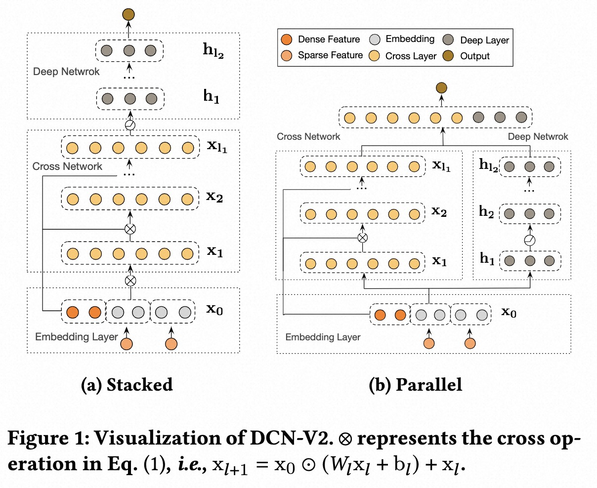
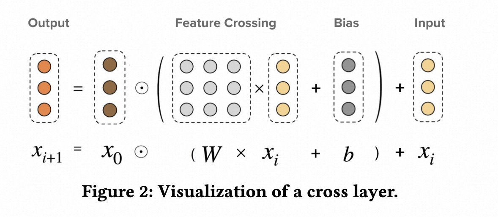

# DCN

### 简介

Deep＆Cross Network（DCN）是在DNN模型的基础上，引入了一种新型的交叉网络，该网络在学习某些特征交叉时效率更高。特别是，DCN显式地在每一层应用特征交叉，不需要人工特征工程，并且只增加了很小的额外复杂性。


DCN-V2相对于前一个版本的模型，主要的改进点在于：

(1) Wide侧-Cross Network中用矩阵替代向量；

(2) 提出2种模型结构，传统的Wide&Deep并行 + Wide&Deep串行。




### DCN v1 配置说明

```protobuf
model_config: {
  model_class: 'DCN'
  feature_groups: {
    group_name: 'all'
    feature_names: 'user_id'
    feature_names: 'cms_segid'
    feature_names: 'cms_group_id'
    feature_names: 'age_level'
    feature_names: 'pvalue_level'
    feature_names: 'shopping_level'
    feature_names: 'occupation'
    feature_names: 'new_user_class_level'
    feature_names: 'adgroup_id'
    feature_names: 'cate_id'
    feature_names: 'campaign_id'
    feature_names: 'customer'
    feature_names: 'brand'
    feature_names: 'price'
    feature_names: 'pid'
    feature_names: 'tag_category_list'
    feature_names: 'tag_brand_list'
    wide_deep: DEEP
  }
  dcn {
    deep_tower {
      input: "all"
      dnn {
        hidden_units: [256, 128, 96, 64]
      }
    }
    cross_tower {
      input: "all"
      cross_num: 5
    }
    final_dnn {
      hidden_units: [128, 96, 64, 32, 16]
    }
    l2_regularization: 1e-6
  }
  embedding_regularization: 1e-4
}
```

- model_class: 'DCN', 不需要修改

- feature_groups: 配置一个名为'all'的feature_group。

- dcn: dcn相关的参数

- deep_tower

  - dnn: deep part的参数配置

    - hidden_units: dnn每一层的channel数目，即神经元的数目

- cross_tower

  - cross_num: 交叉层层数，默认为3

- final_dnn: 整合wide part, fm part, deep part的参数输入, 可以选择是否使用

  - hidden_units: dnn每一层的channel数目，即神经元的数目

- embedding_regularization: 对embedding部分加regularization，防止overfit

### DCN v2 配置说明

```protobuf
model_config {
  model_class: 'RankModel'
  feature_groups: {
    group_name: 'all'
    feature_names: 'user_id'
    feature_names: 'movie_id'
    feature_names: 'job_id'
    feature_names: 'age'
    feature_names: 'gender'
    feature_names: 'year'
    feature_names: 'genres'
    wide_deep: DEEP
  }
  backbone {
    blocks {
      name: "deep"
      inputs {
        name: 'all'
      }
      keras_layer {
        class_name: 'MLP'
        mlp {
          hidden_units: [256, 128, 64]
        }
      }
    }
    blocks {
      name: "dcn"
      inputs {
        name: 'all'
        input_fn: 'lambda x: [x, x]'
      }
      recurrent {
        num_steps: 3
        fixed_input_index: 0
        keras_layer {
          class_name: 'Cross'
        }
      }
    }
    concat_blocks: ['deep', 'dcn']
    top_mlp {
      hidden_units: [64, 32, 16]
    }
  }
  rank_model {
    l2_regularization: 1e-4
  }
  embedding_regularization: 1e-4
}
```

- model_class: 'RankModel', 不需要修改, 通过组件化方式搭建的排序模型都叫这个名字

- feature_groups: 配置一个名为'all'的feature_group。

- backbone: 通过组件化的方式搭建的主干网络，[参考文档](../component/backbone.md)

  - blocks: 由多个`组件块`组成的一个有向无环图（DAG），框架负责按照DAG的拓扑排序执行个`组件块`关联的代码逻辑，构建TF Graph的一个子图
  - concat_blocks: DAG的输出节点由`concat_blocks`配置项定义
  - top_mlp: 各输出`组件块`的输出tensor拼接之后输入给一个可选的顶部MLP层

- rank_model:

  - l2_regularization: 对DNN参数的regularization, 减少overfit

- embedding_regularization: 对embedding部分加regularization, 减少overfit

### 示例Config

1. DCN V1: [DCN_demo.config](https://easyrec.oss-cn-beijing.aliyuncs.com/config/dcn.config)
1. DCN V2: [dcn_backbone_on_movielens.config](https://github.com/alibaba/EasyRec/tree/master/examples/configs/dcn_backbone_on_movielens.config)

### 参考论文

[DCN](https://arxiv.org/abs/1708.05123)

[DCN v2](https://arxiv.org/abs/2008.13535)
