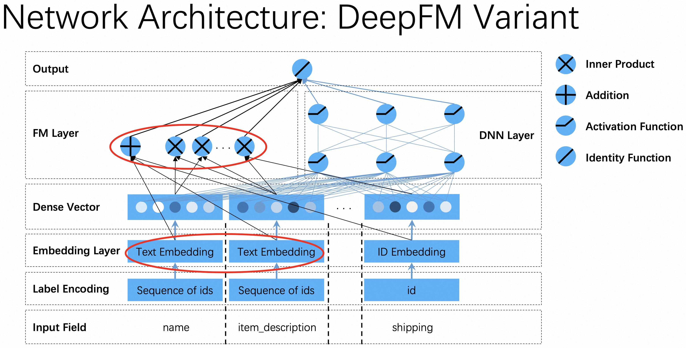

# DeepFM

### 简介

DeepFM是在WideAndDeep基础上加入了FM模块的改进模型。FM模块和DNN模块共享相同的特征，即相同的Embedding。


### 配置说明

#### 1. 内置模型

```protobuf
model_config:{
  model_class: "DeepFM"
  feature_groups: {
    group_name: "deep"
    feature_names: "hour"
    feature_names: "c1"
    ...
    feature_names: "site_id_app_id"
    wide_deep:DEEP
  }
  feature_groups: {
    group_name: "wide"
    feature_names: "hour"
    feature_names: "c1"
    ...
    feature_names: "c21"
    wide_deep:WIDE
  }

  deepfm {
    wide_output_dim: 16

    dnn {
      hidden_units: [128, 64, 32]
    }

    final_dnn {
      hidden_units: [128, 64]
    }
    l2_regularization: 1e-5
  }
  embedding_regularization: 1e-7
}
```

- model_class: 'DeepFM', 不需要修改
- feature_groups:
  需要两个feature_group: wide group和deep group, **group name不能变**
- deepfm: deepfm相关的参数
- dnn: deep part的参数配置
  - hidden_units: dnn每一层的channel数目，即神经元的数目
- wide_output_dim: wide部分输出的大小
- final_dnn: 整合wide part, fm part, deep part的参数输入, 可以选择是否使用
  - hidden_units: dnn每一层的channel数目，即神经元的数目
- embedding_regularization: 对embedding部分加regularization，防止overfit

**FM Varint**

标准的FM，只会输出一个所有二阶交叉求和的logit（scalar）；如果配置了final_dnn，则默认使用了FM模块的一个变种，FM模块输出一个多维的中间结果。



#### 2. 组件化模型

```protobuf
model_config: {
  model_name: 'DeepFM'
  model_class: 'RankModel'
  feature_groups: {
    group_name: 'wide'
    feature_names: 'user_id'
    feature_names: 'movie_id'
    feature_names: 'job_id'
    feature_names: 'age'
    feature_names: 'gender'
    feature_names: 'year'
    feature_names: 'genres'
    wide_deep: WIDE
  }
  feature_groups: {
    group_name: 'features'
    feature_names: 'user_id'
    feature_names: 'movie_id'
    feature_names: 'job_id'
    feature_names: 'age'
    feature_names: 'gender'
    feature_names: 'year'
    feature_names: 'genres'
    feature_names: 'title'
    wide_deep: DEEP
  }
  backbone {
    blocks {
      name: 'wide'
      inputs {
        feature_group_name: 'wide'
      }
      input_layer {
        wide_output_dim: 1
      }
    }
    blocks {
      name: 'features'
      inputs {
        feature_group_name: 'features'
      }
      input_layer {
        output_2d_tensor_and_feature_list: true
      }
    }
    blocks {
      name: 'fm'
      inputs {
        block_name: 'features'
        input_slice: '[1]'
      }
      keras_layer {
        class_name: 'FM'
        fm {
          use_variant: false
        }
      }
    }
    blocks {
      name: 'deep'
      inputs {
        block_name: 'features'
        input_slice: '[0]'
      }
      keras_layer {
        class_name: 'MLP'
        mlp {
          hidden_units: [256, 128, 64, 1]
          use_final_bn: false
          final_activation: 'linear'
        }
      }
    }
    blocks {
      name: 'add'
      inputs {
        block_name: 'wide'
        input_fn: 'lambda x: tf.reduce_sum(x, axis=1, keepdims=True)'
      }
      inputs {
        block_name: 'fm'
      }
      inputs {
        block_name: 'deep'
      }
      merge_inputs_into_list: true
      keras_layer {
        class_name: 'Add'
      }
    }
    concat_blocks: 'add'
  }
  model_params {
    l2_regularization: 1e-4
  }
  embedding_regularization: 1e-4
}
```

- model_name: 任意自定义字符串，仅有注释作用
- model_class: 'RankModel', 不需要修改, 通过组件化方式搭建的单目标排序模型都叫这个名字
- feature_groups: 特征组
  - 包含两个feature_group: wide 和 features group
- backbone: 通过组件化的方式搭建的主干网络，[参考文档](../component/backbone.md)
  - blocks: 由多个`组件块`组成的一个有向无环图（DAG），框架负责按照DAG的拓扑排序执行个`组件块`关联的代码逻辑，构建TF Graph的一个子图
  - name/inputs: 每个`block`有一个唯一的名字（name），并且有一个或多个输入(inputs)和输出
    - input_slice: 用来获取输入元组/列表的某个切片
    - input_fn: 配置一个lambda函数对输入做一些简单的变换
  - input_layer: 对输入的`feature group`配置的特征做一些额外的加工，比如执行可选的`batch normalization`、`layer normalization`、`feature dropout`等操作，并且可以指定输出的tensor的格式（2d、3d、list等）；[参考文档](../component/backbone.md#id15)
    - wide_output_dim: wide部分输出的tensor的维度
  - keras_layer: 加载由`class_name`指定的自定义或系统内置的keras layer，执行一段代码逻辑；[参考文档](../component/backbone.md#keraslayer)
    - FM: fm组件，use_variant参数表示是否使用FM的变种结构(如上图)，默认为false
    - Add: 内置的`tf.keras.layer.Add`，对输入做element-wise的加和操作
  - concat_blocks: DAG的输出节点由`concat_blocks`配置项定义，如果不配置`concat_blocks`，框架会自动拼接DAG的所有叶子节点并输出。
- model_params:
  - l2_regularization: 对DNN参数的regularization, 减少overfit
- embedding_regularization: 对embedding部分加regularization, 减少overfit

### 示例Config

1. 内置模型：[DeepFM_demo.config](https://easyrec.oss-cn-beijing.aliyuncs.com/config/deepfm.config)
1. 组件化模型：[deepfm_backbone_on_movielens.config](https://github.com/alibaba/EasyRec/tree/master/examples/configs/deepfm_backbone_on_movielens.config)

### 参考论文

[DeepFM](https://arxiv.org/abs/1703.04247)
