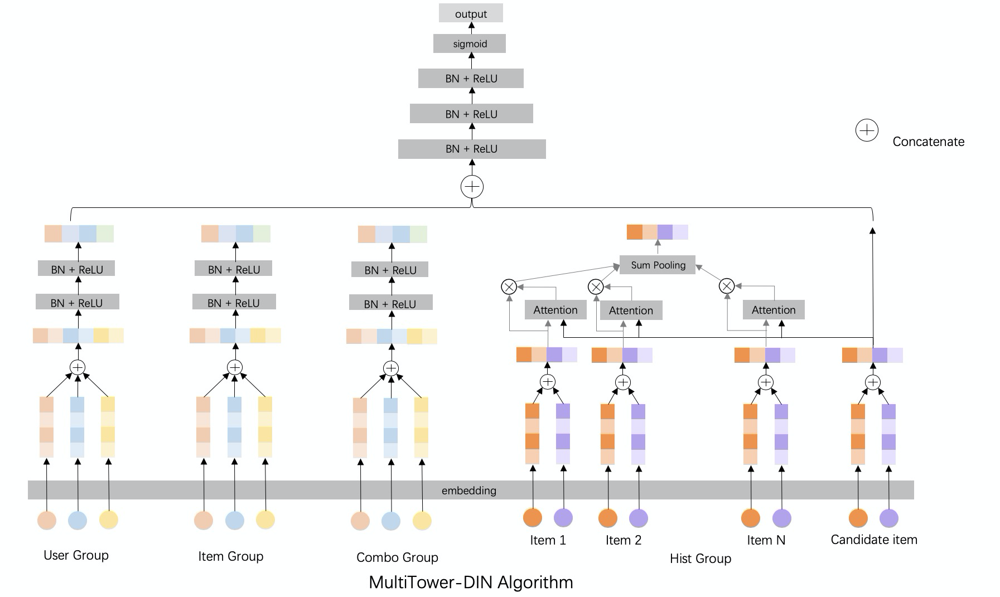

# DIN

### 简介

利用DIN算法建模用户点击序列。支持多组序列共同embedding，如hist_item_id, hist_category_id。目前结合multitower共同使用，din部分作为multitower的一个塔。


### 模型配置

```protobuf
model_config: {
  model_class: 'MultiTowerDIN'
  feature_groups: {
    group_name: 'user'
    feature_names: 'user_id'
    feature_names: 'cms_segid'
    ...
    feature_names: 'new_user_class_level'
    wide_deep: DEEP
  }
  feature_groups: {
    group_name: 'item'
    feature_names: 'adgroup_id'
    feature_names: 'cate_id'
    ...
    feature_names: 'pid'
    wide_deep: DEEP
  }
  seq_att_groups: {
    group_name: "din"
    seq_att_map: {
       key: "brand"
       hist_seq: "tag_brand_list"
    }
    seq_att_map: {
       key: "cate_id"
       hist_seq: "tag_category_list"
    }
  }

  multi_tower {
    towers {
      input: "user"
      dnn {
        hidden_units: [256, 128, 96, 64]
      }
    }
    towers {
      input: "item"
      dnn {
        hidden_units: [256, 128, 96, 64]
      }
    }
    din_towers {
      input: "din"
      dnn {
        hidden_units: [128, 64, 32, 1]
      }
    }
    final_dnn {
      hidden_units: [128, 96, 64, 32, 16]
    }
    l2_regularization: 5e-7
  }
  embedding_regularization: 5e-5
}

```

- model_class: 'MultiTowerDIN', 不需要修改。
- feature_groups: 可配置多个feature_group，group name可以变。
- seq_att_groups: 可配置多个seq_att_groups。
  - group name
  - seq_att_map: 需配置key和hist_seq，一一对应。
- multi_tower: multi_tower相关的参数
  - towers: 每个feature_group对应了一个tower。
    - input必须和feature_groups的group_name对应。
    - dnn: deep part的参数配置
      - hidden_units: dnn每一层的channel数目，即神经元的数目
  - din_towers: 每个seq_att_groups对应了一个din_tower
    - input必须和seq_att_groups的group_name对应。
    - dnn: deep part的参数配置
      - hidden_units: dnn每一层的channel数目，即神经元的数目
  - final_dnn 整合towers和din_towers的输入
    - hidden_units: dnn每一层的channel数目，即神经元的数目
- embedding_regularization: 对embedding部分加regularization，防止overfit

**备注**
DIN 模型需保证在单个样本中, seq_att_groups 内字段的序列长度相同,
例如模型配置示例的 seq_att_groups 中,
第一个样本的 tag_brand_list 和 tag_category_list 都是3个元素；
第二个样本的 tag_brand_list 和 tag_category_list 都是5个元素；

### 示例config

[DIN_demo.config](https://easyrec.oss-cn-beijing.aliyuncs.com/config/din.config)

### 参考论文

[Deep Interest Network](https://arxiv.org/abs/1706.06978)
