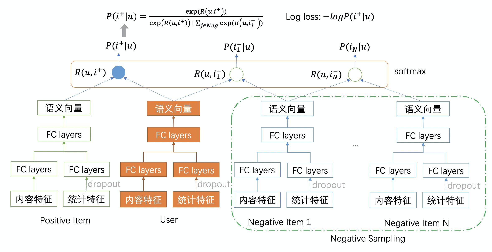

# DropoutNet

### 简介

类似于DSSM的双塔召回模型，分为user塔和item塔。DropoutNet是一种既适用于头部用户和物品，也适用于中长尾的、甚至全新的用户和物品的召回模型。

原始的DropoutNet需要提供用户和物品的embedding向量作为输入监督信号，使得模型使用门槛增高。

EasyRec的实现对原始DropoutNet模型进行了改造，直接使用用户与物品的交互行为数据作为训练目标进行端到端训练，从而避免了需要使用其他模型提供用户和物品的embedding作为监督信号。
相应地，我们对模型的损失函数也进行了改造，如下图所示。

EasyRec的实现使用了Negative Mining的负采样技术，在训练过程中从当前mini batch中采样负样本，扩大了样本空间，使得学习更加高效，同时适用于训练数据量比较少的场景。



### 配置说明

```protobuf
model_config {
  model_class: "DropoutNet"
  feature_groups: {
    group_name: 'user_content'
    feature_names: 'user_id'
    feature_names: 'gender'
    ...
    feature_names: 'city'
    wide_deep:DEEP
  }
  feature_groups: {
    group_name: 'user_preference'
    feature_names: 'fans_num'
    feature_names: 'follow_num'
    ...
    feature_names: 'click_cnt_7d'
    wide_deep:DEEP
  }
  feature_groups: {
    group_name: "item_content"
    feature_names: 'is_new'
    feature_names: 'primary_type'
    ...
    feature_names: 'grade_score'
    wide_deep:DEEP
  }
  feature_groups: {
    group_name: "item_preference"
    feature_names: 'exposure_cnt_7d'
    feature_names: 'click_cnt_7d'
    ...
    feature_names: 'share_cnt_15d'
    wide_deep:DEEP
  }
  losses {
    loss_type: CLASSIFICATION
    weight: 1.0
  }
  losses {
    loss_type: SOFTMAX_CROSS_ENTROPY_WITH_NEGATIVE_MINING
    weight: 1.0
  }
  dropoutnet {
    user_content {
      hidden_units: [256]
    }
    item_content {
      hidden_units: [256]
    }
    user_preference {
      hidden_units: [512]
    }
    item_preference {
      hidden_units: [512]
    }
    user_tower {
      hidden_units: [256, 128]
      use_bn: false
    }
    item_tower {
      hidden_units: [256, 128]
      use_bn: false
    }
    l2_regularization: 1e-06
    user_dropout_rate: 0
    item_dropout_rate: 0.5
    softmax_loss {
      num_negative_mining: 1000
      margin: 0.25
      gamma: 1.8
      coefficient_of_support_vector: 2
    }
  }
  sample_weight_field: "weight"
  embedding_regularization: 5e-5
}
```

- model_class: 'DropoutNet', 不需要修改
- feature_groups: 需要四个feature_group: user_content、user_preference和item_content、item_preference, **group name不能变**。
  其中，user_content和user_preference两者至少要有1个；item_content和item_preference两者至少要有1个。
- losses: 配置模型使用的loss function的类型和权重；DropoutNet支持三种类型的loss函数，可以单独使用，也可以搭配在一起使用。
  - loss_type=CLASSIFICATION: 常规的二分类sigmoid cross entropy loss
  - loss_type=SoftmaxCrossEntropyWithNegativeMining: 自带负采样功能的support vector guided softmax loss，使用该 loss 类型时，
    需要在`dropoutnet`模型参数中配置`softmax_loss`对应的参数。
  - loss_type=PAIR_WISE_LOSS: pairwise rank loss，也就AUC loss，以优化全局AUC为目标；使用该 loss 类型时，
    可以在`dropoutnet`模型参数中配置`pairwise_loss`对应的参数。
- dropoutnet: dropoutnet相关的参数，必须配置user_tower和item_tower
  - user_content/user_content/user_preference/item_preference/user_tower/item_tower: dnn的参数配置
    - hidden_units: dnn每一层的channel数目，即神经元的数目
    - use_bn: 是否开启batch normalization，默认值为`true`
  - user_dropout_rate: 用户偏好统计特征dropout概率，`0`表示不执行dropout操作；当模型用于`用户冷启动`场景时，必须设置该值大于0
  - item_dropout_rate: Item偏好统计特征dropout概率，`0`表示不执行dropout操作；当模型用于`物品冷启动`场景时，必须设置该值大于0
  - l2_regularization: L2正则项系数
  - softmax_loss: 自带负采样功能的support vector guided softmax loss
    - num_negative_samples: 从`mini-batch`中负采样多少个样本，必须小于 `batch_size`
    - margin: 正样本对的语义向量直接的距离必须小于负样本点语义向量之间的距离减去`margin`
    - gamma: softmax函数的平滑系数；建议配置为大于1的值
    - coefficient_of_support_vector: 支持向量softmax loss的参数，一般设置为大于1的值
- sample_weight_field: 【可选】样本权重的输入field name；没有样本权重时可以不配
- embedding_regularization: 对embedding部分加regularization，防止overfit

### 示例Config

[DropoutNet_demo.config](https://easyrec.oss-cn-beijing.aliyuncs.com/config/dropoutnet.config)

### 效果评估

[效果评估](https://easyrec.oss-cn-beijing.aliyuncs.com/docs/recall_eval.pdf)

### 参考论文

[DropoutNet.pdf](https://papers.nips.cc/paper/2017/file/dbd22ba3bd0df8f385bdac3e9f8be207-Paper.pdf)
