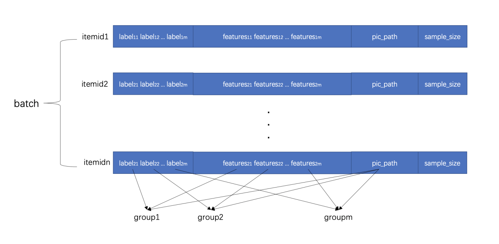

# End-to-end MultiModal DBMTL

### 简介

本算法基于CSCNN(Category-Specific CNN for Visual-aware CTR Prediction at JD.com)思路，即对一个图像只进行一次embedding，并广播到这个batch中的多个样本中，对样本分组，将相同item的样本组合成一个或多个group，一个batch包含多个group。固定一个batch中图像数，一个batch中的总样本数动态调整。如下图所示：


如图，一个batch中包含n个item，每个item最多有m个样本，用sample_size字段记录当前item的样本数，img_path字段用来记录图像的存储oss路径。
通过这种样本构建的方式，可以加快io和模型训练的速度，极大程度的减少模型训练时长。

### 模型配置

```protobuf
data_config {
  batch_size: 64
  input_type: GroupRTPInput
  separator: ""
  group_sample_separator: ""
  rtp_separator: "|"
  selected_cols: "3,4,5,6,7,8,9,11,12"
  input_fields {
    input_name: "is_valid_play"
    input_type: INT32
    default_val: "0"
  }
  ...
  input_fields {
    input_name: "img_path"
    input_type: STRING
  }
  input_fields {
    input_name: "group_size"
    input_type: INT32
  }
}
feature_config {
  ...
  features {
    input_names: "img_path"
    feature_type: ImgFeature
    img_shape {
      width: 224
      height: 224
      channel: 3
    }
  }
  features {
    input_names: "group_size"
    feature_type: SampleNumFeature
  }
}
model_config {
  model_class: "E2E_MM_DBMTL"
  feature_groups {
    group_name: "img"
    feature_names: "img_path"
  }
  feature_groups {
    group_name: "sample_num"
    feature_names: "group_size"
  }
  feature_groups {
    group_name: "all"
    feature_names: "latitude"
    feature_names: "longitude"
    feature_names: "city"
    feature_names: "province"
    feature_names: "os"
    feature_names: "os_version"
    feature_names: "day_h"
    feature_names: "week_day"
    feature_names: "is_new_userid"
    feature_names: "level"
    feature_names: "is_member"
    feature_names: "familyid"
    feature_names: "gender"
    feature_names: "constellation"
    feature_names: "user_auth_type"
    feature_names: "fans_num"
    feature_names: "follow_num"
    feature_names: "visitor_num"
    feature_names: "billboard_num"
    wide_deep: DEEP
  }
  embedding_regularization: 1e-05
  e2e_mm_dbmtl {
    highway_dnn {
      input: "img"
      emb_size: 16
    }
    bottom_dnn {
      hidden_units: 1024
      hidden_units: 512
      dropout_ratio: 0.3
      dropout_ratio: 0.3
      use_bn: false
    }
    task_towers {
      tower_name: "is_valid_play"
      label_name: "is_valid_play"
      metrics_set {
        auc {
        }
      }
      loss_type: CLASSIFICATION
      dnn {
        hidden_units: 256
        hidden_units: 128
        hidden_units: 64
        hidden_units: 32
        dropout_ratio: 0.2
        dropout_ratio: 0.2
        dropout_ratio: 0.1
        dropout_ratio: 0.1
        use_bn: false
      }
      relation_dnn {
        hidden_units: 16
        use_bn: false
      }
      weight: 1.0
    }
    task_towers {
      tower_name: "play_time"
      label_name: "play_time"
      metrics_set {
        mean_squared_error {
        }
      }
      loss_type: L2_LOSS
      dnn {
        hidden_units: 256
        hidden_units: 128
        hidden_units: 64
        hidden_units: 32
        dropout_ratio: 0.2
        dropout_ratio: 0.2
        dropout_ratio: 0.1
        dropout_ratio: 0.1
        use_bn: false
      }
      relation_tower_names: "is_valid_play"
      relation_dnn {
        hidden_units: 16
        use_bn: false
      }
      weight: 1.0
    }
}
export_config {
  multi_placeholder: true
  img_input_name: "img_path"
  img_shape {
      width: 224
      height: 224
      channel: 3
  }
}
```

- data_config:
  - input_type 需使用 GroupRTPInput/OdpsGroupRTPInput
  - group_sample_separator 用来分割group内样本，建议设置为 chr(1)
- feature_config:
  - 分别将 img_path 字段和 sample_size 字段配置成 ImgFeature 和 SampleNumFeature
- model_config:
  - model_class 固定为 E2E_MM_DBMTL
  - 分别配置名为 img 和 sample_num 的 feature_group
  - e2e_mm_dbmtl:
    - highway_dnn/img_dnn: 用来处理图像网络的输出向量
  - 其余配置与[dbmtl](dbmtl.md)一致

### 示例Config

[e2e_mm_dbmtl.config](https://easyrec.oss-cn-beijing.aliyuncs.com/config/end-to-end_multimodal_dbmtl.config)

### 后处理

执行'easy_rec/python/tools/export_mm_model.py'脚本，将导出图像模型(img_model_export_dir)，部署到推荐服务上的模型(rec_model_export_dir)，完整模型（total_model_export_dir）。

- 图像网络：用来推理img embedding，可将embedding存入向量引擎(如hologres)中，线上直接查询以减少推理链路时长。
- 推荐模型：部署到推荐服务上，接收特征和图像embedding（用逗号分割的字符串格式）所为输入。
- 完整模型：包含图像网络和推荐网络，线上不需要使用。

```
pai -name tensorflow1120_ext
-project=algo_public
-Dscript='oss://xxx/easy_rec_ext_0.3.2_res.tar.gz'
-DentryFile='easy_rec/python/tools/export_mm_model.py'
-DuserDefinedParameters='--model_dir oss://xxx/experiments/ --pipeline_config_path oss://xxx/experiments/e2e_img_highway_test.config  --rec_model_export_dir oss://xxx/experiments/export/rec_model --total_model_export_dir oss://xxx/experiments/export/total_model --img_model_export_dir oss://xxx/experiments/export/img_model'
-Darn=xxx
-Dbuckets=xxx
-DossHost=xxx
-Dcluster='{\"worker\":{\"count\":1,"cpu\":800,\"memory\":40000}}'
;
```

### 参考论文

- [DBMTL](https://dl.acm.org/doi/pdf/10.1145/3219819.3220007)
- [The image embedding of one image is conducted only once and broadcasted to multiple impressions in this batch](https://arxiv.org/pdf/2006.10337.pdf)
