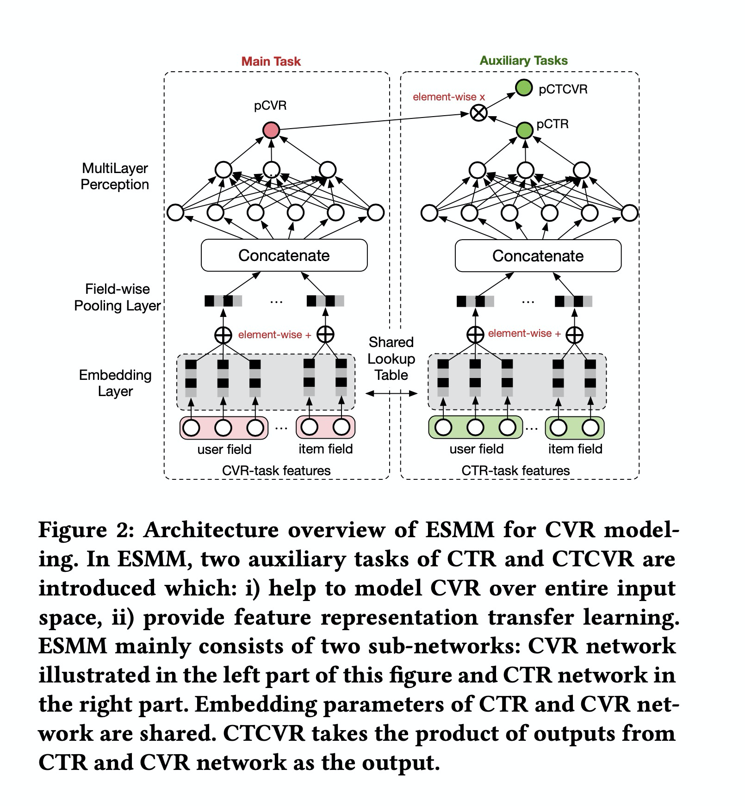

# ESMM

### 简介

CVR预估模型的本质，不是预测“item被点击，然后被转化”的概率（CTCVR），而是“假设item被点击，那么它被转化”的概率（CVR）。\\它与CTR没有绝对的关系，很多人有一个先入为主的认知，即若user对某item的点击概率很低，则user对这个item的转化概率也肯定低，这是不成立的。
这就是不能直接使用全部样本训练CVR模型的原因，因为不知道那些unclicked的item，假设他们被点击了，是否会被转化。如果直接使用0作为它们的label，会很大程度上误导CVR模型的学习。


其中 z,y 分别表示conversion和click。注意到，在全部样本空间中，CTR对应的label为click，而CTCVR对应的label为click & conversion，这两个任务是可以使用全部样本的。因此，通过这学习两个任务，再根据上式隐式地学习CVR任务。



### 配置说明

```protobuf
model_config: {
  model_class: 'ESMM'
  feature_groups: {
    group_name: 'user'
    feature_names: 'user_id'
    feature_names: 'cms_segid'
    ...
    feature_names: 'new_user_class_level'
    wide_deep: DEEP
  }
  feature_groups: {
    group_name: 'item'
    feature_names: 'adgroup_id'
    feature_names: 'cate_id'
    ...
    feature_names: 'price'
    wide_deep: DEEP
  }
  feature_groups: {
    group_name: 'combo'
    feature_names: 'pid'
    feature_names: 'tag_category_list'
    feature_names: 'tag_brand_list'
    wide_deep: DEEP
  }
  esmm {
    groups {
      input: "user"
      dnn {
        hidden_units: [256, 128, 96, 64]
      }
    }
    groups {
      input: "item"
      dnn {
        hidden_units: [256, 128, 96, 64]
      }
    }
    groups {
      input: "combo"
      dnn {
        hidden_units: [128, 96, 64, 32]
      }
    }
    cvr_tower {
      tower_name: "cvr"
      label_name: "buy"
      dnn {
        hidden_units: [128, 96, 64, 32, 16]
      }
      num_class: 1
      weight: 1.0
      loss_type: CLASSIFICATION
      metrics_set: {
       auc {}
      }
    }
    ctr_tower {
      tower_name: "ctr"
      label_name: "clk"
      dnn {
        hidden_units: [128, 96, 64, 32, 16]
      }
      num_class: 1
      weight: 1.0
      loss_type: CLASSIFICATION
      metrics_set: {
       auc {}
      }
    }
    l2_regularization: 1e-6
  }
  embedding_regularization: 5e-5
}
```

- model_class: 'ESMM', 不需要修改
- feature_groups: 支持多组feature_group
- esmm: esmm相关的参数
  - groups
    - input  tower的input必须和feature_groups的group_name对应
    - dnn deep part的参数配置
      - hidden_units: dnn每一层的channel数目，即神经元的数目
  - cvr_tower
    - tower_name：'cvr'，不需要修改
    - label_name: tower对应的label名，若不设置，label_fields需与task_towers一一对齐
    - dnn deep part的参数配置
      - hidden_units: dnn每一层的channel数目，即神经元的数目
    - 默认为二分类任务，即num_class默认为1，weight默认为1.0，loss_type默认为CLASSIFICATION，metrics_set为auc
  - ctr_tower
    - tower_name：'ctr'，不需要修改
    - label_name: tower对应的label名，若不设置，label_fields需与task_towers一一对齐
    - dnn deep part的参数配置
      - hidden_units: dnn每一层的channel数目，即神经元的数目
    - 默认为二分类任务，即num_class默认为1，weight默认为1.0，loss_type默认为CLASSIFICATION，metrics_set为auc
- embedding_regularization: 对embedding部分加regularization，防止overfit

ESMM模型输出的值有以下几项：

- "logits\_" / "probs\_" + ctr_tower的tower_name
- "logits\_" / "probs\_" /  "y\_" + cvr_tower的tower_name
- "probs_ctcvr" / "y_ctcvr"

ESMM模型的指标有以下几项：

- 指标名 + "\_" + ctr_tower 的 tower_name
- 指标名 + "\_" + cvr_tower 的 tower_name + "\_masked"
- 指标名 + "\_ctcvr"

### 示例Config

[ESMM_demo.config](https://easyrec.oss-cn-beijing.aliyuncs.com/config/esmm.config)

### 参考论文

[论文地址](https://arxiv.org/abs/1804.07931)
