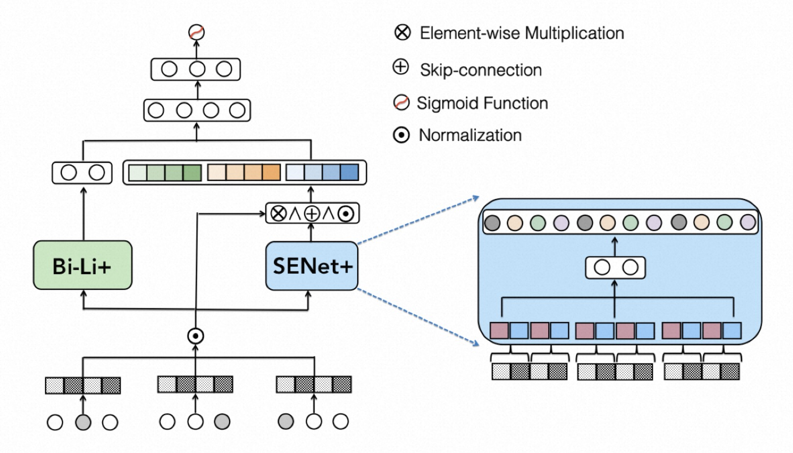

# FiBiNet

### 简介

FiBiNet 模型包含两个核心模块, 分别是:

- SENET(Squeeze-Excitation network)
- Bilinear Feature Interaction

其中 SENET 是借鉴计算机视觉中的网络, 可以动态地学习特征的重要性, 对于越重要的特征, 将学习出更大的权重, 并且减小不那么重要的特征的权重;

另外对于特征交叉的问题, 经典的方法主要采用 Inner Product 或者 Hadamard Product 来构造交叉特征, 作者认为这些方法比较简单,
可能无法对交叉特征进行有效的建模, 因此提出了 Bilinear Feature Interaction 方法, 结合了 Inner Product 以及 Hadamard Product 二者,
在两个要交叉的特征间插入一个权重矩阵, 以动态学习到特征间的组合关系.



### 配置说明

```protobuf
model_config {
  model_class: 'RankModel'
  feature_groups: {
    group_name: 'all'
    feature_names: 'user_id'
    feature_names: 'movie_id'
    feature_names: 'job_id'
    feature_names: 'age'
    feature_names: 'gender'
    feature_names: 'year'
    feature_names: 'genres'
    wide_deep: DEEP
  }
  backbone {
    blocks {
      name: "all"
      input_layer {
        do_batch_norm: true
        only_output_feature_list: true
      }
    }
    blocks {
      name: "fibinet"
      inputs {
        name: "all"
      }
      keras_layer {
        class_name: 'FiBiNet'
        fibinet {
          senet {
            reduction_ratio: 4
          }
          bilinear {
            type: 'each'
            num_output_units: 512
          }
          mlp {
            hidden_units: [512, 256]
          }
        }
      }
    }
    concat_blocks: ['fibinet']
  }
  rank_model {
  }
  embedding_regularization: 1e-4
}
```

- model_class: 'RankModel', 不需要修改, 通过组件化方式搭建的排序模型都叫这个名字

- feature_groups: 配置一个名为'all'的feature_group。

- backbone: 通过组件化的方式搭建的主干网络，[参考文档](../component/backbone.md)

  - blocks: 由多个`组件块`组成的一个有向无环图（DAG），框架负责按照DAG的拓扑排序执行个`组件块`关联的代码逻辑，构建TF Graph的一个子图
  - concat_blocks: DAG的输出节点由`concat_blocks`配置项定义

- rank_model:

  - l2_regularization: (可选) 对DNN参数的regularization, 减少overfit

- embedding_regularization: 对embedding部分加regularization, 减少overfit

### 示例config

[fibinet_on_movielens.config](https://github.com/alibaba/EasyRec/tree/master/examples/configs/fibinet_on_movielens.config)

### 参考论文

1. [FiBiNET](https://arxiv.org/pdf/1905.09433.pdf)
   Combining Feature Importance and Bilinear feature Interaction for Click-Through Rate Prediction
1. [FiBiNet++](https://arxiv.org/pdf/2209.05016.pdf)
   Improving FiBiNet by Greatly Reducing Model Size for CTR Predictio
