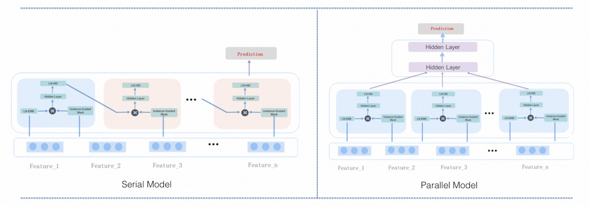

# MaskNet

### 简介

MaskNet提出了一种instance-guided mask方法，该方法在DNN中的特征嵌入层和前馈层同时使用element-wise product。instance-guided mask包含全局上下文信息，动态地融入到特征嵌入层和前馈层，突出重要的特征。



### 配置说明

```protobuf
model_config {
  model_class: 'RankModel'
  feature_groups: {
    group_name: 'all'
    feature_names: 'user_id'
    feature_names: 'movie_id'
    feature_names: 'job_id'
    feature_names: 'age'
    feature_names: 'gender'
    feature_names: 'year'
    feature_names: 'genres'
    wide_deep: DEEP
  }
  backbone {
    blocks {
      name: "mask_net"
      inputs {
        name: "all"
      }
      keras_layer {
        class_name: 'MaskNet'
        masknet {
          mask_blocks {
            aggregation_size: 512
            output_size: 256
          }
          mask_blocks {
            aggregation_size: 512
            output_size: 256
          }
          mask_blocks {
            aggregation_size: 512
            output_size: 256
          }
          mlp {
            hidden_units: [512, 256]
          }
        }
      }
    }
    concat_blocks: ['mask_net']
  }
  rank_model {
  }
  embedding_regularization: 1e-4
}
```

- model_class: 'RankModel', 不需要修改, 通过组件化方式搭建的排序模型都叫这个名字

- feature_groups: 配置一个名为'all'的feature_group。

- backbone: 通过组件化的方式搭建的主干网络，[参考文档](../component/backbone.md)

  - blocks: 由多个`组件块`组成的一个有向无环图（DAG），框架负责按照DAG的拓扑排序执行个`组件块`关联的代码逻辑，构建TF Graph的一个子图
  - concat_blocks: DAG的输出节点由`concat_blocks`配置项定义

- rank_model: 

  - l2_regularization: (可选) 对DNN参数的regularization, 减少overfit

- embedding_regularization: 对embedding部分加regularization, 减少overfit

### 示例Config

[masknet_on_movielens.config](https://github.com/alibaba/EasyRec/tree/master/examples/configs/masknet_on_movielens.config)

### 参考论文

[MaskNet](https://arxiv.org/pdf/2102.07619)