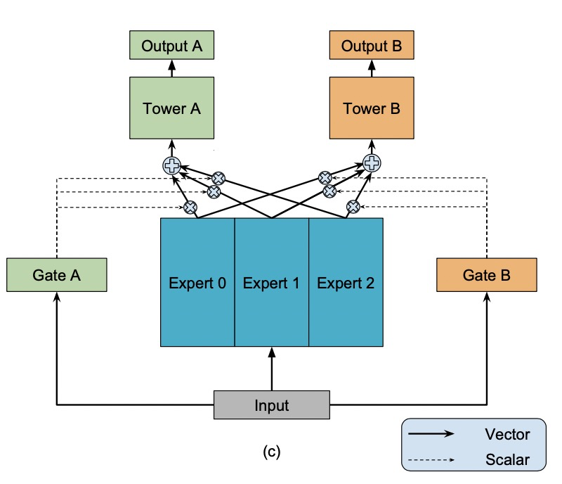

# MMoE

### 简介

常用的多任务模型的预测质量通常对任务之间的关系很敏感。由于MMoE有多个expert，每个expert有不同的gate。因此当任务之间相关性低的时候，不同任务依赖不同的expert，MMoE依旧表现良好。


### 配置说明

```protobuf
model_config {
  model_class: "MMoE"
  feature_groups {
    group_name: "all"
    feature_names: "user_id"
    feature_names: "cms_segid"
    ...
    feature_names: "tag_brand_list"
    wide_deep: DEEP
  }
  mmoe {
    expert_dnn {
      hidden_units: [256, 192, 128, 64]
    }
    num_expert: 4
    task_towers {
      tower_name: "ctr"
      label_name: "clk"
      dnn {
        hidden_units: [256, 192, 128, 64]
      }
      num_class: 1
      weight: 1.0
      loss_type: CLASSIFICATION
      metrics_set: {
       auc {}
      }
    }
    task_towers {
      tower_name: "cvr"
      label_name: "buy"
      dnn {
        hidden_units: [256, 192, 128, 64]
      }
      num_class: 1
      weight: 1.0
      loss_type: CLASSIFICATION
      metrics_set: {
       auc {}
      }
    }
    l2_regularization: 1e-06
  }
  embedding_regularization: 5e-05
}

```

- model_class: 'MMoE', 不需要修改
- feature_groups: 配置一个名为'all'的feature_group。
- mmoe: mmoe相关的参数
  - expert_dnn: MMOE的专家DNN配置
    - hidden_units: dnn每一层的channel数目，即神经元的数目
  - expert_num: 专家DNN的数目
  - task_towers: 根据任务数配置task_towers
    - tower_name：任务名
    - label_name: tower对应的label名，若不设置，label_fields需与task_towers一一对齐
    - dnn: deep part的参数配置
      - hidden_units: dnn每一层的channel数目，即神经元的数目
    - 默认为二分类任务，即num_class默认为1，weight默认为1.0，loss_type默认为CLASSIFICATION，metrics_set为auc
  - embedding_regularization: 对embedding部分加regularization，防止overfit

MMoE模型每个塔的输出名为："logits\_" / "probs\_" / "y\_" + tower_name
其中，logits/probs/y对应: sigmoid之前的值/概率/回归模型的预测值
MMoE模型每个塔的指标为：指标名+ "\_" + tower_name

### 组件化主干网络为底座

```protobuf
model_config {
  model_class: "MMoE"
  feature_groups {
    group_name: "all"
    feature_names: "user_id"
    feature_names: "cms_segid"
    ...
    feature_names: "tag_brand_list"
    wide_deep: DEEP
  }
  backbone {
    blocks {
      name: 'all'
      inputs {
        feature_group_name: 'all'
      }
      input_layer {
        only_output_feature_list: true
      }
    }
    blocks {
      name: "senet"
      inputs {
        block_name: "all"
      }
      keras_layer {
        class_name: 'SENet'
        senet {
          reduction_ratio: 4
        }
      }
    }
    concat_blocks: ['senet']
  }
  mmoe {
    expert_dnn {
      hidden_units: [256, 192, 128, 64]
    }
    num_expert: 4
    task_towers {
      tower_name: "ctr"
      label_name: "clk"
      dnn {
        hidden_units: [256, 192, 128, 64]
      }
      num_class: 1
      weight: 1.0
      loss_type: CLASSIFICATION
      metrics_set: {
       auc {}
      }
    }
    task_towers {
      tower_name: "cvr"
      label_name: "buy"
      dnn {
        hidden_units: [256, 192, 128, 64]
      }
      num_class: 1
      weight: 1.0
      loss_type: CLASSIFICATION
      metrics_set: {
       auc {}
      }
    }
    l2_regularization: 1e-06
  }
  embedding_regularization: 5e-05
}
```

- backbone: 通过组件化的方式搭建的主干网络，[参考文档](../component/backbone.md)

  - blocks: 由多个`组件块`组成的一个有向无环图（DAG），框架负责按照DAG的拓扑排序执行个`组件块`关联的代码逻辑，构建TF Graph的一个子图
  - name/inputs: 每个`block`有一个唯一的名字（name），并且有一个或多个输入(inputs)和输出
  - input_layer: 对输入的`feature group`配置的特征做一些额外的加工，比如执行可选的`batch normalization`、`layer normalization`、`feature dropout`等操作，并且可以指定输出的tensor的格式（2d、3d、list等）；[参考文档](../component/backbone.md#id15)
  - keras_layer: 加载由`class_name`指定的自定义或系统内置的keras layer，执行一段代码逻辑；[参考文档](../component/backbone.md#keraslayer)
  - fibinet: FiBiNet模型的参数，详见[参考文档](../component/component.md#id3)
  - concat_blocks: DAG的输出节点由`concat_blocks`配置项定义

- 其余与MMoE内置参数相同

### 示例Config

- [MMoE_demo.config](https://easyrec.oss-cn-beijing.aliyuncs.com/config/mmoe.config)
- [MMoE_Backbone_demo.config](https://github.com/alibaba/EasyRec/blob/master/samples/model_config/mmoe_backbone_on_taobao.config)

### 参考论文

[MMoE.pdf](https://dl.acm.org/doi/pdf/10.1145/3219819.3220007)
