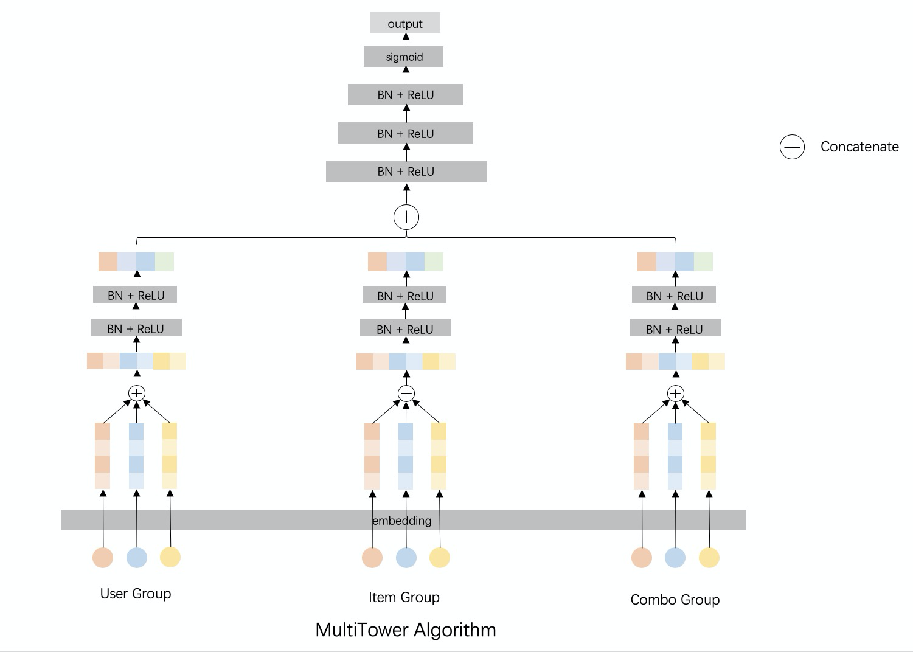

# MultiTower

### 简介

- 多塔模型效果比单塔模型有明显的提升
- 不采用FM，所以embedding可以有不同的dimension。



### 模型配置

```protobuf
model_config: {
  model_class: 'MultiTower'
  feature_groups: {
    group_name: 'user'
    feature_names: 'user_id'
    feature_names: 'cms_segid'
    ...
    feature_names: 'new_user_class_level'
    wide_deep: DEEP
  }
  feature_groups: {
    group_name: 'item'
    feature_names: 'adgroup_id'
    feature_names: 'cate_id'
    ...
    feature_names: 'price'
    wide_deep: DEEP
  }
  feature_groups: {
    group_name: 'combo'
    feature_names: 'pid'
    feature_names: 'tag_category_list'
    feature_names: 'tag_brand_list'
    wide_deep: DEEP
  }
  f1_reweight_loss {
    f1_beta_square: 2.25
  }
  losses {
    loss_type: CLASSIFICATION
    weight: 2.0
  }
  losses {
    loss_type: PAIR_WISE_LOSS
    weight: 1.0
  }
  multi_tower {
    towers {
      input: "user"
      dnn {
        hidden_units: [256, 128, 96, 64]
      }
    }
    towers {
      input: "item"
      dnn {
        hidden_units: [256, 128, 96, 64]
      }
    }
    towers {
      input: "combo"
      dnn {
        hidden_units: [128, 96, 64, 32]
      }
    }
    final_dnn {
      hidden_units: [128, 96, 64, 32, 16]
    }
    l2_regularization: 1e-6
  }
  embedding_regularization: 1e-4
}
```

- feature_groups: 不同的特征组，如user feature为一组，item feature为一组, combo feature为一组
  - group_name: 可以根据实际情况取
  - wide_deep: 必须是DEEP
- losses: 可选，可以选择同时配置两个loss函数，并且为每个loss配置不同的权重
  - loss_type: CLASSIFICATION [默认值] 二分类的sigmoid cross entropy loss
  - loss_type: PAIR_WISE_LOSS [可选] 以优化AUC为主要目标的 pairwise rank loss
  - loss_type: F1_REWEIGHTED_LOSS [可选] 可以调节二分类模型recall/precision相对权重的loss; 注意不要与`loss_type: CLASSIFICATION`同时使用
- towers:
  - 每个feature_group对应了一个tower, tower的input必须和feature_groups的group_name对应
  - dnn: 深度网络
    - hidden_units: 定义不同层的channel数目，即神经元数目
- final_dnn 整合towers和din_towers的输入
  - hidden_units: dnn每一层的channel数目，即神经元的数目
- l2_regularization: L2正则，防止overfit
- embedding_regularization: embedding的L2正则

### 示例config

[multi_tower_demo.config](https://easyrec.oss-cn-beijing.aliyuncs.com/config/multi-tower.config)

### 参考论文

自研模型，暂无参考论文
