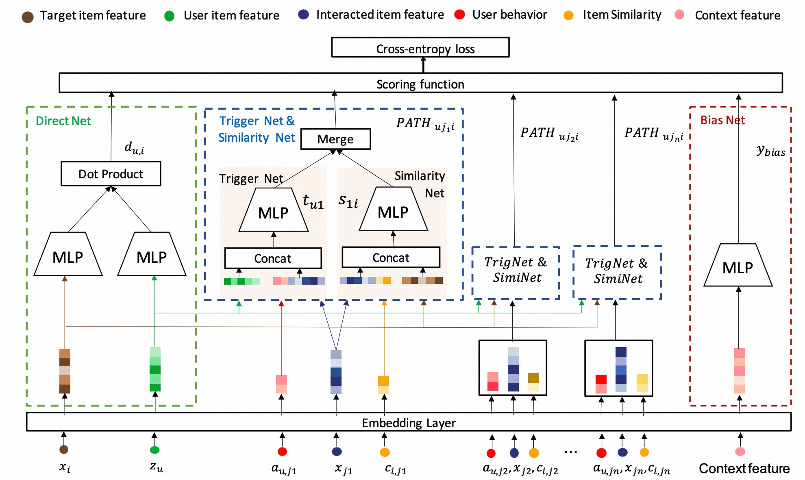

# PDN

### 简介

在推荐系统的召回阶段，工业界常多采用 基于Item的协同过滤 (Item-based CF) 和 基于embedding的检索 (EBR)。然而，Item-based CF很难满足个性化，而EBR则很难满足多样性。

论文中提出了一种新颖的匹配架构——基于路径的深度网络（Path-based Deep Network, PDN）, 它可以结合个性化和多样性来提高匹配性能。

具体来说，PDN由两个模块组成：Trigger Net和Similarity Net。 PDN 利用 Trigger Net 来捕获用户对其每个交互item的兴趣，并利用 Simity Net 根据这些item的特征和共现信息来评估每个交互item与目标item之间的相似度。

用户和目标item之间的最终相关性是通过明确考虑用户的不同兴趣来计算的，即聚合相关两跳路径的相关权重（路径的一跳对应于user - trigger item交互，另一跳对应于trigger item - target item相关性）。



### 配置说明

#### PDN

```protobuf
model_config {
  model_class: "PDN"
  feature_groups: {
    group_name: 'u2i_seq'
    feature_names: 'event_type_seq'
  }
  feature_groups: {
    group_name: 'i_seq'
    feature_names: 'tag_category_list'
  }
  feature_groups: {
    group_name: 'i2i_seq'
    feature_names: 'i2i_rnk'
  }
  feature_groups: {
    group_name: 'user'
    feature_names: 'user_id'
    feature_names: 'cms_segid'
    wide_deep:DEEP
  }
  feature_groups: {
    group_name: "item"
    feature_names: 'adgroup_id'
    feature_names: 'cate_id'
    wide_deep:DEEP
  }
  feature_groups {
    group_name: 'bias'
    feature_names: 'position'
  }

  pdn {
    user_dnn {
      hidden_units: [128, 64, 32]
    }
    item_dnn {
      hidden_units: [128, 64, 32]
    }
    u2i_dnn {
      hidden_units: [64, 32]
    }
    i2i_dnn {
      hidden_units: [128, 64, 32]
    }
    trigger_dnn {
      hidden_units: [64, 32, 1]
    }
    sim_dnn {
      hidden_units: [64, 32, 1]
    }
    bias_dnn {
      hidden_units: [32, 32, 1]
    }

    l2_regularization: 1e-6
  }
  embedding_regularization: 5e-6
}
```

- model_class: 'PDN', 不需要修改
- feature_groups: 需要六个feature_group: u2i_seq, i_seq, i2i_seq, user, item 和 bias.
  **group name不能变, 且u2i_seq, i_seq, i2i_seq的输入均为Sequence Feature**
  - u2i_seq: u用户对交互过的trigger物品的行为侧信息的序列，如 event_type, click_time等
  - i_seq: 用户交互过的trigger物品的相关特征的序列，如 category, brand等
  - i2i_seq: trigger物品到target物品的统计特征和共现特征，如 是否同品牌, swing_score等
  - user: 用户侧相关特征，如 age, sex等
  - item: 物品侧相关特征，如 category, brand等
  - bias: 导致选择性偏差的特征（位置信息等），如 position等
- pdn: pdn模型相关的参数
  - user_dnn：构造DNN编码user特征信息转换为向量
  - item_dnn：构造DNN编码item特征信息转换为向量
  - u2i_dnn：构造DNN编码user to trigger item的行为特征信息转换为向量
  - i2i_dnn：构造DNN编码trigger item to target item特征转换为向量
  - trigger_dnn：构造TrigNetDNN计算user对每个交互item的喜爱程度来捕获user的多峰兴趣
  - sim_dnn：构造SimNetDNN基于item信息和共现信息计算trigger item与target item的相似度
  - bias_dnn：基于会导致选择性偏差的特征（位置信息等）训练一个浅层DNN
  - embedding_regularization: 对embedding部分加regularization，防止overfit

### 示例Config

[PDN_demo.config](../../../samples/model_config/pdn_on_taobao.config)

### 参考论文

[PDN](https://arxiv.org/abs/2105.08246)
