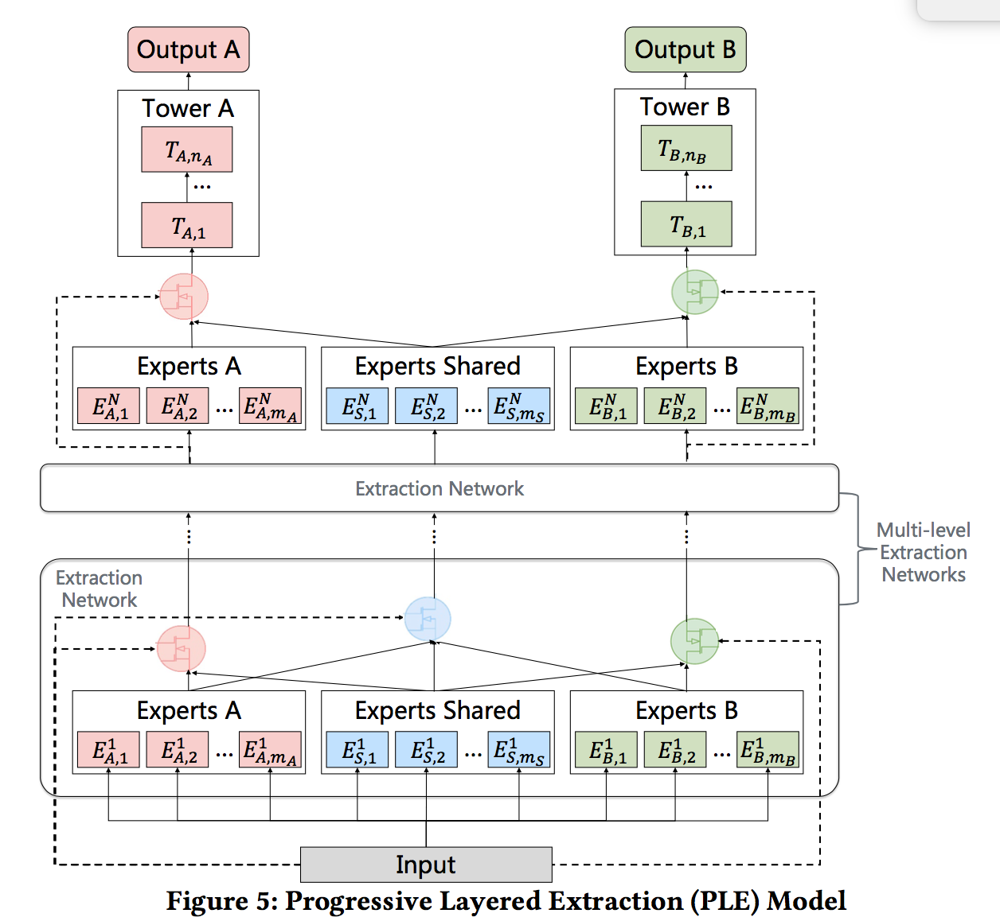

# PLE

### 简介

多任务学习可能带来负迁移（negative transfer）现象，即相关性不强的任务之间的信息共享，会影响网络的表现。此前已经有部分研究来减轻负迁移现象，如谷歌提出的MMoE模型。

但通过实验发现，多任务学习中往往还存在跷跷板现象(seesaw phenomenon)，即多任务学习相对于多个单任务学习的模型，往往能够提升一部分任务的效果，同时牺牲另外部分任务的效果。即使通过MMoE这种方式减轻负迁移现象，跷跷板现象仍然是广泛存在的。

论文提出了Progressive Layered Extraction (简称PLE)，来解决多任务学习的跷跷板现象。



### 配置说明

#### PLE

```protobuf
model_config {
  model_class: "PLE"
  feature_groups {
    group_name: "all"
    feature_names: "user_id"
    feature_names: "cms_segid"
    feature_names: "cms_group_id"
    feature_names: "age_level"
    feature_names: "pvalue_level"
    feature_names: "shopping_level"
    feature_names: "occupation"
    feature_names: "new_user_class_level"
    feature_names: "adgroup_id"
    feature_names: "cate_id"
    feature_names: "campaign_id"
    feature_names: "customer"
    feature_names: "brand"
    feature_names: "price"
    feature_names: "pid"
    feature_names: "tag_category_list"
    feature_names: "tag_brand_list"
    wide_deep: DEEP
  }
  ple {
    extraction_networks {
      network_name: "layer1"
      expert_num_per_task: 3
      share_num: 3

      task_expert_net {
        hidden_units: [128, 64, 32]
      }
      share_expert_net {
        hidden_units: [128, 64, 32]
      }
    }
    extraction_networks {
      network_name: "layer2"
      expert_num_per_task: 3
      share_num: 3

      task_expert_net {
        hidden_units: [64, 32, 16]
      }
      share_expert_net {
        hidden_units: [64, 32, 16]
      }
    }
    extraction_networks {
      network_name: "layer3"
      expert_num_per_task: 3
      share_num: 3

      task_expert_net {
        hidden_units: [64, 32, 16]
      }
      share_expert_net {
        hidden_units: [64, 32, 16]
      }
    }

    task_towers {
      tower_name: "ctr"
      label_name: "clk"
      loss_type: CLASSIFICATION
      metrics_set: {
        auc {}
      }
      dnn {
        hidden_units: [128, 64, 32]
      }
      weight: 1.0
    }
    task_towers {
      tower_name: "cvr"
      label_name: "buy"
      loss_type: CLASSIFICATION
      metrics_set: {
        auc {}
      }
      dnn {
        hidden_units: [256, 128, 64, 32]
      }
      weight: 1.0
    }
    l2_regularization: 1e-6
  }
  embedding_regularization: 5e-6
}
```

- model_class: 'PLE', 不需要修改
- feature_groups: 配置一个名为'all'的feature_group。
- ple: ple相关的参数
  - extraction_networks
    - network_name
    - expert_num_per_task 每个目标任务的专家数
    - share_num 共享任务的专家数
    - task_expert_net 目标任务的专家网络的dnn参数配置
    - share_expert_net 共享任务的专家网络的dnn参数配置
    - dnn deep part的参数配置
      - hidden_units: dnn每一层的channel数目，即神经元的数目
  - task_towers 根据任务数配置task_towers
    - tower_name
    - dnn deep part的参数配置
      - hidden_units: dnn每一层的channel数目，即神经元的数目
    - 默认为二分类任务，即num_class默认为1，weight默认为1.0，loss_type默认为CLASSIFICATION，metrics_set为auc
    - 注：label_fields需与task_towers一一对齐。
  - embedding_regularization: 对embedding部分加regularization，防止overfit

### 示例Config

[PLE_demo.config](https://easyrec.oss-cn-beijing.aliyuncs.com/config/ple.config)

### 参考论文

[PLE](https://dl.acm.org/doi/abs/10.1145/3383313.3412236)
