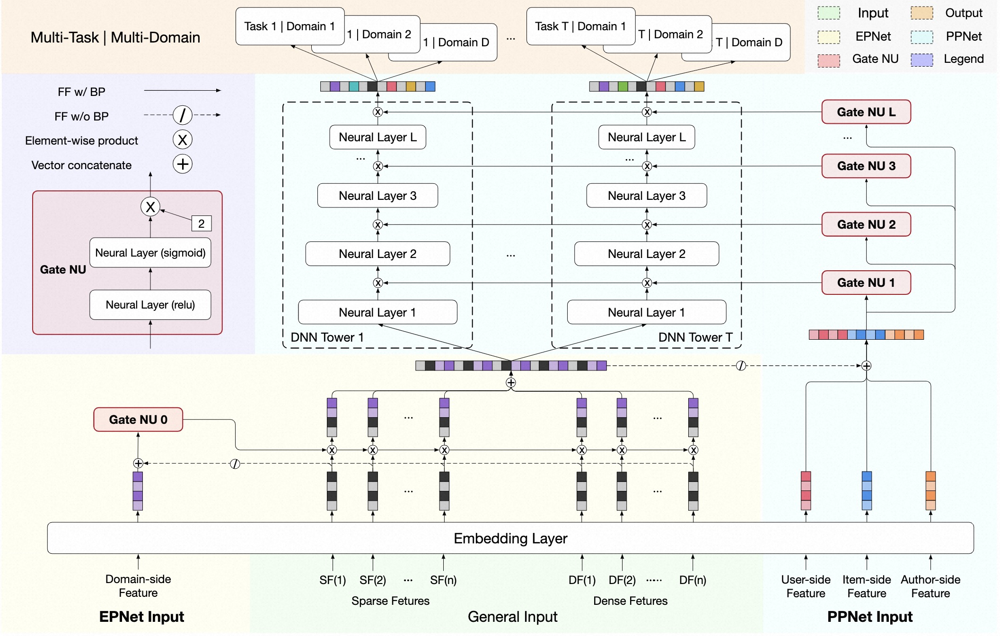

# PPNet（Parameter Personalized Net）

### 简介

PPNet的核心思想来源于NLP领域的LHUC，在语音识别领域中，2016 年提出的LHUC 算法（learning hidden unit contributions）
核心思想是做说话人自适应（speaker adaptation），其中一个关键突破是在 DNN 网络中，为每个说话人学习一个特定的隐式单元贡献（hidden unit contributions），
来提升不同说话人的语音识别效果。

借鉴 LHUC 的思想，PPNet设计出一种 gating 机制，可以增加 DNN 网络参数个性化并能够让模型快速收敛。



### 配置说明

```protobuf
model_config: {
  model_name: 'PPNet'
  model_class: 'RankModel'
  feature_groups: {
    group_name: 'memorize'
    feature_names: 'user_id'
    feature_names: 'adgroup_id'
    feature_names: 'pid'
    wide_deep: DEEP
  }
  feature_groups: {
    group_name: 'general'
    feature_names: 'cms_segid'
    feature_names: 'cms_group_id'
    feature_names: 'age_level'
    feature_names: 'pvalue_level'
    feature_names: 'shopping_level'
    feature_names: 'occupation'
    feature_names: 'new_user_class_level'
    feature_names: 'cate_id'
    feature_names: 'campaign_id'
    feature_names: 'customer'
    feature_names: 'brand'
    feature_names: 'price'
    feature_names: 'tag_category_list'
    feature_names: 'tag_brand_list'
    wide_deep: DEEP
  }
  backbone {
    blocks {
      name: "ppnet"
      inputs {
        feature_group_name: "general"
      }
      inputs {
        feature_group_name: "memorize"
      }
      merge_inputs_into_list: true
      keras_layer {
        class_name: "PPNet"
        ppnet {
          mlp {
            hidden_units: [512, 256]
          }
          mode: "lazy"
          full_gate_input: true
        }
      }
    }
    top_mlp {
      hidden_units: [128, 64]
    }
  }
  model_params {
    l2_regularization: 1e-6
  }
  embedding_regularization: 1e-5
}
```

- model_name: 任意自定义字符串，仅有注释作用
- model_class: 'RankModel', 不需要修改, 通过组件化方式搭建的单目标排序模型都叫这个名字
- feature_groups: 配置一组特征。
- backbone: 通过组件化的方式搭建的主干网络，[参考文档](../component/backbone.md)
  - blocks: 由多个`组件块`组成的一个有向无环图（DAG），框架负责按照DAG的拓扑排序执行个`组件块`关联的代码逻辑，构建TF Graph的一个子图
  - name/inputs: 每个`block`有一个唯一的名字（name），并且有一个或多个输入(inputs)和输出
  - keras_layer: 加载由`class_name`指定的自定义或系统内置的keras layer，执行一段代码逻辑；[参考文档](../component/backbone.md#keraslayer)
  - ppnet: PPNet的基础组件，参数详见[参考文档](../component/component.md#id4)
  - concat_blocks: DAG的输出节点由`concat_blocks`配置项定义，如果不配置`concat_blocks`，框架会自动拼接DAG的所有叶子节点并输出。
- model_params:
  - l2_regularization: (可选) 对DNN参数的regularization, 减少overfit
- embedding_regularization: 对embedding部分加regularization, 减少overfit

### 示例Config

[ppnet_on_taobao.config](https://github.com/alibaba/EasyRec/tree/master/samples/model_config/ppnet_on_taobao.config)

### 参考论文

[PEPNet: Parameter and Embedding Personalized Network for Infusing with Personalized Prior Information](https://arxiv.org/pdf/2302.01115.pdf)
