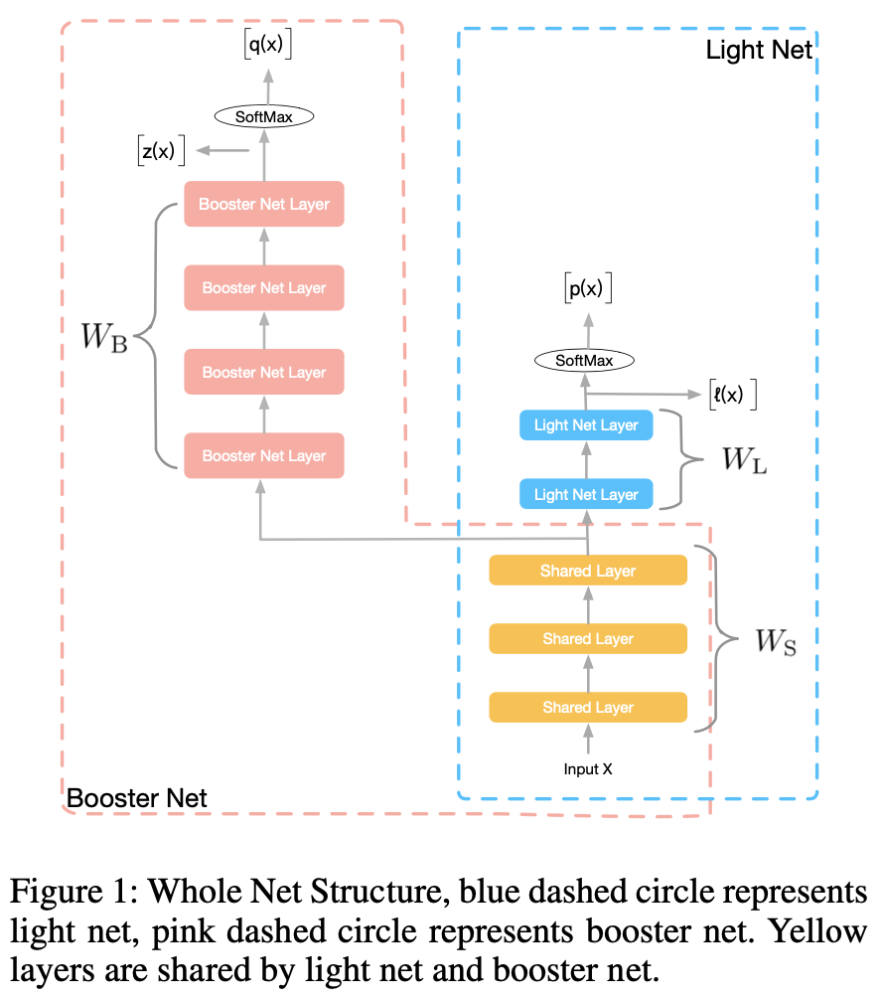

# Rocket Launching

### 简介

像点击率预估这样的在线实时响应系统对响应时间要求非常严格，结构复杂，层数很深的深度模型不能很好的满足严苛的响应时间的限制。

为了获得满足响应时间限制的具有优良表现的模型，采用Rocket Launching框架。训练阶段，同时训练繁简两个复杂度有明显差异的网络，简单的网络称为轻量网络（light net），复杂的网络称为助推器网络（booster net），两网络共享部分参数，分别学习类别标记，此外，轻量网络通过学习助推器的 soft target 来模仿助推器的学习过程，从而得到更好的训练效果。测试阶段，仅采用轻量网络进行预测。


### 模型配置

```protobuf
model_config: {
  model_class: 'RocketLaunching'
  feature_groups: {
    group_name: 'all'
    feature_names: 'user_id'
    feature_names: 'cms_segid'
    feature_names: 'cms_group_id'
    feature_names: 'age_level'
    feature_names: 'pvalue_level'
    feature_names: 'shopping_level'
    feature_names: 'occupation'
    feature_names: 'new_user_class_level'
    feature_names: 'adgroup_id'
    feature_names: 'cate_id'
    feature_names: 'campaign_id'
    feature_names: 'customer'
    feature_names: 'brand'
    feature_names: 'price'
    feature_names: 'pid'
    feature_names: 'tag_category_list'
    feature_names: 'tag_brand_list'
    wide_deep: DEEP
  }
  rocket_launching {
   share_dnn {
      hidden_units: [128, 96, 64]
    }
    booster_dnn {
      hidden_units: [256, 128, 96, 64]
    }
    light_dnn{
      hidden_units:[128, 64]
    }
    l2_regularization: 1e-6
    feature_based_distillation:false
    feature_distillation_function:1
  }
  embedding_regularization:5e-6
  num_class: 2
}
```

- model_class: 'RocketLaunching', 不需要修改。
- feature_groups: 可配置多个feature_group，group name可以变。
- rocket_launching: rocket_launching相关的参数。
  - share_dnn: 共享部分的参数配置。
    - hidden_units: dnn每一层的channel数目，即神经元的数目
  - booster_dnn: 助推器网络的参数配置
    - hidden_units: dnn每一层的channel数目，即神经元的数目
  - light_dnn:  轻量网络的参数配置
    - hidden_units: dnn每一层的channel数目，即神经元的数目
  - feature_based_distillation：是否配置特征蒸馏（默认不配）
  - feature_distillation_function：中间层相似度衡量指标（COSINE; EUCLID; 默认COSINE）
- embedding_regularization: 对embedding部分加regularization，防止overfit

### 示例config

[Rocket_Launching_demo.config](http://easy-rec.oss-cn-hangzhou.aliyuncs.com/config/rocket_launching.config)

### 参考论文

[Rocket Launching: A Universal and Efficient Framework for Training Well-performing Light Net](https://arxiv.org/abs/1708.04106)
