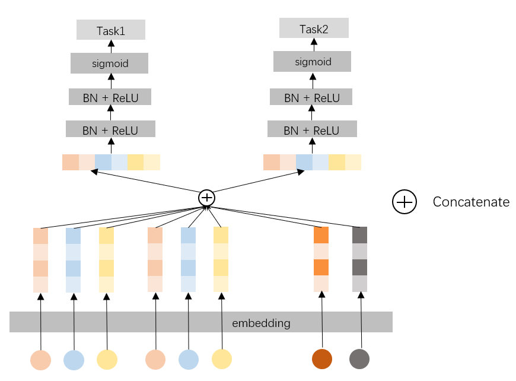

# SimpleMultiTask

### 简介

针对简单的多任务模型,所有任务共享特征和embedding,但是针对每个任务使用单独的Task Tower,任务之间相互独立



### 配置说明

#### 1.内置模型

```protobuf
model_config:{
  model_class: "SimpleMultiTask"
  feature_groups {
    group_name: "all"
    feature_names: "user_id"
    feature_names: "cms_segid"
    ...
    feature_names: "tag_brand_list"
    wide_deep: DEEP
  }

  simple_multi_task {
    task_towers {
      tower_name: "ctr"
      label_name: "clk"
      dnn {
        hidden_units: [256, 192, 128, 64]
      }
      num_class: 1
      weight: 1.0
      loss_type: CLASSIFICATION
      metrics_set: {
       auc {}
      }
    }
    task_towers {
      tower_name: "cvr"
      label_name: "buy"
      dnn {
        hidden_units: [256, 192, 128, 64]
      }
      num_class: 1
      weight: 1.0
      loss_type: CLASSIFICATION
      metrics_set: {
       auc {}
      }
    }
    l2_regularization: 0.0
  }
  embedding_regularization: 0.0
}
```

- model_class: 'SimpleMultiTask', 不需要修改
- feature_groups: 配置一个名为'all'的feature_group。
- simple_multi_task: 相关的参数
  - task_towers 根据任务数配置task_towers
    - tower_name：任务名
    - label_name: tower对应的label名，若不设置，label_fields需与task_towers一一对齐
    - dnn deep part的参数配置
      - hidden_units: dnn每一层的channel数目，即神经元的数目
    - 默认为二分类任务，即num_class默认为1，weight默认为1.0，loss_type默认为CLASSIFICATION，metrics_set为auc
  - embedding_regularization: 对embedding部分加regularization，防止overfit

SimpleMultiTask模型每个塔的输出名为："logits\_" / "probs\_" / "y\_" + tower_name
其中，logits/probs/y对应: sigmoid之前的值/概率/回归模型的预测值
SimpleMultiTask模型每个塔的指标为：指标名+ "\_" + tower_name

#### 2. 组件化模型

```protobuf
model_config {
  model_name: "SimpleMultiTask"
  model_class: "MultiTaskModel"
  feature_groups {
    group_name: "all"
    feature_names: "user_id"
    feature_names: "cms_segid"
    ...
    wide_deep: DEEP
  }
  backbone {
    blocks {
      name: "identity"
      inputs {
        feature_group_name: "all"
      }
    }
  }
  model_params {
    task_towers {
      tower_name: "ctr"
      label_name: "clk"
      dnn {
        hidden_units: [256, 192, 128, 64]
      }
      num_class: 1
      weight: 1.0
      loss_type: CLASSIFICATION
      metrics_set: {
       auc {}
      }
    }
    task_towers {
      tower_name: "cvr"
      label_name: "buy"
      dnn {
        hidden_units: [256, 192, 128, 64]
      }
      num_class: 1
      weight: 1.0
      loss_type: CLASSIFICATION
      metrics_set: {
       auc {}
      }
    }
    l2_regularization: 1e-07
  }
  embedding_regularization: 5e-06
}
```

- model_name: 任意自定义字符串，仅有注释作用
- model_class: 'MultiTaskModel', 不需要修改, 通过组件化方式搭建的多目标排序模型都叫这个名字
- backbone: 通过组件化的方式搭建的主干网络，[参考文档](../component/backbone.md)

  - blocks: 由多个`组件块`组成的一个有向无环图（DAG），框架负责按照DAG的拓扑排序执行个`组件块`关联的代码逻辑，构建TF Graph的一个子图
  - name/inputs: 每个`block`有一个唯一的名字（name），并且有一个或多个输入(inputs)和输出

- 其余与内置模型参数相同
