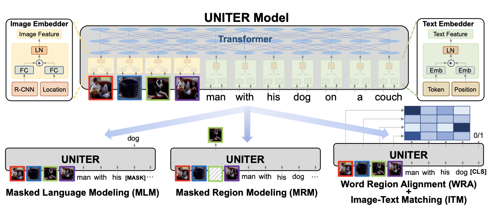

# UNITER

### 简介

人类感知和处理周围世界的信息是通过多种手段综合起来的，比如视觉、触觉和听觉等。
在分析处理外部信息时，人脑都是综合多种形式的信息进行补充和比对进而生成决策判断结果，很少只单独用一个单一形式的信息。
这种信息的不同发生的方式叫做模态（Modality）。

推荐系统中的物品很多情况下天然包含了各种模态的信息，比如物品的文本标题，物品的主副图，物品的属性信息等。
各个模态的信息相互补充构成了人对物品的完整理解。任何单一一个模态的信息，都不足以完整描述一件物品。

基于以上分析，多模态物品表征学习成为一种趋势。

UNITER (UNiversal Image-TExt Representation Learning) 模型是基于Transformer结构来融合图像和文本的跨模态信息，
其结构如下图所示：



为了使UNITER模型更加适用于推荐场景，我们对其进行了一下扩展，包括加入物品的属性特征，与图像、文本的信息进行融合，
同时还支持融合后的跨模态特征与其他的特征（如各类统计型特征）拼接后再过MLP层。

模型支持四种类型的特征组（`feature group`），如下所述。
不一定需要有全部四种类型的输入特征，只需要保证至少有一种类型的输入特征即可训练模型。根据输入特征类型的不同，部分网络结构可能会被`短路`（skip）掉。

视觉特征提取模块通常是一个CNN-based/Transformer-based的模型，用来提取图像或视频特征，以便后续接入transformer模块。

文本型特征包括两部分：

- 常规类型的特征，包括数值特征、单值类别特征、多值类别特征；（对应配置名为`general`的`feature group`）
- 不定长文本序列特征，例如 物品的`title`、`description`等；（对应配置名为`text`的`feature group`）
  每个特征需要转换为相同维度的embedding，以便接入后续的transformer模块。

其他特征：直接与`UNITER模块`的结果拼接后，接入后续的MLP，通常是一些统计类特征。
（对应配置名为`other`的`feature group`）

UNITER模型在多目标学习任务重的应用请参考 [DBMTL+UNITER](dbmtl.md)。

### 配置说明

```protobuf
model_config: {
  model_class: 'Uniter'
  feature_groups: {
    group_name: 'image'
    feature_names: 'embedding'
    wide_deep: DEEP
  }
  feature_groups: {
    group_name: 'general'
    feature_names: 'user_id'
    feature_names: 'movie_id'
    feature_names: 'gender'
    feature_names: 'age'
    feature_names: 'occupation'
    feature_names: 'zip_id'
    feature_names: 'movie_year_bin'
    wide_deep: DEEP
  }
  feature_groups: {
    group_name: 'text'
    feature_names: 'title'
    feature_names: 'genres'
    wide_deep: DEEP
  }
  feature_groups: {
    group_name: 'other'
    feature_names: 'score_year_diff'
    feature_names: 'score_time'
    wide_deep: DEEP
  }
  uniter {
    config {
      hidden_size: 512
      num_attention_heads: 4
      num_hidden_layers: 2
      intermediate_size: 512
      hidden_act: 'swish'
      max_position_embeddings: 16
      hidden_dropout_prob: 0.1
      attention_probs_dropout_prob: 0
      other_feature_dnn: {
        hidden_units: 256
        hidden_units: 128
      }
    }
    final_dnn: {
        hidden_units: 256
        hidden_units: 64
    }
  }
  embedding_regularization: 1e-6
}
```

- model_class: 'Uniter', 不需要修改

- feature_groups:

  - 配置一个名为`image`的feature_group，包含一个图像特征，或者一组embedding_size相同的图像特征（对应视频的多个帧，或者图像的多个region）。
  - 配置一个名为`general`的feature_group，包含需要做跨模态attention的常规特征，这些特征的`embedding_dim`必须相同。
  - 配置一个名为`text`的feature_group，包含需要做跨模态attention的不定长文本序列特征，这些特征的`embedding_dim`必须相同。
  - 注意：CMBF 模型要求所有文本侧（包括`text`和`general`两个特征组）输入特征的 embedding_dim 保持一致。
  - \[可选\] 配置一个名为`other`的feature_group，包含不需要做跨模态attention的其他特征，如各类统计特征。

- uniter/config: UNITER 模型相关的参数

  - num_attention_heads: 跨模态融合模块中的 head 数量
  - hidden_size: transformer模块的隐层单元数，必须是`num_attention_heads`的整数倍。
  - num_hidden_layers: transformer模块中的self-attention层数，建议设在1到5之间，默认为1
  - intermediate_size: transformer模块中MLP层的神经元个数
  - hidden_act: transformer模块中MLP层的激活函数，目前支持：'relu'、'swish'、'gelu'、'tanh'
  - attention_probs_dropout_prob: self/cross attention模块attention权重的dropout概率
  - hidden_dropout_prob: multi-headed attention模块中FC layer的dropout概率
  - use_position_embeddings: bool, default is true；是否为文本序列添加位置编码
  - max_position_embeddings: 文本序列的最大位置，当`use_position_embeddings`为true时，必须配置；并且必须大于或等于所有特征配置`max_seq_len`的最大值
  - other_feature_dnn: \[可选\] 其他特征的MLP网络配置

- uniter/final_dnn: 输出模块的MLP网络配置

- embedding_regularization: 对embedding部分加regularization，防止overfit

### 示例Config

[Uniter_demo.config](https://github.com/alibaba/EasyRec/blob/master/samples/model_config/uniter_on_movielens.config)

### 参考论文

[UNITER: UNiversal Image-TExt Representation Learning](https://arxiv.org/pdf/1909.11740.pdf)
