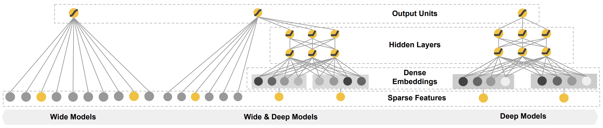

# WideAndDeep

### 简介

WideAndDeep包含Wide和Deep两部分，Wide部分负责记忆，Deep部分负责泛化。Wide部分可以做显式的特征交叉，Deep部分可以实现隐式自动的特征交叉。



### 配置说明

#### 1. 内置模型

```protobuf
model_config:{
  model_class: "WideAndDeep"
  feature_groups: {
    group_name: "deep"
    feature_names: "hour"
    feature_names: "c1"
    ...
    feature_names: "site_id_app_id"
    wide_deep:DEEP
  }
  feature_groups: {
    group_name: "wide"
    feature_names: "hour"
    feature_names: "c1"
    ...
    feature_names: "c21"
    wide_deep:WIDE
  }

  wide_and_deep {
    wide_output_dim: 16

    dnn {
      hidden_units: [128, 64, 32]
    }

    final_dnn {
      hidden_units: [128, 64]
    }
    l2_regularization: 1e-5
  }
  embedding_regularization: 1e-7
}
```

- model_class: 'WideAndDeep', 不需要修改

- feature_groups:

  需要两个feature_group: wide group和deep group, **group name不能变**

- wide_and_deep:  wide_and_deep 相关的参数

- dnn: deep part的参数配置

  - hidden_units: dnn每一层的channel数目，即神经元的数目

- wide_output_dim: wide部分输出的大小

- final_dnn: 整合wide part, deep part的参数输入, 可以选择是否使用

  - hidden_units: dnn每一层的channel数目，即神经元的数目

- embedding_regularization: 对embedding部分加regularization，防止overfit

- input_type: 如果在提交到pai-tf集群上面运行，读取max compute 表作为输入数据，data_config：input_type要设置为OdpsInputV2。

#### 2. 组件化模型

```protobuf
model_config: {
  model_class: "RankModel"
  feature_groups: {
    group_name: 'wide'
    feature_names: 'user_id'
    feature_names: 'movie_id'
    feature_names: 'job_id'
    feature_names: 'age'
    feature_names: 'gender'
    feature_names: 'year'
    feature_names: 'genres'
    wide_deep: WIDE
  }
  feature_groups: {
    group_name: 'deep'
    feature_names: 'user_id'
    feature_names: 'movie_id'
    feature_names: 'job_id'
    feature_names: 'age'
    feature_names: 'gender'
    feature_names: 'year'
    feature_names: 'genres'
    wide_deep: DEEP
  }
  backbone {
    blocks {
      name: 'wide'
      input_layer {
        only_output_feature_list: true
      }
    }
    blocks {
      name: 'deep_logit'
      inputs {
        name: 'deep'
      }
      keras_layer {
        class_name: 'MLP'
        mlp {
          hidden_units: [256, 256, 256, 1]
          use_final_bn: false
          final_activation: 'linear'
        }
      }
    }
    blocks {
      name: 'final_logit'
      inputs {
        name: 'wide'
        input_fn: 'lambda x: tf.add_n(x)'
      }
      inputs {
        name: 'deep_logit'
      }
      merge_inputs_into_list: true
      keras_layer {
        class_name: 'Add'
      }
    }
    concat_blocks: 'final_logit'
  }
  rank_model {
    wide_output_dim: 1
    l2_regularization: 1e-4
  }
  embedding_regularization: 1e-4
}
```

- model_class: 'RankModel', 不需要修改, 通过组件化方式搭建的排序模型都叫这个名字

- feature_groups: 特征组

  - 包含两个feature_group: wide 和 deep group

- backbone: 通过组件化的方式搭建的主干网络，[参考文档](../component/backbone.md)

  - blocks: 由多个`组件块`组成的一个有向无环图（DAG），框架负责按照DAG的拓扑排序执行个`组件块`关联的代码逻辑，构建TF Graph的一个子图
  - concat_blocks: DAG的输出节点由`concat_blocks`配置项定义

- rank_model: 

  - l2_regularization: 对DNN参数的regularization, 减少overfit
  - wide_output_dim: wide部分输出的tensor的维度

- embedding_regularization: 对embedding部分加regularization, 减少overfit

### 示例Config

1. 内置模型：[WideAndDeep_demo.config](https://easyrec.oss-cn-beijing.aliyuncs.com/config/wide_and_deep.config)
2. 组件化模型：[wide_and_deep_backbone_on_movielens.config](https://github.com/alibaba/EasyRec/tree/master/examples/configs/wide_and_deep_backbone_on_movielens.config)

### 参考论文

[WideAndDeep](https://arxiv.org/abs/1606.07792)
