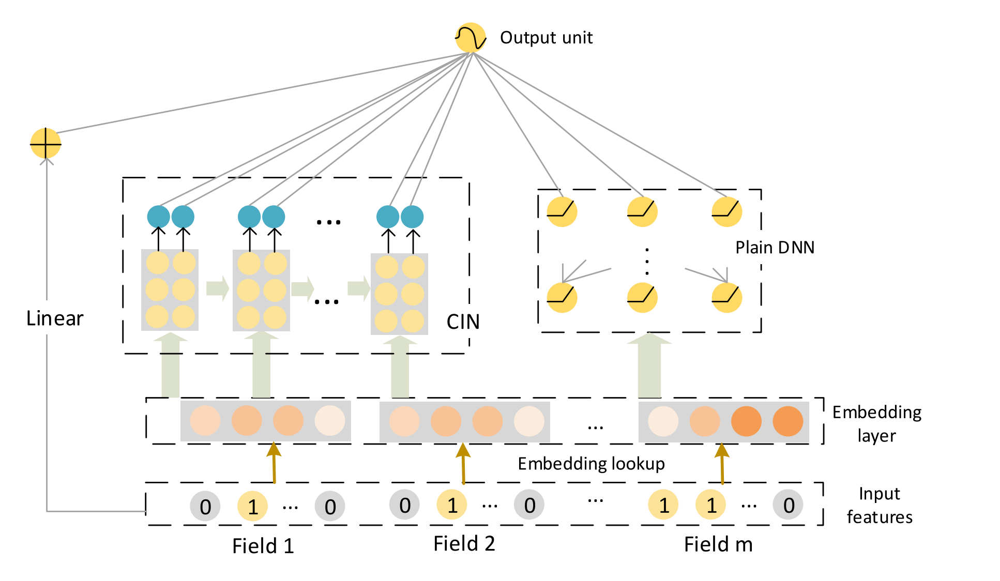

# xDeepFM

### 简介

xDeepFM模型延续了deep&cross network(参考[DCN](https://easyrec.readthedocs.io/en/latest/models/dcn.html))模型的建模思想。不过，在建模显式高阶交叉特征时，采用了不同于deep&cross network的方式，文章称为compressed interaction network(CIN)，并将CIN网络与深度神经网络结合，最后输入到输出层。



### 配置说明

组件化模型

```protobuf
model_config: {
  model_name: 'xDeepFM'
  model_class: 'RankModel'
  feature_groups: {
    group_name: 'features'
    feature_names: 'user_id'
    feature_names: 'cms_segid'
    feature_names: 'cms_group_id'
    feature_names: 'age_level'
    feature_names: 'pvalue_level'
    feature_names: 'shopping_level'
    feature_names: 'occupation'
    feature_names: 'new_user_class_level'
    feature_names: 'tag_category_list'
    feature_names: 'tag_brand_list'
    feature_names: 'adgroup_id'
    feature_names: 'cate_id'
    feature_names: 'campaign_id'
    feature_names: 'customer'
    feature_names: 'brand'
    feature_names: 'price'
    feature_names: 'pid'
    wide_deep:DEEP
  }

  feature_groups: {
    group_name: "wide"
    feature_names: 'user_id'
    feature_names: 'cms_segid'
    feature_names: 'cms_group_id'
    feature_names: 'age_level'
    feature_names: 'pvalue_level'
    feature_names: 'shopping_level'
    feature_names: 'occupation'
    feature_names: 'new_user_class_level'
    feature_names: 'tag_category_list'
    feature_names: 'tag_brand_list'
    feature_names: 'adgroup_id'
    feature_names: 'cate_id'
    feature_names: 'campaign_id'
    feature_names: 'customer'
    feature_names: 'brand'
    feature_names: 'price'
    feature_names: 'pid'
    wide_deep:WIDE
  }
  backbone {
    blocks {
      name: 'wide'
      inputs {
        feature_group_name: 'wide'
      }
      input_layer {
        only_output_feature_list: true
        wide_output_dim: 1
      }
    }

    blocks {
      name: 'features'
      inputs {
        feature_group_name: 'features'
      }
      input_layer {
        output_2d_tensor_and_feature_list: true
      }
    }
    blocks {
      name: 'cin'
      inputs {
        block_name: 'features'
        input_slice: '[1]'
      }
      extra_input_fn: 'lambda x: tf.stack(x, axis=1)'
      keras_layer {
        class_name: 'CIN'
        cin {
          hidden_feature_sizes: [64, 64, 64]
        }
      }
    }

    blocks {
      name: 'dnn'
      inputs {
        block_name: 'features'
        input_slice: '[0]'
      }
      keras_layer {
        class_name: 'MLP'
        mlp {
          hidden_units: [128, 64]
        }
      }
    }

    blocks {
      name: 'final_logit'
      inputs {
        block_name: 'wide'
        input_fn: 'lambda x: tf.add_n(x)'
      }
      inputs {
        block_name: 'cin'
      }
      inputs {
        block_name: 'dnn'
      }

      keras_layer {
        class_name: 'MLP'
        mlp {
          hidden_units: [32, 1]
          use_final_bn: false
          final_activation: 'linear'
        }
      }
    }
    concat_blocks: 'final_logit'
  }
}
```

- model_name: 任意自定义字符串，仅有注释作用, 本模型命名为xDeepFM
- model_class: 'RankModel', 不需要修改
- feature_groups: 特征组
  - 包含两个feature_group: wide 和 deep features group
- backbone: 通过组件化的方式搭建的主干网络，[参考文档](../component/backbone.md)
  - wide block: 输入wide特征，以list形式输出wide特征
  - features block: 输入deep features特征，以2Dtensor和list形式同时输出deep features特征
  - cin block: CIN模块
  - dnn block: DNN模块
  - final_logit block: 拼接wide输出、cin输出、dnn输出，叠加一个顶层的MLP，输出最终的预测结果

### 示例Config

1. 组件化模型：[xdeepfm_on_taobao_backbone.config](https://github.com/alibaba/EasyRec/tree/master/samples/model_config/xdeepfm_on_taobao_backbone.config)

### 参考论文

[xDeepFM](https://arxiv.org/pdf/1803.05170)
