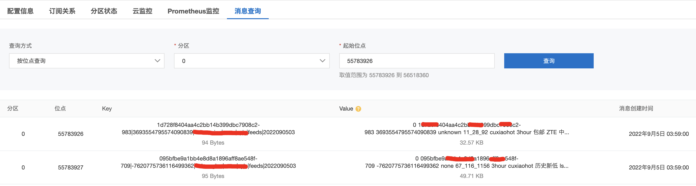

# 实时训练(ODL)

实时训练ODL(Online Deep Learning)让模型快速迭代，适应新的样本分布，并快速学习到新的item信息。针对大促、信息流等场景会比较大的增益。


## 前置条件
- 离线链路:
   - 已经走通 基于 EasyRec 的离线推荐链路
   - 能够产出天级模型 或者 小时级模型

## 样本
实时训练需要先准备好 [实时样本](./feature/odl_sample.md)

## 输入
实时训练从消息中间件接收流式样本输入，目前支持的输入包括KafkaInput和DataHubInput
### KafkaInput
```protobuf
kafka_train_input {
  server: '127.0.0.1:9092'
  topic: 'kafka_data_input'
  group: 'kafka_train'
  # start read time in kafka
  offset_time: '20220907 00:00:00'
}

kafka_eval_input {
  server: '127.0.0.1:9092'
  topic: 'kafka_data_input'
  group: 'kafka_test'
  # start read time in kafka for evaluation
  offset_time: '20220907 00:00:00'
}
```

- server: kafka bootstrapped servers, 可以是多个server，中间用","分割
- topic: 读取数据的topic
- group: 消费kakfka数据的consumer group
- offset_time: 指定读数据的起始位置
  - 适用于每天从离线checkpoint启动实时训练时，可以用timestamp指定要读取的offset
  - 实现上用KafkaConsumer.offsets_for_times获取timestamp对应的offset，然后从offset处开始读取数据
  - 可以是unix timestamp, 也可以是'%Y%m%d %H:%M:%S'格式
- offset_info: json_format, 指定kafka offset
  - 例如: '{"0": 5, "1": 10}'
  - 适用于训练失败后重启的场景
  - 训练过程中保存checkpoint的时候，也会保存对应的offset; 
  - 训练因为某些原因失败重启后，可以自动从checkpoint处恢复训练;
- offset_info和offset_time指定其中之一即可
  - 不指定offset_info和offset_time, 默认从起始位置读取数据.
- 数据格式: 样本以CSV格式保存在value里面
  ```text
     label_ctr,label_cvr,...,fea1,fea2,...
  ```
  - 分隔符可以通过data_config.separator来指定
  - sample_id(request_id, user_id, item_id)等信息保存在message_key
    

### DatahubInput
```protobuf
datahub_train_input{
  akId:"xxx"
  akSecret:"xxx"
  region:"http://dh-cn-beijing-int-vpc.aliyuncs.com"
  project:"odl"
  topic:"odl_test"
  offset_info: '{"1": {"cursor": "30006230..."}, "0": {"cursor": "30006231..."}}'
}

datahub_eval_input{
  akId:"xxx"
  akSecret:"xxx"
  region:"http://dh-cn-beijing-int-vpc.aliyuncs.com"
  project:"odl"
  topic:"odl_test"
  offset_info: '{"1": {"cursor": "30006230..."}, "0": {"cursor": "30006231..."}}'
}
```

- akId: datahub access_key
- akSecret: datahub access_secret
- region:  endpoint
   - 注意必须是http的，不能是https，vpc里面只通80端口，不通443端口
- project: datahub project
- topic: datahub topic
- offset_time: 指定读数据的起始位置
  - 可以是unix timestamp, 也可以是'%Y%m%d %H:%M:%S'格式, 如: "20220508 23:59:59"
- offset_info: json字符串, 方便失败后重启
   - key: partition_id
   - value: dict，其中包含cursor字段
- 权限开通: ak对应的用户必须要添加datahub访问权限
  
- 数据格式:
```
  request_id    STRING
  userid        STRING
  item_id       STRING
  ln_play_time  DOUBLE
  is_valid_play BIGINT
  feature       STRING
  request_time  BIGINT
```
- 推荐使用datahub保存实时训练样本,有两个优势:
  - 有schema, 方便数据读取和解析
  - 一键保存到odps表,方便数据分析

### VPC打通
MaxCompute在经典网络里面，而Kafka/Datahub通常在VPC里面，为了能够访问VPC，需要打通网络，[打通流程](https://help.aliyun.com/document_detail/187866.html#section-qug-auu-qn2)。

## 训练
### 增量更新配置
增量更新的参数通过OSS/NAS/Kafka发送到EAS Processor
```sql
train_config {
  ...
  incr_save_config {
    dense_save_steps: 10
    sparse_save_steps: 10
    fs {} 
  }
  ...
  enable_oss_stop_signal: true
}
```

- dense_save_steps:  dense参数发送的频率
- sparse_save_steps: sparse参数发送的频率
- incr_update: 保存增量更新，可以选fs和kafka:
  - fs:
     - incr_save_dir: 增量更新保存位置, 默认保存在${model_dir}/incr_save
     - relative: 默认true, 表示是相对路径(相对${model_dir})
     - mount_path: 导出模型时用到, 表示模型挂载到eas实例的路径, 一般不用修改
     - 网络存储系统:
       - MaxCompute上支持OSS
       - DLC上支持OSS和NAS
       - DS上支持NAS
  - kafka:
     - server: kafka server地址
     - topic: kafka模型增量更新的topic
        - 如果topic不存在会自动创建
     - consumer: 导出模型时使用
        - offset: 读取模型参数的offset
           - 默认是0
     - kafka实例max_message_size>=64M, 设置小了会导致大消息发送失败
     - 示例:
     ```sql
        kafka {
          server: 'alikafka-post-cn-zvpxxxx-1-vpc.alikafka.aliyuncs.com:9092'
          topic: 'odl_model_20220901'
          consumer {
            offset:0
          }
        }
     ``` 
- enable_oss_stop_signal:
   - 通过在model_dir下面创建OSS_STOP_SIGNAL文件来通知训练程序退出
- dead_line:
   - 支持在指定时间结束训练, 格式: "20220908 23:59:59"

### 启动训练
目前支持在MaxCompute/DLC/DataScience上拉起训练
#### MaxCompute训练
```sql
  pai -name easy_rec_ext
  -Dversion=datahub
  -Dcmd=train
  -Dmodel_dir=oss://bucket-bj/checkpoints/${bizdate}/online/
  -Dconfig=oss://bucket-bj/configs/deepfm/online.config
  -Darn=acs:ram::xxx:role/aliyunodpspaidefaultrole
  -Dbuckets=oss://bucket-bj/
  -Dcluster='{"ps":{"count":1, "cpu":1000}, "worker" : {"count":2, "cpu":1000, "memory":40000}}'
  -Deval_method=none
  -Dfine_tune_checkpoint="oss://bucket-bj/checkpoints/${bizdate}/offline/"
  -Dedit_config_json='{"train_config.incr_save_config.fs":"{}", "datahub_train_input.offset_time": "${bizdate} 00:00:00", "train_config.dead_line":"${bizdate+2} 06:00:00"}'
  -DossHost=oss-cn-beijing.aliyuncs.com
  -DvpcId=vpc-xxxxxxxxx
  -DvpcRegion=cn-beijing
```
 - edit_config_json: 修改config
    - fine_tune_checkpoint: 从离线训练的checkpoint进行初始化
    - train_config.incr_save_config.fs: {}, 表示保存增量更新到文件系统(OSS/NAS).
    - datahub_train_input.offset_time: 修改增量训练读取数据的起始位点
 - 注意: cluster里面不能指定GPU, GPU集群无法访问vpc网络
 - 其他参数参考[MaxCompute离线训练](./train.md#on-pai)
 - 评估: 
   - 需要设置eval_method=separate
   - 设置eval_config.num_examples:
     - eval_steps = eval_config.num_examples / data_config.batch_size
   - cluster里面worker_num增加1, 会预留task_index=1的worker做评估 
   - 评估程序读取相同的数据流: 数据流的offset = 模型保存时在训练数据流的offset

#### DLC训练
- [参考文档](./quick_start/dlc_tutorial.md#id2)
- 执行命令:
  ```bash
    python -m easy_rec.python.train_eval --pipeline_config_path /mnt/data/configs/deepfm.config --continue_train --model_dir /mnt/data/models/deepfm_online/${bizdate} --fine_tune_checkpoint /mnt/data/models/deepfm_offline/${bizdate} --edit_config_json='{"train_config.incr_save_config.fs":"{}", "datahub_train_input.offset_time": "${bizdate} 00:00:00", "train_config.dead_line":"${bizdate+2} 06:00:00"}' 
  ```

#### DataScience训练
- [参考文档]()

### 停止训练
- Signal停止:
   - 在model_dir下面创建OSS_STOP_SIGNAL, 训练程序就会自动退出
- DeadLine停止:
   - 在dead_line时间之后停止
- 手动停止:
   - kill训练任务

## 导出
### MaxCompute导出
```sql
  pai -name easy_rec_ext -project algo_public
  -Dconfig=oss://bucket-bj/configs/deepfm/online.config
  -Dcmd=export
  -Dexport_dir=oss://bucket-bj/easy_rec_test/export/${bizdate}/
  -Dcluster='{"worker" : {"count":1, "cpu":1000, "memory":40000}}'
  -Darn=acs:ram::xxx:role/ev-ext-test-oss
  -Dbuckets=oss://bucket-bj/
  -DossHost=oss-cn-beijing-internal.aliyuncs.com
  -Dcheckpoint_path='oss://bucket-bj/checkpoints/${bizdate}/offline/'
  -Dextra_params='--oss_path=oss://bucket-bj/embedding/${bizdate}/ --oss_ak=LTAIXXXXXXXX --oss_sk=vJkxxxxxxx --oss_endpoint=oss-cn-beijing.aliyuncs.com --asset_files oss://bucket-bj/config/fg.json'
```
- checkpoint_path: 导出离线训练的checkpoint作为base模型
- extra_params: 增量更新相关的参数, embedding参数和dense参数分开导出
   - oss_path: embedding保存的oss地址
   - oss_ak: oss access_key
   - oss_sk: oss access_secret
   - oss_endpoint: oss endpoint
   - asset_files: 把fg.json加入到asset_file里面，EAS Processor依赖fg.json生成特征
- 其他参数参考MaxCompute离线训练
### DLC导出
```sql
  python -m easy_rec.python.export --pipeline_config_path=/mnt/data/configs/deepfm.config --export_dir=/mnt/data/online/${bizdate}/ --oss_path=oss://bucket-bj/embedding/${bizdate}/ --oss_ak=LTAIXXXXXXXX --oss_sk=vJkxxxxxxx --oss_endpoint=oss-cn-beijing.aliyuncs.com --asset_files oss://bucket-bj/config/fg.json
```

### 导出模型
#### 目录结构:
- assets/DENSE_UPDATE_VARIABLES: 
   - 记录了dense参数名称到参数id的映射
   - 增量更新消息里面使用参数id，减少消息的大小
- assets/embed_name_to_ids.txt
   - 记录了embedding参数名称到参数id的映射
   - 增量更新消息里面使用参数id，减少消息的大小
- assets/fg.json: 特征处理的配置
- assets/incr_update.txt: json格式
   - storage_type: 增量更新存储方式
     - kafka: 存储到kafka消息队列
     - fs: 存储到磁盘或者oss
   - kafka: kafka consumer需要的参数 
     - 内容同train_config.incr_save_config.kafka
     - EAS Processor通过该配置获得 增量更新的topic和offset信息
   - fs: 增量更新存储的路径
     - 默认: /home/admin/docker_ml/workspace/incr_save/
   - kafka和fs二选一, 不能同时配置
- saved_model.pb和variables: saved_model参数

#### saved_model的输入输出:
```bash
  saved_model_cli show --all --dir export/1650854967
```
包含两组signature:
- serving_default: 定义了inference需要的输入输出
   - inputs: 每个特征对应一个输入
   - outputs: 对于deepfm模型，输出probs和logits，其他模型参考对应的文档
- incr_update_sig: 定义了增量更新需要的输入输出
   - inputs: 
      - dense更新输入:
         - incr_update/dense/0/input
         - incr_update/dense/1/input 
         - ...
      - sparse更新输入:
         - incr_update/sparse/embedding_update: 
   - outputs:
      - dense更新输出:
         - incr_update/dense/0/output
         - incr_update/dense/1/output
         - ...
      - sparse更新输出:
         - incr_update/sparse/embedding_update

## 部署
- 需要使用支持增量更新的processor进行部署, [下载](http://easyrec.oss-cn-beijing.aliyuncs.com/deploy/LaRec-0.9.5b-b890f69-TF-2.5.0-Linux.tar.gz)
- processor重启会恢复base版本，重新拉取增量更新的消息
