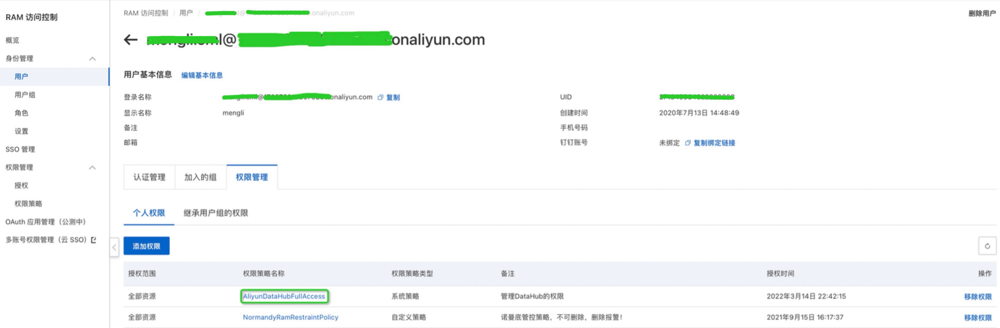

# 实时训练(ODL)

实时训练ODL(Online Deep Learning)让模型快速迭代，适应新的样本分布，并快速学习到新的item信息。针对大促、信息流等场景会比较大的增益。


### 输入
实时训练从消息中间件接收流式样本输入，目前支持的输入包括KafkaInput和DataHubInput
#### KafkaInput
```protobuf
kafka_train_input {
server: '127.0.0.1:9092'
topic: 'kafka_data_input'
group: 'kafka_train'
# timestamp in seconds
offset_info: '{"timestamp": 1650765731}'
}

kafka_eval_input {
server: '127.0.0.1:9092'
topic: 'kafka_data_input'
group: 'kafka_test'
# timestamp in seconds
offset_info: '{"timestamp": 1650765731}'
}
```

- server: kafka bootstrapped servers, 可以是多个server，中间用","分割
- topic: 读取数据的topic
- group: 消费kakfka数据的consumer group
- offset_info: json字符串，描述读取topic每个partition的offset，有两种形式:
   - 指定timestamp: 
      - 适用于每天从离线checkpoint启动实时训练时，可以用timestamp指定要读取的offset
      - 实现上用KafkaConsumer.offsets_for_times获取timestamp对应的offset，然后从offset处开始读取数据
   - 指定partition offset:
      - 例:   '{"0": 5, "1": 10}'
      - 适用于训练失败后重启的场景
      - 训练过程中保存checkpoint的时候，也会保存对应的offset；训练因为某些原因失败重启后，可以自动从checkpoint处恢复训练;
   - 不指定offset_info，默认从offset=0的位置读取数据.
#### DatahubInput
```protobuf
datahub_train_input{
  akId:"{DH_ID}"
  akSecret:"{DH_KEY}"
  region:"{DH_REG}"
  project:"{DH_PRO}"
  topic:"{DH_TOPIC}"
  offset_info: '{"1": {"cursor": "30006230bed60000000000003e800010"}, "0": {"cursor": "30006230be740000000000001f400000"}}'
}

datahub_eval_input{
  akId:"{DH_ID}"
  akSecret:"{DH_KEY}"
  region:"{DH_REG}"
  project:"{DH_PRO}"
  topic:"{DH_TOPIC}"
  offset_info: '{"1": {"cursor": "30006230bed60000000000003e800010"}, "0": {"cursor": "30006230be740000000000001f400000"}}'
}
```

- akId: datahub access_key
- akSecret: datahub access_secret
- region:  endpoint
   - 注意必须是http的，不能是https，vpc里面只通80端口，不通443端口
- project: datahub project
- topic: datahub topic
- offset_info: json字符串, 方便失败后重启
   - key: partition_id
   - value: dict，其中必须包含 cursor字段
- 权限开通: ak对应的用户必须要添加datahub访问权限
  

#### VPC打通
MaxCompute在经典网络里面，而Kafka/Datahub通常在VPC里面，为了能够访问VPC，需要打通网络，[打通流程](https://help.aliyun.com/document_detail/187866.html#section-qug-auu-qn2)。
### 训练
#### 增量保存
增量更新的参数通过kafka发送到EAS Processor
```sql
train_config {
  ...
  incr_save_config {
    dense_save_steps: 10
    sparse_save_steps: 10
    kafka {
      server: '127.0.0.1:9092'
      topic: 'kafka_model_20220408'
      consumer {
        offset:0
      }
    }
  }
  ...
  enable_oss_stop_signal: true
}
```

- dense_save_steps:  dense参数发送的频率
- sparse_save_steps: sparse参数发送的频率
- kafka:
   - server: kafka server地址
   - topic: kafka模型增量更新的topic
      - 如果topic不存在会自动创建
   - consumer:  导出模型时使用
      - offset: 读取模型参数的offset
         - 默认是0
- enable_oss_stop_signal:
   - 通过在model_dir下面创建OSS_STOP_SIGNAL文件来通知训练程序退出
#### 启动训练
```sql
pai -name easy_rec_ext
-Dversion=datahub
-Dcmd=train
-Dmodel_dir=oss://bucket-bj/checkpoints/${bizdate}/online/
-Dconfig=oss://bucket-bj/configs/deepfm/online.config
-Darn=acs:ram::xxx:role/aliyunodpspaidefaultrole
-Dbuckets=oss://bucket-bj/
-Dcluster='{"ps":{"count":1, "cpu":1000}, "worker" : {"count":2, "cpu":1000, "memory":40000}}'
-Deval_method=none
-Dedit_config_json='{{"train_config.fine_tune_checkpoint": "oss://bucket-bj/checkpoints/${bizdate-1}/offline/", "train_config.incr_save_config.kafka.topic":"incr_model_${bizdate}", "kafka_train_input.offset_info": "{\"timestamp\": ${bizdate_ts}}"}'
-DossHost=oss-cn-beijing.aliyuncs.com
-Dtrain_tables='odps://project_name/tables/deepfm_train'
-Deval_tables='odps://project_name/tables/deepfm_test'
-Dextra_params='--online'
-DvpcId=vpc-xxxxxxxxx
-DvpcRegion=cn-beijing
```

   - train_tables和eval_tables随便写一张存在的表就行, 训练时用不到
      - -Dextra_params='--online'  
   - edit_config_json: 修改config
      - fine_tune_checkpoint: 从离线训练的checkpoint进行初始化
      - train_config.incr_save_config.kafka.topic: 修改增量更新的topic
      - kafka_train_input.offset_info: 修改增量训练读取数据的起始位点
   - 注意: cluster里面不能指定GPU,   gpu集群无法访问vpc网络
   - 其他参数参考MaxCompute离线训练
#### 停止训练

- 例行停止:
   - 在model_dir下面创建OSS_STOP_SIGNAL，等待几分钟之后，训练程序就会自动退出
- 手动停止:
   - kill训练任务
### 导出
#### 导出命令
```sql
pai -name easy_rec_ext -project algo_public
-Dconfig=oss://bucket-bj/configs/deepfm/online.config
-Dcmd=export
-Dexport_dir=oss://bucket-bj/easy_rec_test/export
-Dcluster='{"worker" : {"count":1, "cpu":1000, "memory":40000}}'
-Darn=acs:ram::xxx:role/ev-ext-test-oss
-Dbuckets=oss://bucket-bj/
-DossHost=oss-cn-beijing-internal.aliyuncs.com
-Dcheckpoint_path='oss://bucket-bj/checkpoints/20220420/offline/'
-Dextra_params='--oss_path=oss://bucket-bj/export_embedding_step_0 --oss_ak=LTAIXXXXXXXX --oss_sk=vJkxxxxxxx --oss_endpoint=oss-cn-beijing.aliyuncs.com --asset_files oss://bucket-bj/config/fg.json'
```

- checkpoint_path: 导出离线训练的checkpoint作为base模型
- extra_params: 增量更新相关的参数, embedding参数和dense参数分开导出
   - oss_path: embedding保存的oss地址
   - oss_ak: oss access_key
   - oss_sk: oss access_secret
   - oss_endpoint: oss endpoint
   - asset_files: 把fg.json加入到asset_file里面，EAS Processor依赖fg.json生成特征
- 其他参数参考MaxCompute离线训练

#### 目录结构:

- DENSE_UPDATE_VARIABLES: 
   - 记录了dense参数名称到参数id的映射
   - 增量更新消息里面使用参数id，减少消息的大小
- embed_name_to_ids.txt
   - 记录了embedding参数名称到参数id的映射
   - 增量更新消息里面使用参数id，减少消息的大小
- fg.json: 特征处理的配置
- kafka.txt: 同train_config.incr_save_config.kafka
   - EAS Processor通过该配置获得 增量更新的topic和offset信息
- saved_model.pb和variables: saved_model参数
   - 查看saved_model的输入输出:
```bash
saved_model_cli show --all --dir export/1650854967
```

   - 包含两组signature:
      - serving_default: 定义了inference需要的输入输出
         - inputs: 每个特征对应一个输入
         - outputs: 对于deepfm模型，输出probs和logits，其他模型参考对应的文档
      - incr_update_sig: 定义了增量更新需要的输入输出
         - inputs: 
            - dense更新输入:
               - incr_update/dense/0/input
               - incr_update/dense/1/input 
               - ...
            - sparse更新输入:
               - incr_update/sparse/embedding_update: 
         - outputs:
            - dense更新输出:
               - incr_update/dense/0/output
               - incr_update/dense/1/output
               - ...
            - sparse更新输出:
               - incr_update/sparse/embedding_update
### 部署

- 需要使用支持增量更新的processor进行部署, [下载](http://easyrec.oss-cn-beijing.aliyuncs.com/deploy/LaRec-0.9.5b-c1b42fc-TF-2.5.0-Linux.tar.gz)
- processor重启会恢复base版本，拉取增量更新的消息

