# PyCharm / VSCode

<style>
img[alt=image_10.png] { height:320px; }
img[alt=image_11.png] { height:320px; }
</style>

### 构建镜像

```bash
git clone https://github.com/Alibaba/EasyRec
cd EasyRec
sh scripts/build_docker.sh
```

### 运行容器

- 查看docker镜像

```bash
docker images
```

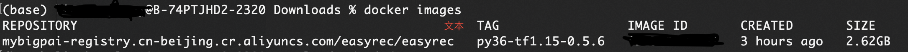

- 启动docker镜像

```bash
docker run -it <imageid> /bin/bash
```

### vscode配置

#### 连接本地容器

- vscode 安装 插件 remote - containers、remote - wsl 、remote development

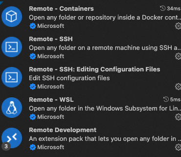

- 安装插件后，vscode 状态栏会出现远程连接的图标，点击图标。remote_explorer 选择containers ，CONTAINERS 显示出 运行的容器。点击 + ，连接容器。

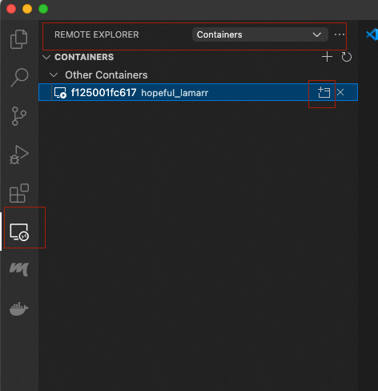

- 弹出新的window

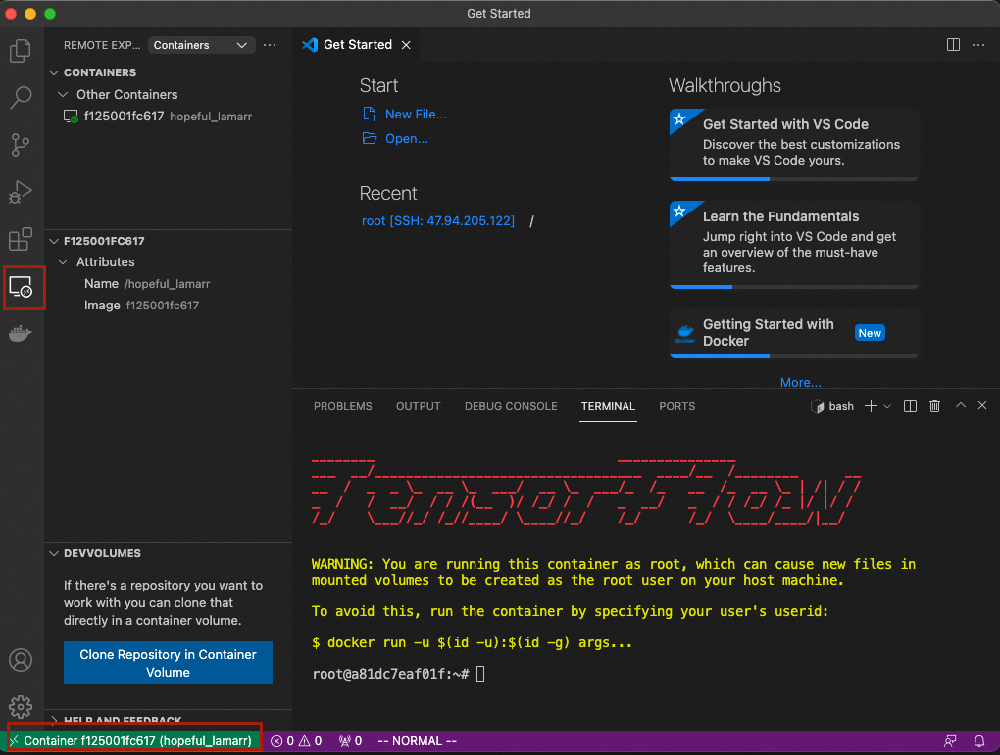

#### 连接远程容器

- vscode 安装 插件docker ，remote-ssh

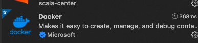
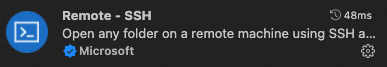

- vscode 连接远程服务器

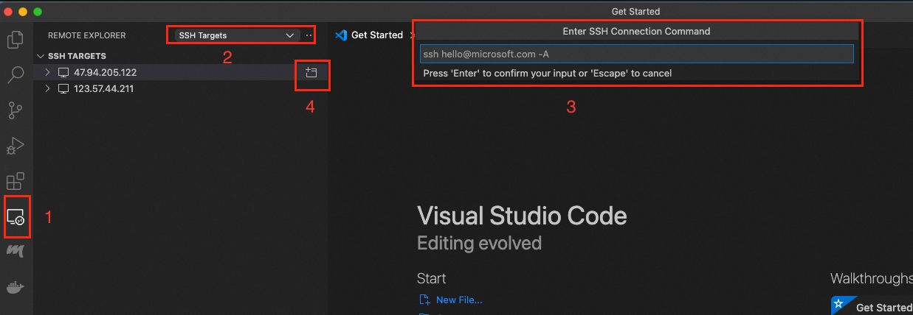

- 弹出 window , 点击 docker 图标，展示出运行的容器

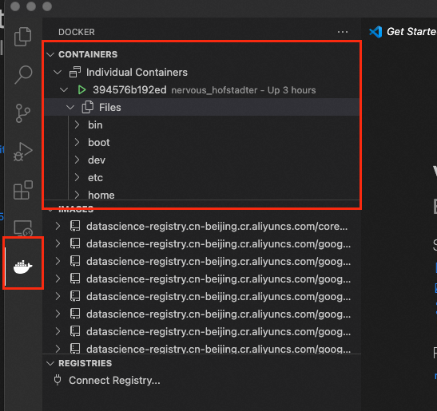

- 选择容器，右键attach shell，打开终端

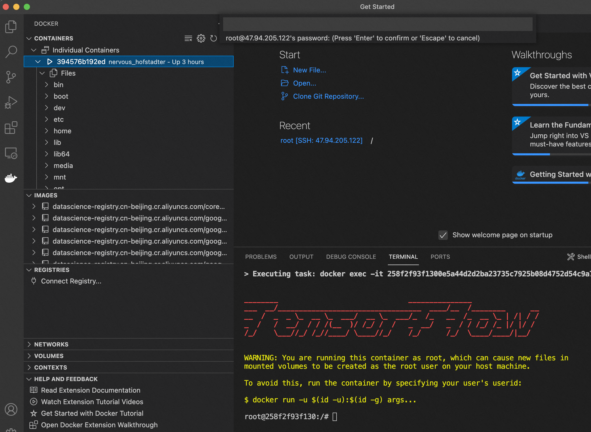

### pycharm配置

#### pycharm版本

- 本示例使用的版本是: **professional 2022.2.2**

#### 安装插件 docker

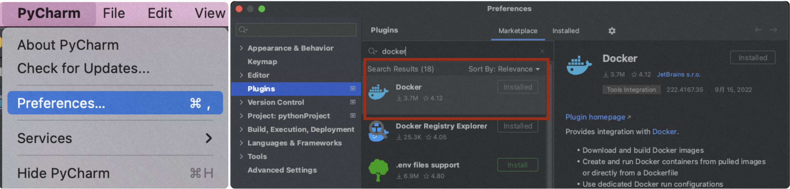

- 安装插件后 pycharm 底部的services会显示docker connect

#### 配置docker 连接

- 菜单路径: View=>Tools=>Services

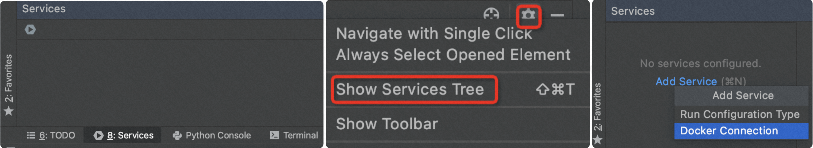

- 本地docker: 选择 docker for mac
- 远程服务器docker 选择 ssh, 填上 <username>@<ip>

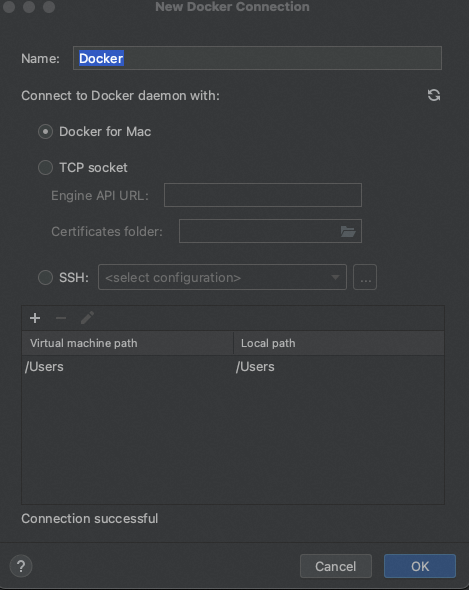

- 确定后，显示出containers和images.

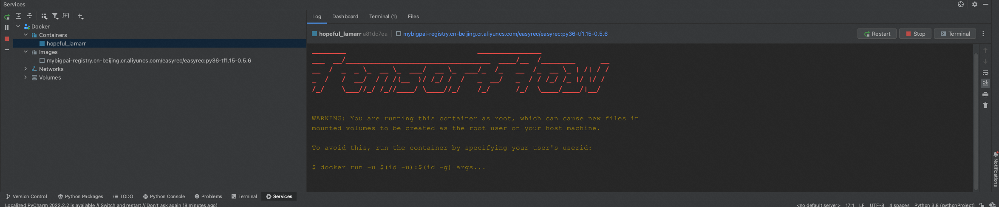

- 点击右上端terminal，进入交互.

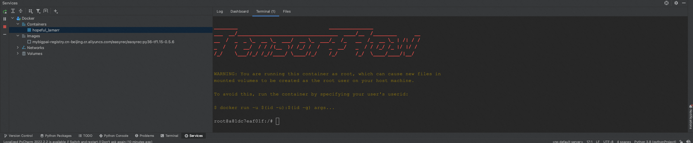

- 选择容器，右键，点击show files ,显示容器内所有文件.
- 选择文件，右键，查看和下载到本地.

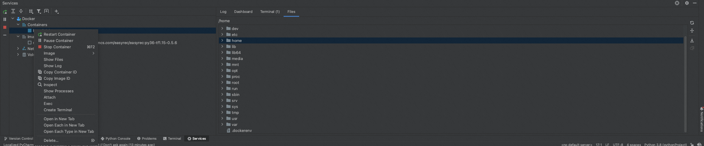
