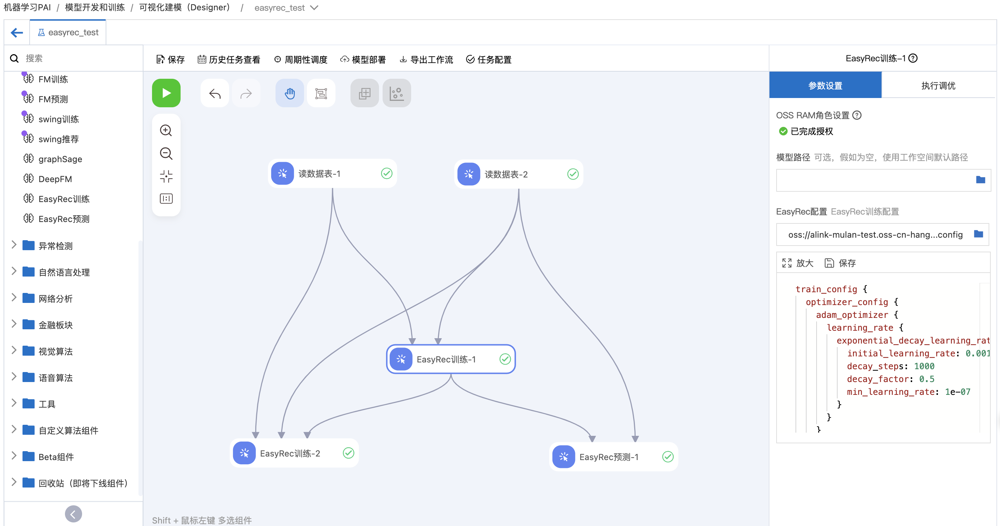

# PAI-Designer Tutorial

## PAI-Designer介绍

PAI-Designer（Studio 2.0）是基于云原生架构Pipeline Service（PAIFlow）的可视化建模工具， 提供可视化的机器学习开发环境，同时提供丰富且成熟的机器学习算法，覆盖商品推荐、金融风控及广告预测等场景，支持基于MaxCompute、PAI-DLC、Flink等计算资源进行大规模分布式运算，可以满足您不同方向的业务需求，实现低门槛开发人工智能服务。
[使用文档](https://help.aliyun.com/document_detail/114522.html)

### 在Designer进行EasyRec训练的优势

- 可视化编辑配置文件并自动保存至OSS
- 简化rolearn、执行资源等配置
- 历史任务记录及版本回滚
- 一键部署DataWorks定时调度任务

## 使用入口

点击[阿里云PAI管控台](https://pai.console.aliyun.com/#/studio)，选择进入一个工作空间
开始使用Designer。

新建一个工作流，可以在画布上拖拉拽左侧组件按照业务需求构建工作流，对MaxCompute数据表/OSS文件等数据源进行分析及模型构建。

## EasyRec训练组件

### 输入桩配置

| 输入桩（从左到右）  | 限制数据类型      | 对应PAI命令参数                                               | 是否必选 |
| ---------- | ----------- | ------------------------------------------------------- | ---- |
| 训练表        | MaxCompute表 | `train_tables`                                          | 是    |
| 评估表        | MaxCompute表 | `eval_tables`                                           | 否    |
| checkpoint | OSS存储的模型    | `edit_config_json`中的`train_config.fine_tune_checkpoint` | 否    |
| 分箱表        | MaxCompute表 | `boundary_table`                                        | 否    |

### 右侧参数说明

| 页签   | 参数                     | 是否必选 | 描述                                                                                                     | 默认值          |
| ---- | ---------------------- | ---- | ------------------------------------------------------------------------------------------------------ | ------------ |
| 参数设置 | 模型路径                   | 否    | 对应PAI命令参数`model_dir`                                                                                   | 工作流自动设置的工作路径 |
| 参数设置 | EasyRec配置              | 是    | 在下方编辑框填写config配置，保存至指定的OSS路径下，对应PAI命令参数`config`                                                        |              |
| 参数设置 | 指定算法版本                 | 否    | 点开高级选项后，可以自定义EasyRec的执行版本。请先参考文档[EasyRec版本更新](../release.md)上传对应版本的tar包到OSS，在这个参数中选中上传的文件。对应参数`script` | 空            |
| 执行调优 | ps数量                   | 否    | 完整的执行调优参数会拼装成`cluster`参数                                                                               | 2            |
| 执行调优 | ps CPU数量               | 否    | 完整的执行调优参数会拼装成`cluster`参数                                                                               | 6            |
| 执行调优 | ps Memory数量（MB）        | 否    | 完整的执行调优参数会拼装成`cluster`参数                                                                               | 30000        |
| 执行调优 | Worker数量               | 否    | 完整的执行调优参数会拼装成`cluster`参数                                                                               | 6            |
| 执行调优 | Worker CPU数量           | 否    | 完整的执行调优参数会拼装成`cluster`参数                                                                               | 6            |
| 执行调优 | Worker Memory用量（单位为MB） | 否    | 完整的执行调优参数会拼装成`cluster`参数                                                                               | 30000        |
| 执行调优 | Worker GPU卡数           | 否    | 完整的执行调优参数会拼装成`cluster`参数                                                                               | 0            |

### 输出桩配置

| 输出桩（从左到右） | 数据类型     | 对应PAI命令参数    |
| --------- | -------- | ------------ |
| 输出模型      | OSS存储的模型 | `model_dir ` |

### 对应PAI命令

在页面提交该组件执行，底层实际等同于执行了名为`easy_rec_ext`的PAI命令进行模型训练
`pai -name easy_rec_ext -project algo_public  -Dcmd=train`

- 具体命令及详细[参数说明](../train.md#on-pai)

## EasyRec预测组件

### 输入桩配置

| 输入桩（从左到右） | 限制数据类型      | 对应PAI命令参数         | 是否必选 |
| --------- | ----------- | ----------------- | ---- |
| 输入模型      | OSS存储的模型    | `saved_model_dir` | 是    |
| 输入表       | MaxCompute表 | `input_table`     | 是    |

### 右侧参数说明

| 页签   | 参数                     | 是否必选 | 描述                                                                                                             | 默认值               |
| ---- | ---------------------- | ---- | -------------------------------------------------------------------------------------------------------------- | ----------------- |
| 参数设置 | 输入选择列                  | 否    | 从输入表选择特征列给到预测模型，不能与排除列同时使用                                                                                     | -                 |
| 参数设置 | 排除列                    | 否    | 预测模型不需要使用的输入列，不能和输入选择列同时使用                                                                                     | -                 |
| 参数设置 | 输出保留列                  | 否    | 在预测结构表中原样输出的列                                                                                                  | -                 |
| 参数设置 | 预测详情输出列                | 否    | 选择预测模型的输出到MaxCompute表的映射，细节请参见[EasyRec离线预测文档](../predict/MaxCompute%20%E7%A6%BB%E7%BA%BF%E9%A2%84%E6%B5%8B.md) | 默认为"probs double" |
| 参数设置 | miniBatch的大小           | 否    | 对应参数`batch_size`                                                                                               | 1024              |
| 执行调优 | Worker数量               | 否    | 完整的执行调优参数会拼装成`cluster`参数                                                                                       | 6                 |
| 执行调优 | Worker CPU数量           | 否    | 完整的执行调优参数会拼装成`cluster`参数                                                                                       | 6                 |
| 执行调优 | Worker Memory用量（单位为MB） | 否    | 完整的执行调优参数会拼装成`cluster`参数                                                                                       | 30000             |
| 执行调优 | Worker GPU卡数           | 否    | 完整的执行调优参数会拼装成`cluster`参数                                                                                       | 0                 |

### 输出桩配置

| 输出桩（从左到右） | 数据类型        | 对应PAI命令参数       |
| --------- | ----------- | --------------- |
| 输出表       | MaxCompute表 | `output_table ` |

### 对应PAI命令

在页面提交该组件执行，底层实际等同于执行了名为`easy_rec_ext`的PAI命令进行数据批量预测
`pai -name easy_rec_ext -project algo_public  -Dcmd=predict`

- 具体命令及详细[参数说明](../train.md#on-pai)

### 推荐算法定制的方案

- 在Designer中做推荐算法特征工程、排序模型训练、向量召回等案例的阿里云官网[文档链接](https://help.aliyun.com/zh/pai/use-cases/overview-18)
