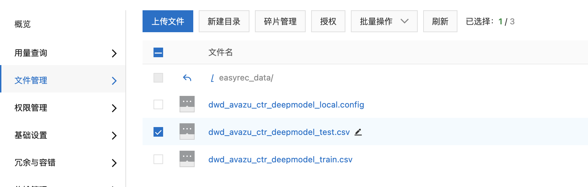
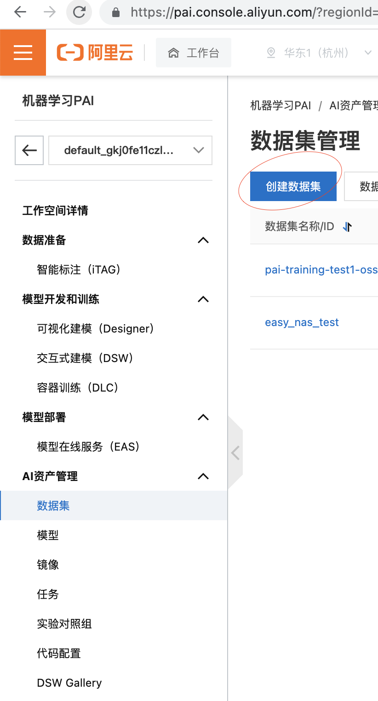
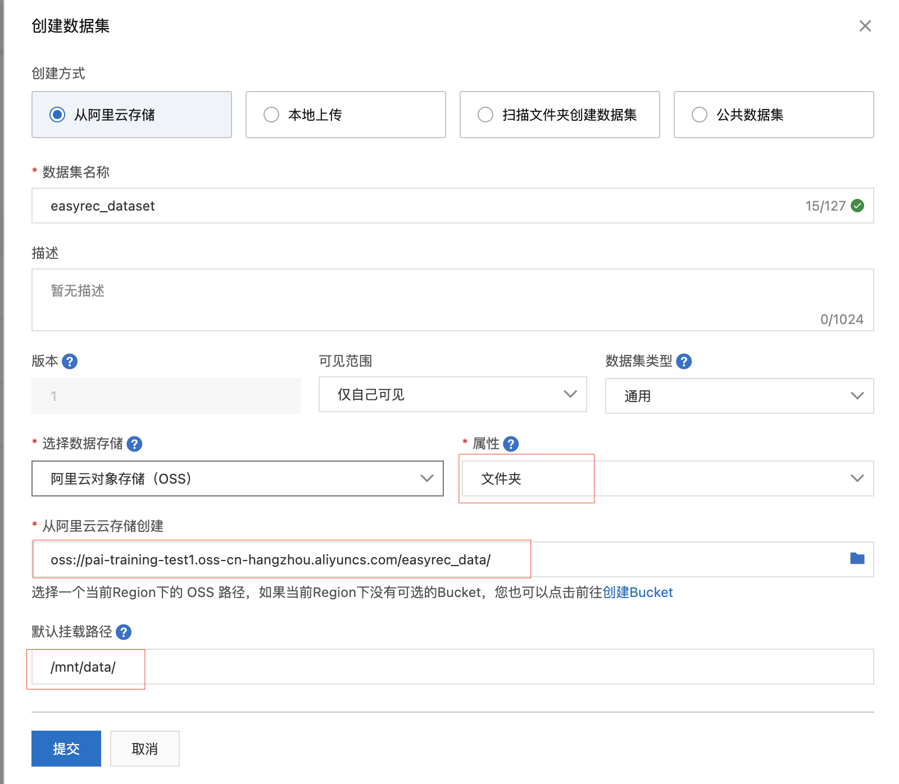
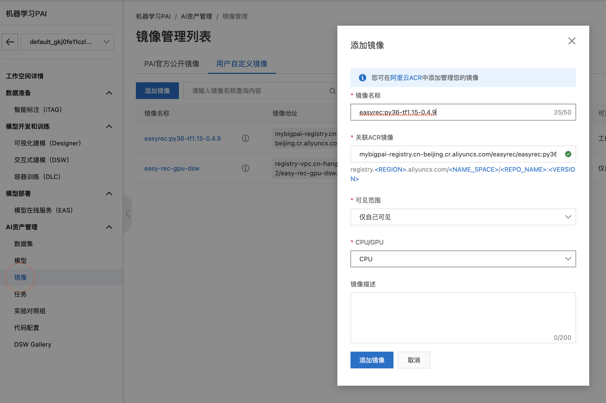
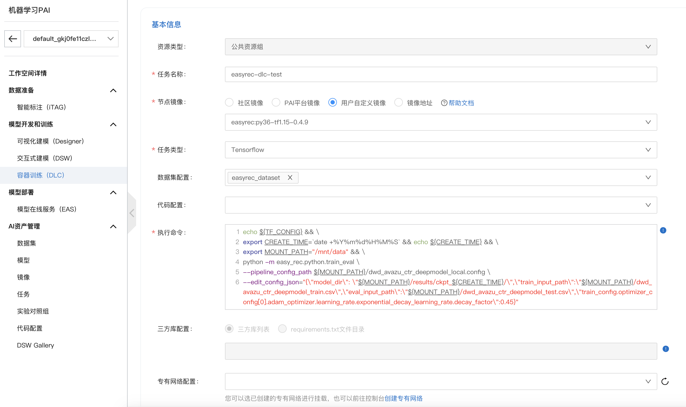
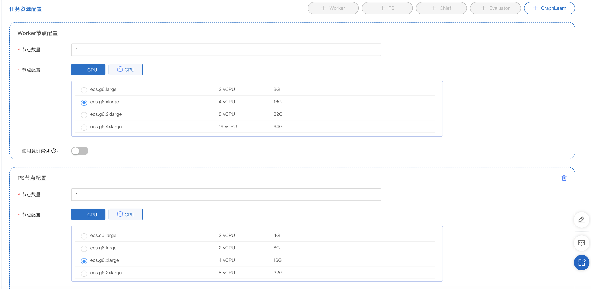
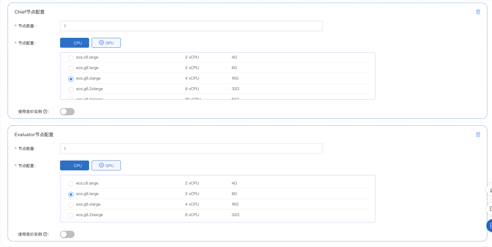
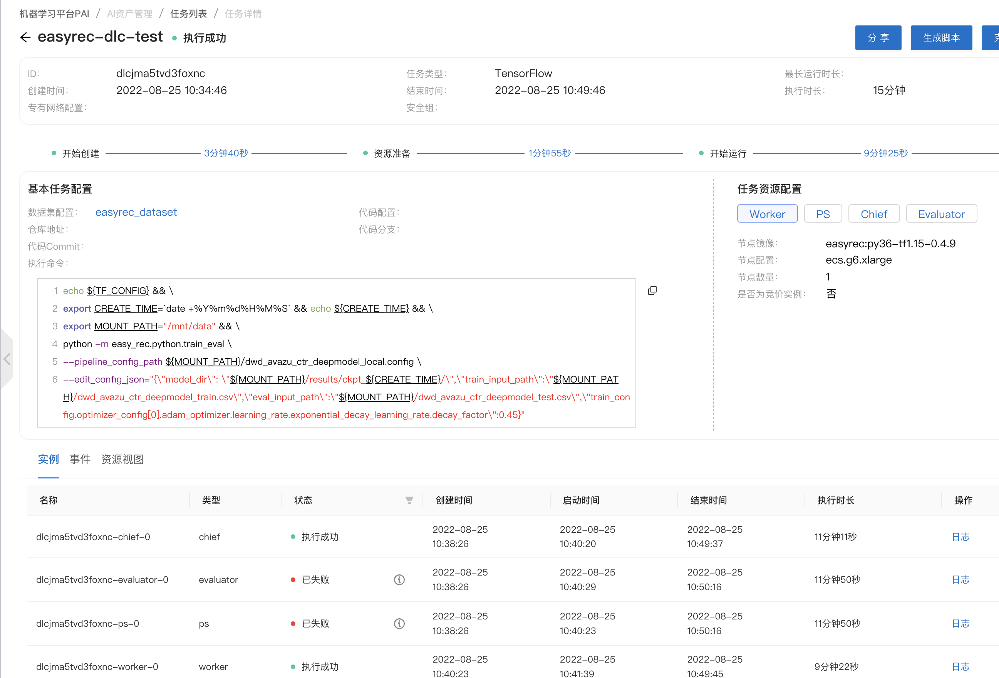
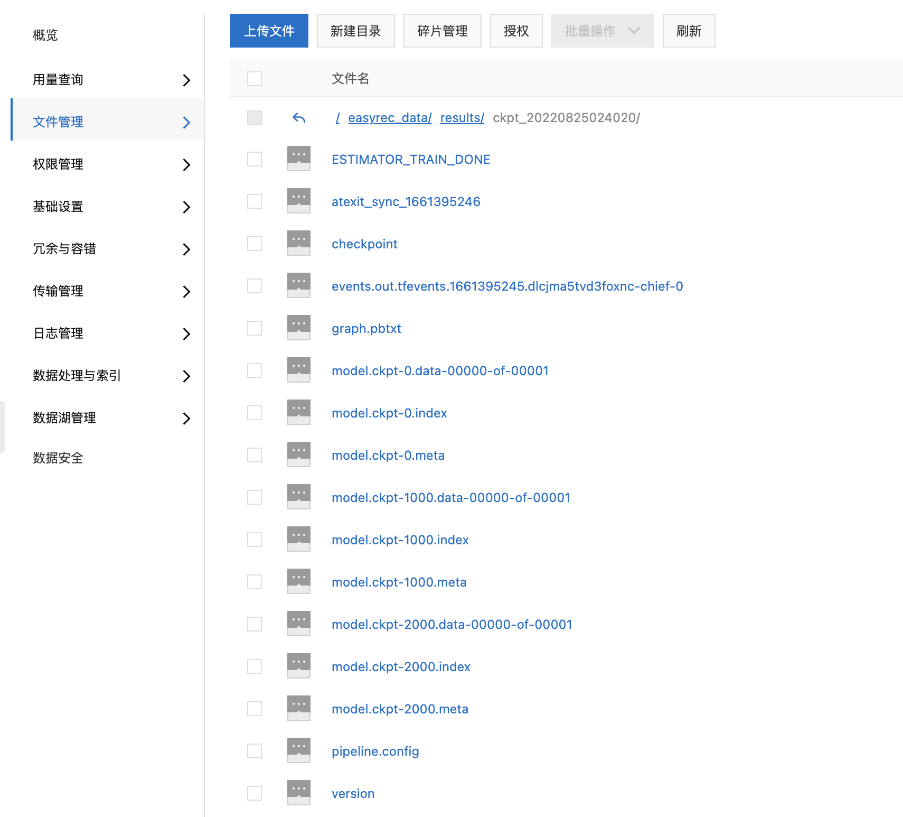

# DLC Tutorial
PAI-DLC（Deep Learning Containers）是基于阿里巴巴容器服务ACK（Alibaba Cloud Container Service for Kubernetes）的深度学习训练平台，为您提供灵活、稳定、易用和极致性能的深度学习训练环境。使用文档详见：[https://help.aliyun.com/document_detail/165124.html](https://help.aliyun.com/document_detail/165124.html)
# 使用流程
## 上传数据到OSS
假如要使用DLC运行EasyRec，首先需要将EasyRec的训练数据和配置文件上传到Aliyun OSS。

## 创建数据集
进入[PAI控制台](https://pai.console.aliyun.com/?regionId=cn-beijing)，并选择需要使用的工作空间，点击AI资源管理/数据集，创建数据集。

创建方式选择阿里云存储，属性选择文件夹，选择数据和配置文件所在的OSS路径，并设置数据集的挂载路径。任务运行时，会从挂载路径下读取训练数据和配置文件。

## 添加自定义镜像
进入[PAI控制台](https://pai.console.aliyun.com/?regionId=cn-beijing)，并选择需要使用的工作空间，点击AI资源管理/镜像，切换到用户自定义镜像，点击添加镜像。添加EasyRec官方提供的镜像。
```json
mybigpai-registry.cn-beijing.cr.aliyuncs.com/easyrec/easyrec:py36-tf1.15-0.4.9
```

## 创建DLC任务
### 配置任务
进入[PAI控制台](https://pai.console.aliyun.com/?regionId=cn-beijing)，并选择需要使用的工作空间，点击模型开发和训练/容器训练(DLC)，点击创建任务。
选择运行镜像，以及数据集，并输入执行命令：

执行命令如下：

- MOUNT_PATH是创建数据集时指定的挂载路径。
- 可以通过edit_config_json修改配置，避免频繁修改配置文件，如mode_dir、training_input_path, eval_input_path等信息
```bash
echo ${TF_CONFIG} && \
export bizdate=`date +%Y%m%d%H%M%S` && echo ${bizdate} && \
export MOUNT_PATH="/mnt/data" && \
python -m easy_rec.python.train_eval \
--pipeline_config_path ${MOUNT_PATH}/dwd_avazu_ctr_deepmodel_local.config \
--edit_config_json="{\"model_dir\": \"${MOUNT_PATH}/results/ckpt_${bizdate}/\",\"train_input_path\":\"${MOUNT_PATH}/dwd_avazu_ctr_deepmodel_train.csv\",\"eval_input_path\":\"${MOUNT_PATH}/dwd_avazu_ctr_deepmodel_test.csv\"}"
```
### 配置任务资源
任务的资源配置选择进阶模式，我们选择了1个Chief、1个Worker、一个PS、一个Evaluator的配置。


### 查看任务详情
然后点击提交即可，点击任务能看到任务列表，可以查看任务详情。

## 查看模型
当任务运行成功后，找到对应的oss路径，可以看到任务生成的模型。

