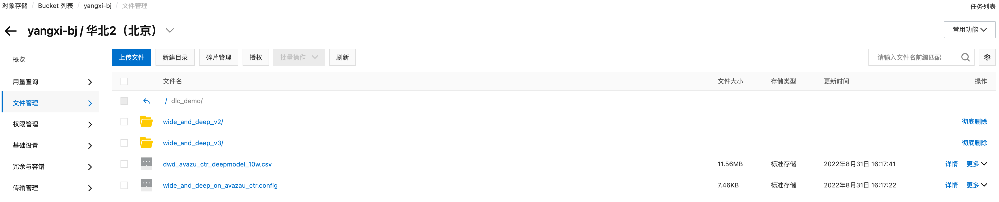
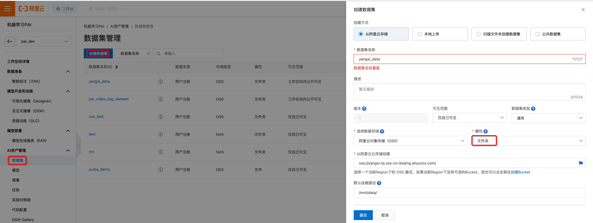
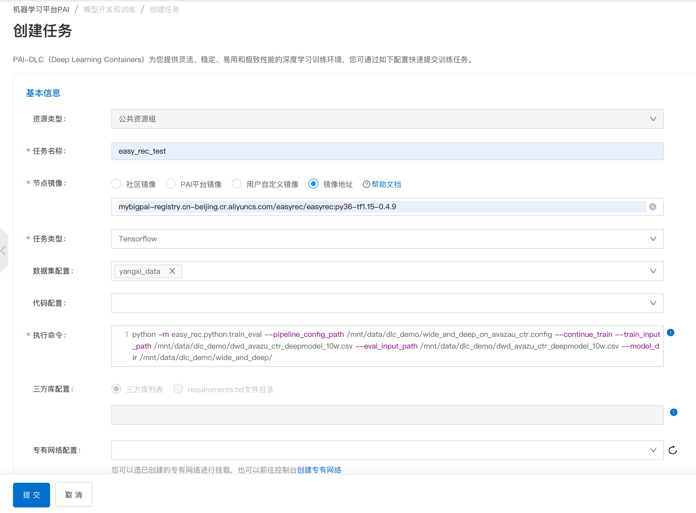
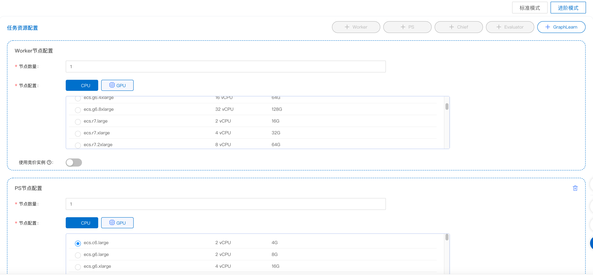
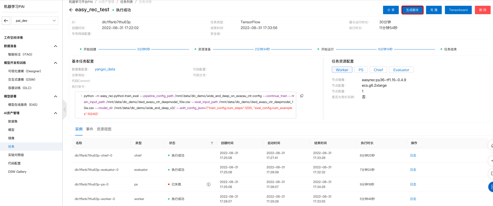
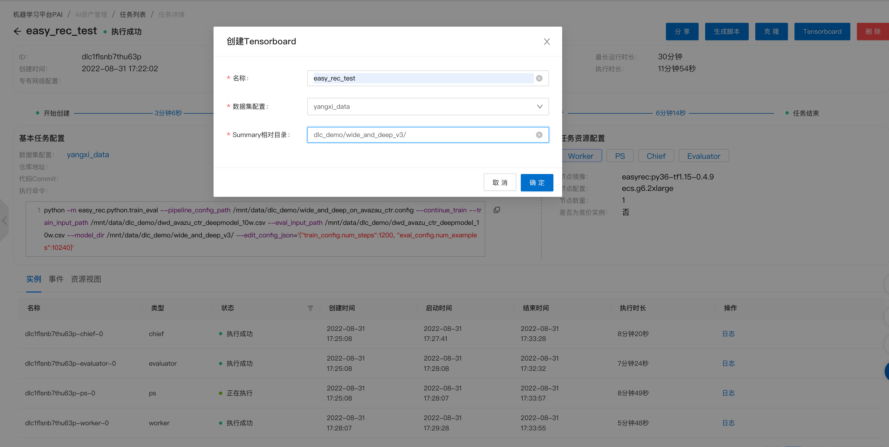
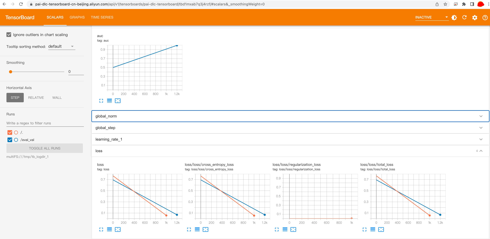
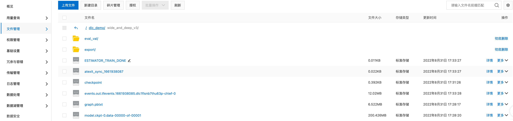

# DLC Tutorial

[PAI-DLC](https://help.aliyun.com/document_detail/165124.html)（Deep Learning Containers）是基于阿里巴巴容器服务ACK（Alibaba Cloud Container Service for Kubernetes）的深度学习训练平台，为您提供灵活、稳定、易用和极致性能的深度学习训练环境。

## 上传数据到OSS

使用DLC运行EasyRec，首先需要将EasyRec的[训练数据](http://easyrec.oss-cn-beijing.aliyuncs.com/demo/dwd_avazu_ctr_deepmodel_10w.csv)和[配置文件](http://easyrec.oss-cn-beijing.aliyuncs.com/demo/wide_and_deep_on_avazau_ctr.config)上传到Aliyun OSS。


## 创建数据集

进入[PAI控制台](https://pai.console.aliyun.com/?regionId=cn-beijing)，并选择需要使用的工作空间，点击AI资源管理/数据集，创建数据集。

创建方式选择阿里云存储，属性选择文件夹，选择数据和配置文件所在的OSS路径，并设置数据集的挂载路径。任务运行时，会从挂载路径下读取训练数据和配置文件。

## 创建DLC任务

### 配置任务

进入[PAI控制台](https://pai.console.aliyun.com)，并选择需要使用的工作空间，点击模型开发和训练/容器训练(DLC)，点击创建任务。
选择运行镜像，以及数据集，并输入执行命令：

执行命令如下：

```bash
python -m easy_rec.python.train_eval --pipeline_config_path /mnt/data/dlc_demo/wide_and_deep_on_avazau_ctr.config --continue_train --train_input_path /mnt/data/dlc_demo/dwd_avazu_ctr_deepmodel_10w.csv --eval_input_path /mnt/data/dlc_demo/dwd_avazu_ctr_deepmodel_10w.csv --model_dir /mnt/data/dlc_demo/wide_and_deep_v3/ --edit_config_json='{"train_config.num_steps":1200, "eval_config.num_examples":10240}'
```

- 可以通过edit_config_json修改配置，避免频繁修改配置文件，如train_config.num_steps等信息
- 注意:这里仅仅是训练的demo, 所以使用train_config.num_steps, 实际实验时不建议设置train_config.num_steps,建议设置data_config.num_epochs, 实际实验时也不建议设置eval_config.num_examples, 不设置时默认评估整个测试集.

#### 使用ODPS表作为输入:

```bash
cat  << EOF >> odps_conf
access_id=xxxx
access_key=xxxx
end_point=http://xxxx

EOF

export ODPS_CONFIG_FILE_PATH=odps_conf
python -m easy_rec.python.train_eval --pipeline_config_path /mnt/data/dlc_demo/wide_and_deep_on_avazau_ctr.config --continue_train --train_input_path odps://project/tables/train_input_table --eval_input_path odps://project/tables/test_input_table --model_dir /mnt/data/dlc_demo/wide_and_deep_v3/ --edit_config_json='{"data_config.num_epochs":1, "data_config.input_type":"OdpsInputV3"}'
```

- data_config.input_type: 加载输入数据的类是OdpsInputV3, 目前只支持OdpsInputV3.

#### 评估

```bash
python -m easy_rec.python.eval --pipeline_config_path /mnt/data/dlc_demo/wide_and_deep_v3/pipeline.config --eval_input_path /mnt/data/dlc_demo/dwd_avazu_ctr_deepmodel_10w.csv
```

- checkpoint_path: 指定要评估的checkpoint, 默认评估model_dir下面最新的checkpoint
- eval_input_path: 评估的输入路径, 如果是Odps表的话, 需要配置odps_conf文件，并且设置环境变量: export ODPS_CONFIG_FILE_PATH=odps_conf
- distribute_eval: 是否使用分布式预测，如果使用分布式预测, 在配置任务资源时需要设置ps.
- eval_result_path: 评估指标的保存位置

#### 预测

```bash
python -m easy_rec.python.tools.predict_and_chk --saved_model_dir /mnt/data/dlc_demo/wide_and_deep_v3/export/final --input_path /mnt/data/dlc_demo/dwd_avazu_ctr_deepmodel_10w.csv  --label_id 0 --separator "," --save_path /mnt/data/dlc_demo/wide_and_deep_v3/predict.out
```

- saved_model_dir: saved_model目录
- input_path: 需要预测的文件
- label_id: label column id, 可以指定多个, 比如: --label_id 0 1 2
- separator: 输入的分隔符
- save_path: 预测结果的保存目录
- 注意: 目前只支持单worker预测,多worker预测适配中; odps表预测适配中.

### 配置任务资源

任务的资源配置选择进阶模式，我们选择了1个Chief、1个Worker、一个PS、一个Evaluator的配置。


### 查看任务详情

然后点击 提交 即可，点击 任务 能看到 任务列表，可以查看任务详情:

点击生成脚本, 可以查看通过通过[命令行](https://help.aliyun.com/document_detail/214317.html)提交任务, 方便在DataWorks里面做例行训练.

```bash
dlc submit tfjob \
    --name=easy_rec_test \
    --command='python -m easy_rec.python.train_eval --pipeline_config_path /mnt/data/dlc_demo/wide_and_deep_on_avazau_ctr.config --continue_train --train_input_path /mnt/data/dlc_demo/dwd_avazu_ctr_deepmodel_10w.csv --eval_input_path /mnt/data/dlc_demo/dwd_avazu_ctr_deepmodel_10w.csv --model_dir /mnt/data/dlc_demo/wide_and_deep_v3/ --edit_config_json='\''{"train_config.num_steps":1200, "eval_config.num_examples":10240}'\''' \
    --data_sources=d-5sf0ox5pw1pgi4vl7e \
    --workspace_id=67849 \
    --priority=1 \
    --workers=1 \
    --worker_image=mybigpai-public-registry.cn-beijing.cr.aliyuncs.com/easyrec/easyrec:py36-tf1.15-0.7.4 \
    --worker_spec=ecs.g6.2xlarge \
    --ps=1 \
    --ps_image=mybigpai-public-registry.cn-beijing.cr.aliyuncs.com/easyrec/easyrec:py36-tf1.15-0.7.4 \
    --ps_spec=ecs.g6.2xlarge \
    --chief=true \
    --chief_image=mybigpai-public-registry.cn-beijing.cr.aliyuncs.com/easyrec/easyrec:py36-tf1.15-0.7.4 \
    --chief_spec=ecs.g6.2xlarge \
    --evaluators=1 \
    --evaluator_image=mybigpai-public-registry.cn-beijing.cr.aliyuncs.com/easyrec/easyrec:py36-tf1.15-0.7.4 \
    --evaluator_spec=ecs.g6.2xlarge
```

通过dlc命令提交的任务也可以在 任务列表 中查看.

### 查看tensorboard

创建tensorboard, 填写model_dir的相对路径

查看tensorboard


### 查看模型

当任务运行成功后，找到对应的oss路径，可以看到任务生成的模型。

