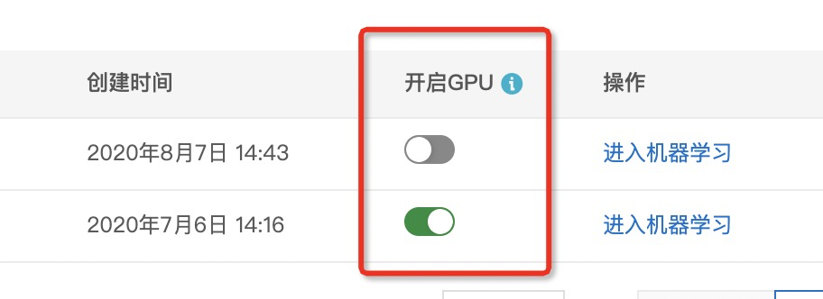
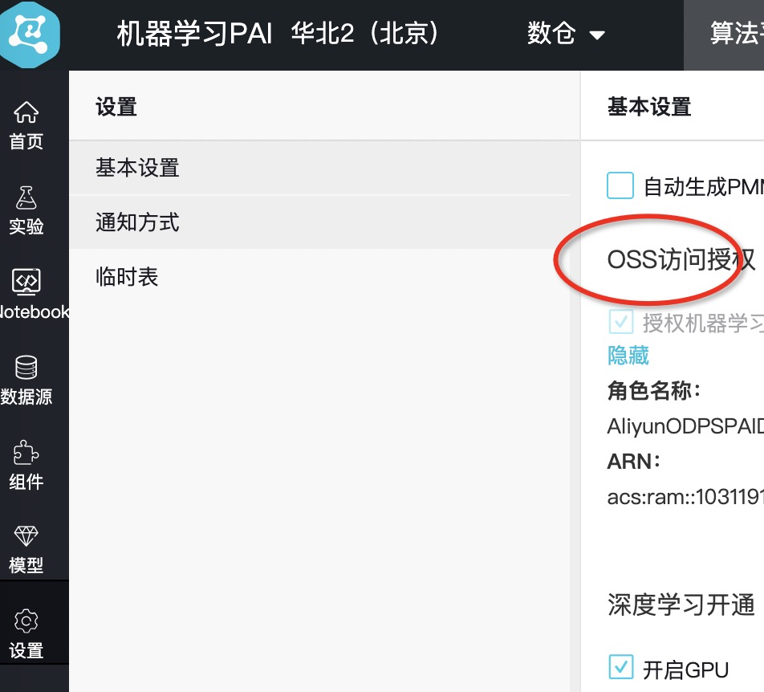

# MaxCompute Tutorial

**此文档是针对公网用户（非阿里内部开发）**，在MaxCompute公有云版本上使用EasyRec的说明。

针对阿里集团内部用户，请参考[mc_tutorial_inner](mc_tutorial_inner.md)。

有技术问题可加钉钉群：37930014162

### 输入数据:

输入一般是MaxCompute表:

- train: pai_online_project.dwd_avazu_ctr_deepmodel_train
- test:  pai_online_project.dwd_avazu_ctr_deepmodel_test

说明：原则上这两张表是自己odps的表，为了方便，以上提供case的两张表可在国内用户的MaxCompute项目空间中访问。

两个表可以带分区，也可以不带分区。带分区的方式：odps://xyz_project/table1/dt=20240101

### 训练:

- 配置文件: [dwd_avazu_ctr_deepmodel_ext.config](https://easyrec.oss-cn-beijing.aliyuncs.com/config/MultiTower/dwd_avazu_ctr_deepmodel_ext.config), 配置文件采用prototxt格式，内容解析见[配置文件](#Qgqxc)
  - 修改配置文件里面的**model_dir**字段为: 自己的实验oss目录

```sql
pai -name easy_rec_ext -project algo_public
-Dcmd=train
-Dconfig=oss://easyrec/config/MultiTower/dwd_avazu_ctr_deepmodel_ext.config
-Dtrain_tables='odps://pai_online_project/tables/dwd_avazu_ctr_deepmodel_train'
-Deval_tables='odps://pai_online_project/tables/dwd_avazu_ctr_deepmodel_test'
-Dcluster='{"ps":{"count":1, "cpu":1000}, "worker" : {"count":3, "cpu":1000, "gpu":0, "memory":40000}}'
-Deval_method=separate
-Dmodel_dir=oss://easyrec/ckpt/MultiTower
-Darn=acs:ram::xxx:role/xxx
-Dbuckets=oss://easyrec/
-DossHost=oss-cn-beijing-internal.aliyuncs.com;
```

- -Dcmd: train 表示模型训练
- -Dconfig: 训练用的配置文件
- -Dtrain_tables: 定义训练表
- -Deval_tables: 定义评估表
- -Dtables: 定义其他依赖表(可选)，如负采样的表
- -Dcluster: 定义PS的数目和worker的数目。具体见：[PAI-TF任务参数介绍](https://help.aliyun.com/document_detail/154186.html?spm=a2c4g.11186623.4.3.e56f1adb7AJ9T5)
- -Deval_method: 评估方法
- separate: 用worker(task_id=1)做评估。找到MaxCompute训练任务的logview，打开logview之后在worker1机器的stderr日志中查看评估指标数据。
- none: 不需要评估
- master: 在master(task_id=0)上做评估
- -Dfine_tune_checkpoint: 可选，从checkpoint restore参数，进行finetune
- 可以指定directory，将使用directory里面的最新的checkpoint.
- -Dmodel_dir: 如果指定了model_dir将会覆盖config里面的model_dir，一般在周期性调度的时候使用。
- -Darn: rolearn  注意这个的arn要替换成客户自己的。可以从dataworks的设置中查看arn;或者阿里云控制台人工智能平台PAI，左侧菜单"开通和授权"，找到全部云产品依赖->Designer->OSS->查看授权信息。
- -Dbuckets: config所在的bucket和保存模型的bucket; 如果有多个bucket，逗号分割
- -DossHost: ossHost地址

### 注意：

- dataworks和PAI的project一样，案例都是pai_online_project，用户需要根据自己的环境修改。如果需要使用gpu，PAI的project需要设置开通GPU。链接：[https://pai.data.aliyun.com/console?projectId=&regionId=cn-beijing#/visual](https://pai.data.aliyun.com/console?projectId=%C2%AEionId=cn-beijing#/visual)  ，其中regionId可能不一致。

  

- oss的bucket需要提前开通好，案例中bucket名称是easyrec。创建bucket请参考：[创建存储空间](https://help.aliyun.com/document_detail/31885.html)

- arn需要在PAI-studio的project（当前案例中的project是pai_online_project）的OSS访问授权设置页面查看和创建，如下图：



### 评估:

```sql
pai -name easy_rec_ext -project algo_public
-Dcmd=evaluate
-Dconfig=oss://easyrec/config/MultiTower/dwd_avazu_ctr_deepmodel_ext.config
-Deval_tables='odps://pai_online_project/tables/dwd_avazu_ctr_deepmodel_test'
-Dcluster='{"worker" : {"count":1, "cpu":1000, "gpu":0, "memory":40000}}'
-Dmodel_dir=oss://easyrec/ckpt/MultiTower
-Darn=acs:ram::xxx:role/xxx
-Dbuckets=oss://easyrec/
-DossHost=oss-cn-beijing-internal.aliyuncs.com；
```

- -Dcmd: evaluate 模型评估
- -Dconfig: 同训练
- -Deval_tables: 指定测试tables
- -Dtables: 指定其他依赖表，如负采样的表
- -Dcluster: 评估不需要PS节点，指定一个worker节点即可
- -Dmodel_dir: 如果指定了model_dir将会覆盖config里面的model_dir，一般在周期性调度的时候使用
- -Dcheckpoint_path: 使用指定的checkpoint_path，如oss://easyrec/ckpt/MultiTower/model.ckpt-1000。不指定的话，默认model_dir中最新的ckpt文件。
- arn,buckets,ossHost同训练.

### 导出:

```
由于导出模型，只需要读入checkpoint导出model，因此不需要ps 结点，也不需要GPU。
```

```sql
pai -name easy_rec_ext -project algo_public
-Dcmd=export
-Dconfig=oss://easyrec/config/MultiTower/dwd_avazu_ctr_deepmodel_ext.config
-Dmodel_dir=oss://easyrec/ckpt/MultiTower
-Dexport_dir=oss://easyrec/ckpt/MultiTower/export
-Dcluster='{"worker" : {"count":1, "cpu":1000, "memory":40000}}'
-Darn=acs:ram::xxx:role/xxx
-Dbuckets=oss://easyrec/
-DossHost=oss-cn-beijing-internal.aliyuncs.com
```

- -Dcmd: export 模型导出
- -Dconfig: 同训练
- -Dmodel_dir: 同训练
- -Dexport_dir: 导出的目录
- -Dcluster: 评估不需要PS节点，指定一个worker节点即可
- -Dcheckpoint_path: 同评估
- arn,buckets,ossHost同训练.

### 导出RTP serving checkpoint:

```
导出RTPserving支持的checkpoint, 更多参考[RTPServing的文档](../feature/rtp_native.md).
```

```sql
pai -name easy_rec_ext -project algo_public
-Dcmd=export_checkpoint
-Dconfig=oss://easyrec/config/MultiTower/dwd_avazu_ctr_deepmodel_ext.config
-Dmodel_dir=oss://easyrec/ckpt/MultiTower
-Dexport_dir=oss://easyrec/ckpt/MultiTower/export
-Dcluster='{"worker" : {"count":1, "cpu":1000, "memory":40000}}'
-Darn=acs:ram::xxx:role/xxx
-Dbuckets=oss://easyrec/
-DossHost=oss-cn-beijing-internal.aliyuncs.com
```

- -Dcmd: export_checkpoint, 导出RTP支持的checkpoint
- -Dconfig: 同训练
- -Dmodel_dir: 同训练
- -Dexport_dir: 导出的目录
- -Dcluster: 评估不需要PS节点，指定一个worker节点即可
- -Dcheckpoint_path: 同评估
- arn,buckets,ossHost同训练.

### 配置文件:

#### 输入输出

```protobuf
# 训练表和测试表，如果在PAI上，不需要设置，会被-Dtables参数覆盖
train_input_path: ""
eval_input_path: ""
# 模型保存路径
model_dir: "oss://easyrec/easy_rec_test/experiment/dwd_avazu_ctr"
```

#### 数据相关

数据配置具体见：[数据](../feature/data.md)

```protobuf
# 数据相关的描述
data_config {
  separator: ","
  input_fields: {
    input_name: "label"
    input_type: FLOAT
    default_val:""
  }
  input_fields: {
    input_name: "hour"
    input_type: STRING
    default_val:""
  }
  ...
  input_fields: {
    input_name: "c20"
    input_type: STRING
    default_val:""
  }
  input_fields: {
    input_name: "c21"
    input_type: STRING
    default_val:""
  }
  label_fields: "label"

  batch_size: 1024
  num_epochs: 10000
  prefetch_size: 32
  input_type: OdpsInputV2
}
```

#### 特征相关

特征配置具体见：[特征](../feature/feature.rst)

```protobuf
feature_config: {
  features: {
    input_names: "hour"
    feature_type: IdFeature
    embedding_dim: 16
    hash_bucket_size: 50
  }
  features: {
    input_names: "c1"
    feature_type: IdFeature
    embedding_dim: 16
    hash_bucket_size: 10
  }

  ...

  features: {
    input_names: "c20"
    feature_type: IdFeature
    embedding_dim: 16
    hash_bucket_size: 500
  }
  features: {
    input_names: "c21"
    feature_type: IdFeature
    embedding_dim: 16
    hash_bucket_size: 500
  }
}
```

#### 训练相关

训练配置具体见：[训练](../train.md)

```protobuf
# 训练相关的参数
train_config {
  # 每200轮打印一行log
  log_step_count_steps: 200
  # 优化器相关的参数
  optimizer_config: {
    adam_optimizer: {
      learning_rate: {
        exponential_decay_learning_rate {
          initial_learning_rate: 0.0001
          decay_steps: 100000
          decay_factor: 0.5
          min_learning_rate: 0.0000001
        }
      }
    }
    use_moving_average: false
  }
  # 使用SyncReplicasOptimizer进行分布式训练(同步模式)
  sync_replicas: true
  # num_steps = total_sample_num * num_epochs / batch_size / num_workers
  num_steps: 1000
}
```

#### 评估相关

评估配置具体见：[评估](../eval.md)

```protobuf
eval_config {
  # 仅仅评估1000个样本，这里是为了示例速度考虑，实际使用时需要删除
  num_examples: 1000
  metrics_set: {
    # metric为auc
    auc {}
  }
}
```

#### 模型相关

```protobuf
model_config:{
  model_class: "MultiTower"
  feature_groups: {
    group_name: "item"
    feature_names: "c1"
    feature_names: "banner_pos"
    feature_names: "site_id"
    feature_names: "site_domain"
    feature_names: "site_category"
    feature_names: "app_id"
    feature_names: "app_domain"
    feature_names: "app_category"
    wide_deep:DEEP
  }
  feature_groups: {
    group_name: "user"
    feature_names: "device_id"
    feature_names: "device_ip"
    feature_names: "device_model"
    feature_names: "device_type"
    feature_names: "device_conn_type"
    wide_deep:DEEP
  }
  feature_groups: {
    group_name: "user_item"
    feature_names: "hour"
    feature_names: "c14"
    feature_names: "c15"
    feature_names: "c16"
    feature_names: "c17"
    feature_names: "c18"
    feature_names: "c19"
    feature_names: "c20"
    feature_names: "c21"
    wide_deep:DEEP
  }

  multi_tower {
    towers {
      input: "item"
      dnn {
        hidden_units: [384, 320, 256, 192, 128]
      }
    }
    towers {
      input: "user"
      dnn {
        hidden_units: [384, 320, 256, 192, 128]
      }
    }
    towers {
      input: "user_item"
      dnn {
        hidden_units: [384, 320, 256, 192, 128]
      }
    }

    final_dnn {
      hidden_units: [256, 192, 128, 64]
    }
    l2_regularization: 0.0
  }
  embedding_regularization: 0.0
}

```

配置文件下载：[dwd_avazu_ctr_deepmodel_ext.config](https://easyrec.oss-cn-beijing.aliyuncs.com/config/MultiTower/dwd_avazu_ctr_deepmodel_ext.config)

#### 配置参考手册

[EasyRecConfig参考手册](../reference.md)
