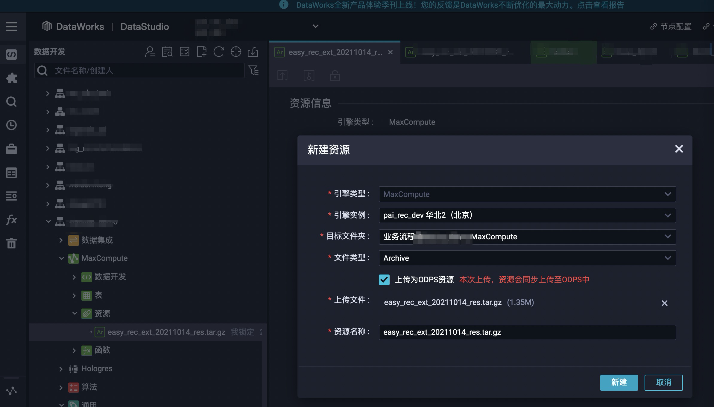
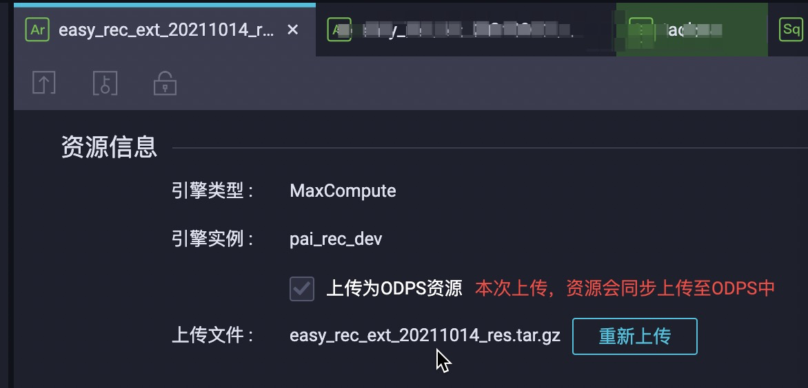

# Release & Upgrade

### PAI(Max Compute) EasyRec升级

```bash
sh pai_jobs/deploy_ext.sh -V ${VERSION} -G
ls -lh pai_jobs/easy_rec_ext_${VERSION}_res.tar.gz
```

将资源包pai_jobs/easy_rec_ext\_${VERSION}\_res.tar.gz上传至ODPS





执行的时候只需加上下述命令参数，即可调用该版本EasyRec:

```
pai -name easy_rec_ext
-Dres_project=${YOUR_PROJECT_NAME}
-Dversion=${VERSION}
...
;
```

### EMR EasyRec升级

```bash
su hadoop
cd /home/hadoop
wget https://easyrec.oss-cn-beijing.aliyuncs.com/releases/releases/upgrade_easy_rec.sh -O upgrade_easy_rec.sh
chmod a+rx upgrade_easy_rec.sh
sh upgrade_easy_rec.sh https://easyrec.oss-cn-beijing.aliyuncs.com/releases/easy_rec-0.1.0-py2.py3-none-any.whl
```
