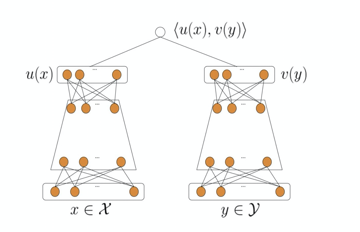

# DSSM

### 简介

双塔召回模型，分为user塔和item塔。
注：使用时需指定user id和item id。


### 参考论文

[DSSM.pdf](https://www.microsoft.com/en-us/research/wp-content/uploads/2016/02/cikm2013_DSSM_fullversion.pdf)

### 配置说明

```protobuf
model_config:{
  model_class: "DSSM"
  feature_groups: {
    group_name: 'user'
    feature_names: 'user_id'
    wide_deep:DEEP
    sequence_features: {
      group_name: "seq_fea"
      tf_summary: false
      allow_key_search: true
      seq_att_map: {
        key: "book_id"
        hist_seq: "book_id_seq"
      }
    }
  }
  feature_groups: {
    group_name: "item"
    feature_names: 'book_id'
    wide_deep:DEEP
  }
  dssm {
    user_tower {
      id: "user_id"
      dnn {
        hidden_units: [256, 128, 64, 32]
      }
    }
    item_tower {
      id: "book_id"
      dnn {
        hidden_units: [256, 128, 64, 32]
      }
    }
    l2_regularization: 1e-6
  }
  embedding_regularization: 5e-5
}
```

- model_class: 'DSSM', 不需要修改
- feature_groups: 需要两个feature_group: user和item, **group name不能变**
- sequence_features: 配置序列特征
- dssm: dssm相关的参数，必须配置user_tower和item_tower
- user_tower/item_tower:
  - dnn: deep part的参数配置
    - hidden_units: dnn每一层的channel数目，即神经元的数目
  - id: 指定user_id/item_id列
- simi_func: 向量相似度函数，包括\[COSINE, INNER_PRODUCT, EUCLID\]，默认COSINE，建议使用INNER_PRODUCT
- embedding_regularization: 对embedding部分加regularization，防止overfit

支持的metric_set包括:

- auc
- mean_absolute_error
- accuracy

### 示例Config

[dssm_on_books.config](../configs/dssm_on_books.config)

### 效果评估

[效果评估](https://easyrec.oss-cn-beijing.aliyuncs.com/docs/recall_eval.pdf)
