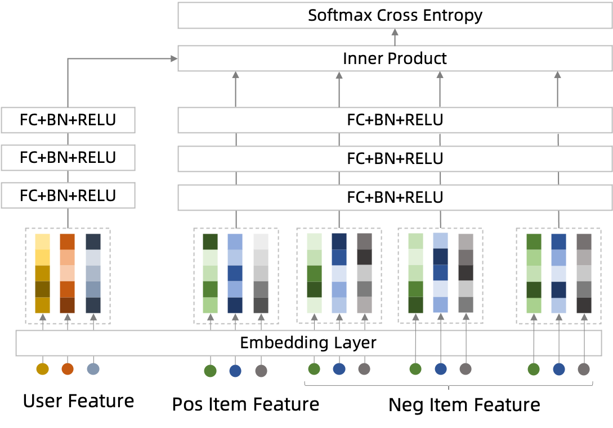

# DSSM负采样版

### 简介

双塔召回模型，支持训练时负采样。



当物品池很大上百万甚至是上亿的时候，双塔召回模型常常需要在物品池中针对每个正样本采样一千甚至一万的负样本才能达到比较好的召回效果，
意味着正负样本比例达到了1: 1k，甚至是1: 1w， 要支持这个正负样本比例的训练，如果用离线构造样本的方式会导致离线存储和离线计算的压力都激增。
该版本的DSSM支持运行时进行负采样，会以图存储的方式将物品的特征存储在Parameter Server节点上，并且Mini-Batch内的共享同一批负样本的计算，
使得离线存储和离线计算的压力都大大降低。

注：训练样本一般只需准备点击（正样本）的样本即可

### 参考论文

[DSSM.pdf](https://www.microsoft.com/en-us/research/wp-content/uploads/2016/02/cikm2013_DSSM_fullversion.pdf)

### 配置说明

```protobuf
eval_config {
  metrics_set: {
    recall_at_topk {
      topk: 10
    }
  }
  metrics_set: {
    recall_at_topk {
      topk: 5
    }
  }
  metrics_set: {
    recall_at_topk {
      topk: 1
    }
  }
}

data_config: {
  ...
  negative_sampler {
    input_path: 'examples/data/book_data/negative_book_data'
    num_sample: 1024
    num_eval_sample: 1024
    attr_fields: 'book_id'
    item_id_field: 'book_id'
  }
}

model_config:{
  model_class: "DSSM"
  feature_groups: {
    group_name: 'user'
    feature_names: 'user_id'
    wide_deep:DEEP
  }
  feature_groups: {
    group_name: "item"
    feature_names: 'book_id'
    wide_deep:DEEP
  }
  dssm {
    user_tower {
      id: "user_id"
      dnn {
        hidden_units: [256, 128, 64, 32]
      }
    }
    item_tower {
      id: "book_id"
      dnn {
        hidden_units: [256, 128, 64, 32]
      }
    }
	simi_func: INNER_PRODUCT
    scale_simi: false
    l2_regularization: 1e-6
  }
  loss_type: SOFTMAX_CROSS_ENTROPY
  embedding_regularization: 5e-5
}
```

- eval_config: 评估配置，目前只支持recall_at_topk
- data_config: 数据配置，其中需要配置负采样Sampler，负采样Sampler的配置详见[负采样配置](./%E8%B4%9F%E9%87%87%E6%A0%B7%E9%85%8D%E7%BD%AE)
- model_class: 'DSSM', 不需要修改
- feature_groups: 需要两个feature_group: user和item, **group name不能变**
- dssm: dssm相关的参数，必须配置user_tower和item_tower
- user_tower/item_tower:
  - dnn: deep part的参数配置
    - hidden_units: dnn每一层的channel数目，即神经元的数目
  - id: 指定user_id/item_id列
- simi_func: 向量相似度函数，包括\[COSINE, INNER_PRODUCT, EUCLID\]，默认COSINE，建议使用INNER_PRODUCT
- scale_simi: 是否自动缩放相似度便于loss计算，建议设置成false
- loss_type: 目前只支持SOFTMAX_CROSS_ENTROPY
- embedding_regularization: 对embedding部分加regularization，防止overfit

注意，DSSM负采样版目前仅支持recall_at_topk做评估指标。

#### 负采样配置

目前支持四种负采样Sampler：

- negative_sampler：加权随机负采样，会排除Mini-Batch内的Item Id
  - input_path: 负采样Item表, Schema为: id:int64 | weight:float | attrs:string，其中attr为":"分隔符拼接的Item特征
  - num_sample: 训练worker的负采样数
  - num_eval_sampler: 评估worker的负采样数
  - attr_fields: Item特征名，顺序与Item的attr中特征的拼接顺序保持一致
  - item_id_field: item_id列名
- negative_sampler_v2：加权随机负采样，会跟排除Mini-Batch内的User有边的Item Id
  - user_input_path: User表, Schema为: id:int64 | weight:float
  - item_input_path: 负采样Item表, Schema为: id:int64 | weight:float | attrs:string，其中attr为":"分隔符拼接的Item特征
  - pos_edge_input_path: Positive边表, Schema为: userid:int64 | itemid:int64 | weight:float
  - user_id_field: user_id列名
  - 其余同negative_sampler
- hard_negative_sampler：加权随机负采样，会排除Mini-Batch内的Item Id，同时HardNegative边表中(一般为曝光未点击)进行负采样作为HardNegative
  - user_input_path: User表, Schema为: id:int64 | weight:float
  - item_input_path: 负采样Item表, Schema为: id:int64 | weight:float | attrs:string，其中attr为":"分隔符拼接的Item特征
  - hard_neg_edge_input_path: HardNegative边表, Schema为: userid:int64 | itemid:int64 | weight:float
  - num_hard_sample: hard negative的最大采样数目
  - user_id_field: user_id列名
  - 其余同negative_sampler
- hard_negative_sampler_v2：加权随机负采样，会跟排除Mini-Batch内的User有边的Item Id，同时HardNegative边表中(一般为曝光未点击)进行负采样作为HardNegative
  - user_input_path: User表, Schema为: id:int64 | weight:float
  - item_input_path: 负采样Item表, Schema为: id:int64 | weight:float | attrs:string，其中attr为":"分隔符拼接的Item特征
  - pos_edge_input_path: Positive边表, Schema为: userid:int64 | itemid:int64 | weight:float
  - hard_neg_edge_input_path: HardNegative边表, Schema为: userid:int64 | itemid:int64 | weight:float
  - num_hard_sample: hard negative的最大采样数目
  - user_id_field: user_id列名
  - 其余同negative_sampler
    一般用negative_sampler即可。

### 示例Config

[dssm_on_books_negative_sample.config](../configs/dssm_on_books_negative_sample.config)

[DSSM_NegSampler.config](https://easyrec.oss-cn-beijing.aliyuncs.com/config/dssm_neg_sampler_on_taobao.config)

[DSSM_NegSamplerV2.config](https://easyrec.oss-cn-beijing.aliyuncs.com/config/dssm_neg_sampler_v2_on_taobao.config)

[DSSM_HardNegSampler.config](https://easyrec.oss-cn-beijing.aliyuncs.com/config/dssm_hard_neg_sampler_on_taobao.config)

[DSSM_HardNegSamplerV2.config](https://easyrec.oss-cn-beijing.aliyuncs.com/config/dssm_hard_neg_sampler_v2_on_taobao.config)

### 效果评估

[效果评估](https://easyrec.oss-cn-beijing.aliyuncs.com/docs/recall_eval.pdf)
