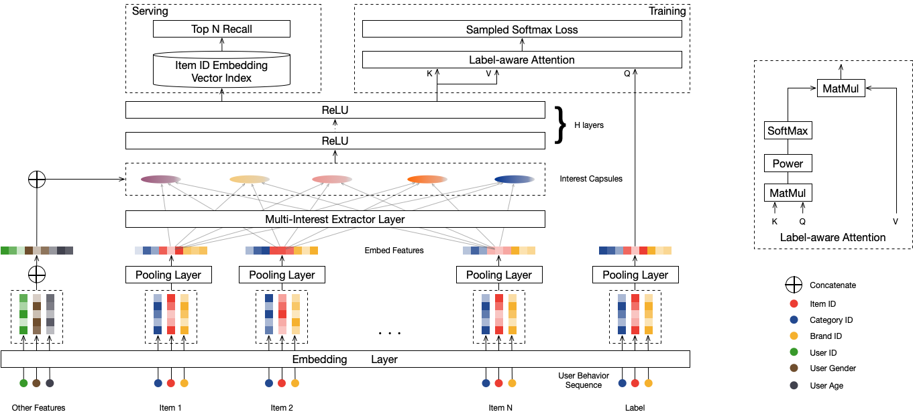

# MIND负采样版

### 简介

mind召回模型, 在dssm的基础上加入了兴趣聚类功能，支持多兴趣召回，能够显著的提升召回层的效果，支持训练时负采样。


### 参考论文

[MIND.pdf](https://arxiv.org/pdf/1904.08030.pdf)

### 配置说明

```protobuf
  ...
eval_config {
  metrics_set: {
    recall_at_topk {
      topk: 10
    }
  }
  metrics_set: {
    recall_at_topk {
      topk: 5
    }
  }
  metrics_set: {
    recall_at_topk {
      topk: 1
    }
  }
}

data_config: {
  ...
  negative_sampler {
    input_path: 'examples/data/book_data/negative_book_data'
    num_sample: 1024
    num_eval_sample: 1024
    attr_fields: 'book_id'
    item_id_field: 'book_id'
  }
}
model_config:{
  model_class: "MIND"
  feature_groups: {
    group_name: 'hist'
    feature_names: 'book_id_seq'
  }
  feature_groups: {
    group_name: 'user'
    feature_names: 'user_id'
    wide_deep:DEEP
  }
  feature_groups: {
    group_name: "item"
    feature_names: 'book_id'
    wide_deep:DEEP
  }
  mind {
    user_dnn {
      hidden_units: [128, 64, 32]
    }
    item_dnn {
      hidden_units: [128, 64, 32]
    }

    concat_dnn {
      hidden_units: [64, 32]
    }

    capsule_config {
      max_k: 3
      max_seq_len: 50
      high_dim: 64
    }
    item_id: "book_id"
    l2_regularization: 1e-6
    ignore_in_batch_neg_sam: true
  }
  embedding_regularization: 5e-5
  loss_type: SOFTMAX_CROSS_ENTROPY
}
```

- model_class: 'MIND', 不需要修改
- feature_groups: 需要三个feature_group: hist, user和item, **group name不能变**
- mind: mind相关的参数，必须配置user_dnn和item_dnn
- user_dnn: user侧的dnn参数
  - dnn:
    - hidden_units: dnn每一层的channel数
    - use_bn: 是否使用batch_norm, 默认是true
- item_dnn: item侧的dnn参数, 配置同user_dnn
  - note: item侧不能用batch_norm
- pre_capsule_dnn: 进入capsule之前的dnn的配置
  - 可选, 配置同user_dnn和item_dnn
- concat_dnn: hist seq 和 user feature融合后的dnn
- capsule_config: 胶囊(动态路由)的配置
  - max_k: 胶囊(兴趣)的个数
  - max_seq_len: hist seq的最大长度
  - high_dim: 兴趣向量的维度
  - num_iters: 动态路由(兴趣聚类)的轮数
  - routing_logits_scale: 放大routing logits, >0时生效;
    - 一些场景显示设置为20时，兴趣向量比较分散, 即相似度比较低(0.8左右)
  - routing_logits_stddev: routing_logits初始化的标准差
  - squash_pow: 对squash加的power, 防止squash之后的向量值变得太小
- simi_pow: 对相似度做的倍数, 放大interests之间的差异
- embedding_regularization: 对embedding部分加regularization，防止overfit
- user_seq_combine:
  - CONCAT: 多个seq之间采取concat的方式融合
  - SUM: 多个seq之间采取sum的方式融合, default是SUM

注意，DSSM负采样版目前仅支持recall_at_topk做评估指标。

#### 负采样配置

目前支持四种负采样Sampler：

- negative_sampler：加权随机负采样，会排除Mini-Batch内的Item Id
  - input_path: 负采样Item表, Schema为: id:int64 | weight:float | attrs:string，其中attr为":"分隔符拼接的Item特征
  - num_sample: 训练worker的负采样数
  - num_eval_sampler: 评估worker的负采样数
  - attr_fields: Item特征名，顺序与Item的attr中特征的拼接顺序保持一致
  - item_id_field: item_id列名
- negative_sampler_v2：加权随机负采样，会跟排除Mini-Batch内的User有边的Item Id
  - user_input_path: User表, Schema为: id:int64 | weight:float
  - item_input_path: 负采样Item表, Schema为: id:int64 | weight:float | attrs:string，其中attr为":"分隔符拼接的Item特征
  - pos_edge_input_path: Positive边表, Schema为: userid:int64 | itemid:int64 | weight:float
  - user_id_field: user_id列名
  - 其余同negative_sampler
- hard_negative_sampler：加权随机负采样，会排除Mini-Batch内的Item Id，同时HardNegative边表中(一般为曝光未点击)进行负采样作为HardNegative
  - user_input_path: User表, Schema为: id:int64 | weight:float
  - item_input_path: 负采样Item表, Schema为: id:int64 | weight:float | attrs:string，其中attr为":"分隔符拼接的Item特征
  - hard_neg_edge_input_path: HardNegative边表, Schema为: userid:int64 | itemid:int64 | weight:float
  - num_hard_sample: hard negative的最大采样数目
  - user_id_field: user_id列名
  - 其余同negative_sampler
- hard_negative_sampler_v2：加权随机负采样，会跟排除Mini-Batch内的User有边的Item Id，同时HardNegative边表中(一般为曝光未点击)进行负采样作为HardNegative
  - user_input_path: User表, Schema为: id:int64 | weight:float
  - item_input_path: 负采样Item表, Schema为: id:int64 | weight:float | attrs:string，其中attr为":"分隔符拼接的Item特征
  - pos_edge_input_path: Positive边表, Schema为: userid:int64 | itemid:int64 | weight:float
  - hard_neg_edge_input_path: HardNegative边表, Schema为: userid:int64 | itemid:int64 | weight:float
  - num_hard_sample: hard negative的最大采样数目
  - user_id_field: user_id列名
  - 其余同negative_sampler
    一般用negative_sampler即可。

### 示例Config

[mind_on_books_negative_sample.config](../configs/mind_on_books_negative_sample.config)

### 效果评估

可参考MIND的评估方式 [mind.md](mind.md)。
