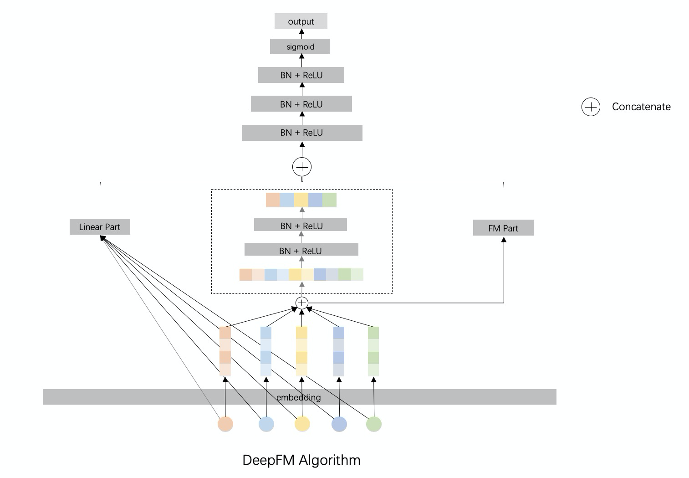

# DeepFM

### 简介

DeepFM是在WideAndDeep基础上加入了FM模块的改进模型。FM模块和DNN模块共享相同的特征，即相同的Embedding。



### 参考论文

[DeepFM](https://arxiv.org/abs/1703.04247)

### 配置说明

```protobuf
model_config:{
  model_class: "DeepFM"
  feature_groups: {
    group_name: "deep"
    feature_names: 'user_id'
    feature_names: 'movie_id'
    ...
    wide_deep:DEEP
  }
  feature_groups: {
    group_name: "wide"
    feature_names: 'user_id'
    feature_names: 'movie_id'
    ...
    wide_deep:WIDE
  }

  deepfm {
    dnn {
      hidden_units: [256, 128, 64]
    }
    l2_regularization: 1e-4
  }
  embedding_regularization: 1e-4
}
```

- model_class: 'DeepFM', 不需要修改

- feature_groups:

  需要两个feature_group: wide group和deep group, **group name不能变**

- deepfm:  deepfm相关的参数

- dnn: deep part的参数配置

  - hidden_units: dnn每一层的channel数目，即神经元的数目

- wide_output_dim: wide部分输出的大小

- final_dnn: 整合wide part, fm part, deep part的参数输入, 可以选择是否使用

  - hidden_units: dnn每一层的channel数目，即神经元的数目

- embedding_regularization: 对embedding部分加regularization，防止overfit

### 示例Config

[deepfm_on_movielens.config](../configs/deepfm_on_movielens.config)
[deepfm_on_criteo.config](../configs/deepfm_on_criteo.config)
