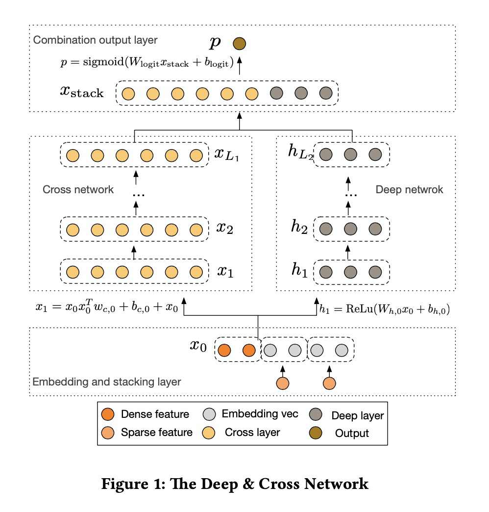

# DCN

### 简介

Deep＆Cross Network（DCN）是在DNN模型的基础上，引入了一种新型的交叉网络，该网络在学习某些特征交叉时效率更高。特别是，DCN显式地在每一层应用特征交叉，不需要人工特征工程，并且只增加了很小的额外复杂性。



### 参考论文

[DCN](https://arxiv.org/abs/1708.05123)

### 配置说明

```protobuf
model_config: {
  model_class: 'DCN'
  feature_groups: {
    group_name: 'all'
    feature_names: 'user_id'
    feature_names: 'movie_id'
    feature_names: 'job_id'
    feature_names: 'age'
    feature_names: 'gender'
    feature_names: 'year'
    feature_names: 'genres'
    wide_deep: DEEP
  }
  dcn {
    deep_tower {
      input: "all"
      dnn {
        hidden_units: [256, 128, 64]
      }
    }
    cross_tower {
      input: "all"
      cross_num: 5
    }
    final_dnn {
      hidden_units: [64, 32, 16]
    }
    l2_regularization: 1e-4
  }
  embedding_regularization: 1e-4
}
```

- model_class: 'DCN', 不需要修改

- feature_groups: 配置一个名为'all'的feature_group。

- dcn: dcn相关的参数

- deep_tower

  - dnn: deep part的参数配置

    - hidden_units: dnn每一层的channel数目，即神经元的数目

- cross_tower

  - cross_num: 交叉层层数，默认为3

- final_dnn: 整合wide part, fm part, deep part的参数输入, 可以选择是否使用

  - hidden_units: dnn每一层的channel数目，即神经元的数目

- embedding_regularization: 对embedding部分加regularization，防止overfit

### 示例Config

[dcn_on_movielens.config](../configs/dcn_on_movielens.config)
