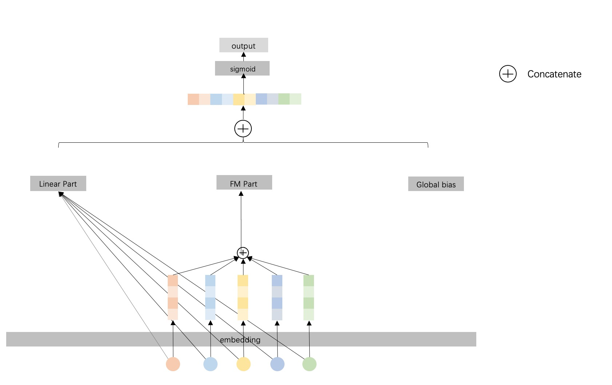

# FM

### 简介

FM模型的主要应用场景是点击率预估，目的是在数据高维稀疏的情况下，解决特征的组合问题。



### 参考论文

[FM](https://www.csie.ntu.edu.tw/%7Eb97053/paper/Rendle2010FM.pdf)

### 配置说明

```protobuf
model_config: {
  model_class: 'FM'
  feature_groups: {
    group_name: 'wide'
    feature_names: 'F1'
    feature_names: 'F2'
    ...
    wide_deep:WIDE
  }
  feature_groups: {
    group_name: 'deep'
    feature_names: 'F1'
    feature_names: 'F2'
    ...
    wide_deep: DEEP
  }

  fm {
  }
  embedding_regularization: 1e-5
}
```

- model_class: 'FM', 不需要修改

- feature_groups:

需要一个feature_group: wide group **group name不能变**

- embedding_regularization: 对embedding部分加regularization，防止overfit

- input_type: 如果在提交到pai-tf集群上面运行，读取max compute 表作为输入数据，data_config：input_type要设置为OdpsInputV2。

### 示列Config

[fm_on_criteo.config](../configs/fm_on_criteo.config)
