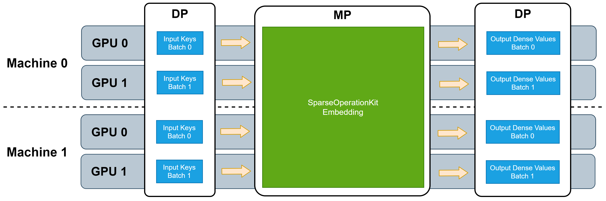

# Features in SparseOperationKit #
The detailed information about the features in SparseOperationKit.

## Model-Parallelism GPU Embedding Layer ##
As described in [Introduction Section](https://nvidia-merlin.github.io/HugeCTR/sparse_operation_kit/master/intro_link.html#features), SOK provides GPU Embedding Layers which works in model-parallelism manner. And it does not require any further data transformation from model-parallelism to data-parallism.

There are several different GPU Embedding Layers in SOK, which are implemented with different algorithms. These embedding layers can work in single machine or multiple machines.


### Sparse Embedding Layer ###
Sparse embedding layer is equivalent to `tf.nn.embedding_lookup_sparse` except the sparse embedding layers in SOK works in MP manner. The supported combiner in SOK sparse embedding layers are `Mean` and `Sum`.

#### Distributed Sparse Embedding ####
This sparse embedding will distribute each key based on `gpu_id = key % gpu_num`. For example, if there are 8 GPUs, then `key=1000` will be distributed to GPU-0, `key=1001` will be distributed to GPU-1. The following picture depicts its forward propagation process.
```{image} ../images/distributed_sparse_embedding.png
:class: bg_primary
:width: 50%
:align: center
```
<br>
To reduce the overhead of multiple embedding tables' looking up, where their embedding vector size are the same, Distributed sparse embedding combines multiple embedding tables as one huge embedding table. Each tiny embedding table is called slot, which is also known as feature-field. And the input keys for different embedding tables should be unified encoded.

When conducting reduction of embedding vectors intra slots (feature-fields), collective operation `Reduce-Scatter` will be used. And `All-Gather` is used for their gradients backward propagation.

### Dense Embedding Layer ###
Dense embedding layer is equivalent to `tf.nn.embedding_lookup` except the dense embedding layers in SOK works in MP manner.

#### All2All Dense Embedding ####
This dense embedding will distribute each key based on `gpu_id = key % gpu_num`. For example, if there are 8 GPUs, then `key=1000` will be distributed to GPU-0, `key=1001` will be distributed to GPU-1. The following picture depicts its forward propagation process.
```{image} ../images/all2all_dense_embedding.png
:class: bg_primary
:width: 50%
:align: center
```
<br>

To reduce the overhead of multiple embedding tables' looking up, where their embedding vector size are the same, All2All dense embedding combines multiple embedding tables as one huge embedding table. Each tiny embedding table is called slot, which is also known as feature-field. And the input keys for different embedding tables should be unified encoded.

In the forward propagation, `All2All` will be used to exchange keys among all GPUs, then another `All2All` will be used to exchange embedding vectors among all GPUs. In the backward propagation, `All2All` will be used to exchange top gradients among all GPUs.
